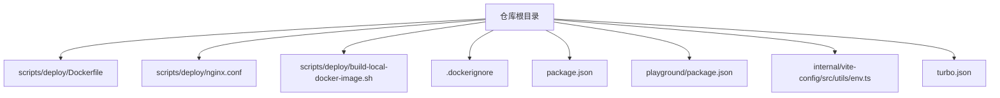
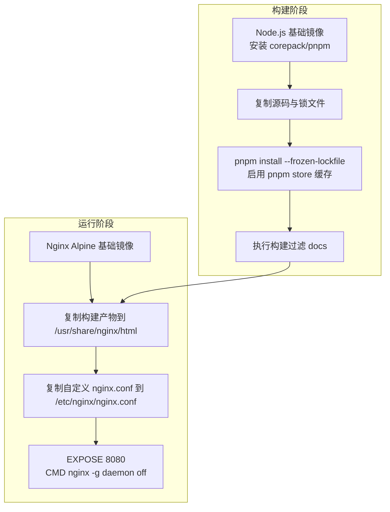
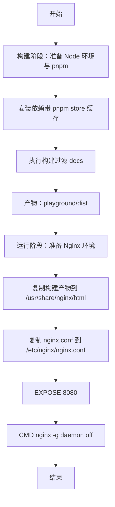
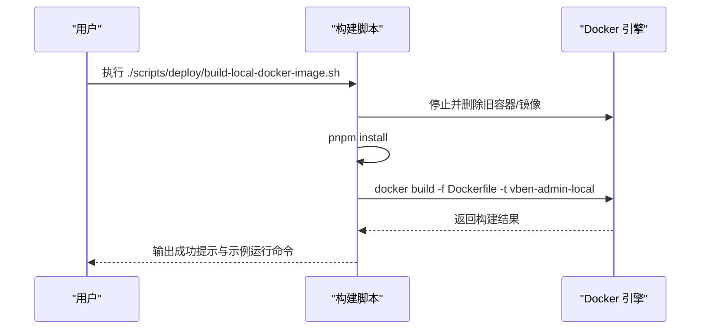
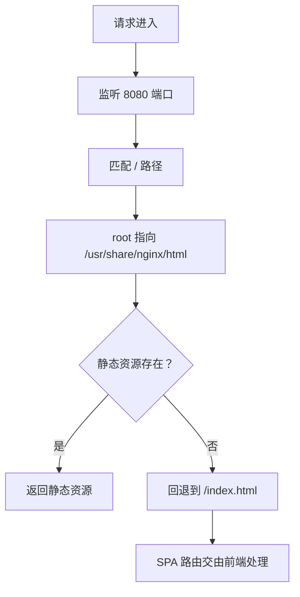
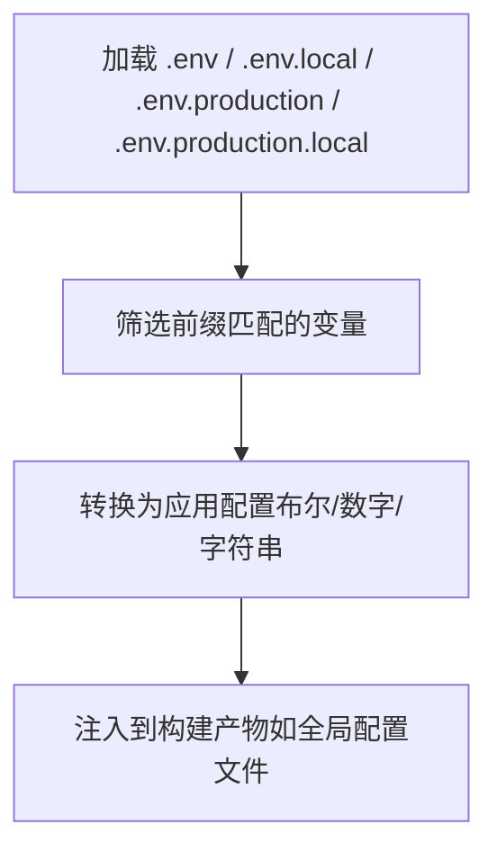
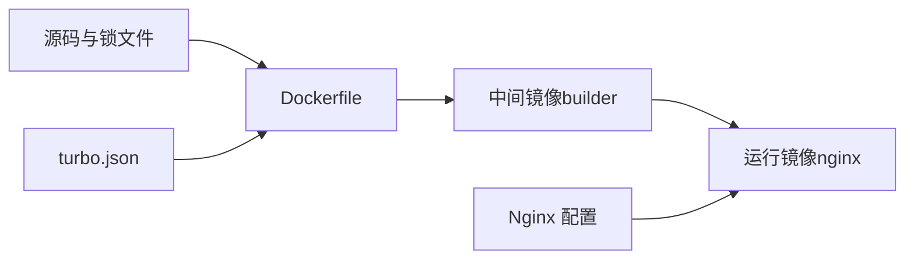

# Docker 部署

<cite>
**本文引用的文件**
- [Dockerfile](file://scripts/deploy/Dockerfile)
- [构建脚本](file://scripts/deploy/build-local-docker-image.sh)
- [Nginx 配置](file://scripts/deploy/nginx.conf)
- [.dockerignore](file://.dockerignore)
- [根包配置](file://package.json)
- [playground 包配置](file://playground/package.json)
- [Vite 环境工具](file://internal/vite-config/src/utils/env.ts)
- [Vite 应用配置入口](file://internal/vite-config/src/index.ts)
- [Turbo 缓存与任务定义](file://turbo.json)
</cite>

## 目录

1. [简介](#简介)
2. [项目结构](#项目结构)
3. [核心组件](#核心组件)
4. [架构总览](#架构总览)
5. [组件详解](#组件详解)
6. [依赖关系分析](#依赖关系分析)
7. [性能考量](#性能考量)
8. [故障排查指南](#故障排查指南)
9. [结论](#结论)
10. [附录](#附录)

## 简介

本文件面向 DevOps 工程师，系统性说明 shiyu-ui 项目的 Docker 容器化部署方案。内容涵盖多阶段 Dockerfile 构建策略（Node.js 构建阶段与 Nginx 运行阶段）、镜像构建过程中的环境变量与依赖安装、构建脚本使用与可选参数、容器运行时配置（端口映射与卷挂载）、不同部署场景下的 Docker Compose 示例思路、以及容器监控与日志管理建议。目标是帮助团队在本地与生产环境中高效、稳定地完成容器化交付。

## 项目结构

与容器化部署直接相关的目录与文件如下：

- scripts/deploy：包含 Dockerfile、Nginx 配置与本地构建脚本
- .dockerignore：控制构建上下文排除项
- 根 package.json：提供构建脚本入口与 Node/PNPM 版本约束
- playground/package.json：前端应用打包产物位置与模式
- internal/vite-config：Vite 环境变量加载与转换逻辑
- turbo.json：缓存与任务定义，影响构建一致性

**图表来源**

- [Dockerfile:1-39](file://scripts/deploy/Dockerfile#L1-L39)
- [Nginx 配置:1-76](file://scripts/deploy/nginx.conf#L1-L76)
- [构建脚本:1-56](file://scripts/deploy/build-local-docker-image.sh#L1-L56)
- [.dockerignore:1-8](file://.dockerignore#L1-L8)
- [根包配置:1-110](file://package.json#L1-L110)
- [playground 包配置:1-63](file://playground/package.json#L1-L63)
- [Vite 环境工具:1-111](file://internal/vite-config/src/utils/env.ts#L1-L111)
- [Turbo 缓存与任务定义:1-49](file://turbo.json#L1-L49)

**章节来源**

- [Dockerfile:1-39](file://scripts/deploy/Dockerfile#L1-L39)
- [Nginx 配置:1-76](file://scripts/deploy/nginx.conf#L1-L76)
- [构建脚本:1-56](file://scripts/deploy/build-local-docker-image.sh#L1-L56)
- [.dockerignore:1-8](file://.dockerignore#L1-L8)
- [根包配置:1-110](file://package.json#L1-L110)
- [playground 包配置:1-63](file://playground/package.json#L1-L63)
- [Vite 环境工具:1-111](file://internal/vite-config/src/utils/env.ts#L1-L111)
- [Turbo 缓存与任务定义:1-49](file://turbo.json#L1-L49)

## 核心组件

- 多阶段 Dockerfile：以 Node.js slim 基础镜像作为构建阶段，使用 pnpm 并启用缓存；随后以 Nginx Alpine 作为运行阶段，复制构建产物与自定义 Nginx 配置，暴露 8080 端口并以前台模式启动。
- 构建脚本：封装本地镜像构建流程，包含停止/删除旧容器与镜像、安装依赖、执行 docker build、输出运行示例命令等步骤。
- Nginx 配置：定义 MIME 类型、CORS 头、监听端口、静态资源根路径与回退到 index.html 的路由策略。
- 环境变量与构建：通过环境变量提升 Node 内存上限、设置时区、CI 模式；Vite 环境工具支持从 .env\* 文件加载前缀匹配的变量并转换为应用配置。
- 构建产物定位：构建产物来自 playground 应用的 dist 目录，由 Dockerfile 在运行阶段复制至 Nginx HTML 根目录。

**章节来源**

- [Dockerfile:1-39](file://scripts/deploy/Dockerfile#L1-L39)
- [构建脚本:1-56](file://scripts/deploy/build-local-docker-image.sh#L1-L56)
- [Nginx 配置:1-76](file://scripts/deploy/nginx.conf#L1-L76)
- [Vite 环境工具:1-111](file://internal/vite-config/src/utils/env.ts#L1-L111)
- [playground 包配置:1-63](file://playground/package.json#L1-L63)

## 架构总览

下图展示从源码到容器运行的整体流程：构建阶段负责安装依赖、执行构建并将产物输出；运行阶段负责将产物与 Nginx 配置复制到运行镜像，并以前台方式启动 Nginx。

**图表来源**

- [Dockerfile:1-39](file://scripts/deploy/Dockerfile#L1-L39)

## 组件详解

### Dockerfile 多阶段构建

- 构建阶段（builder）
  - 使用 Node.js slim 基础镜像，安装 corepack 以启用 pnpm。
  - 设置工作目录与环境变量：PNPM_HOME、PATH、NODE_OPTIONS（提升内存上限）、TZ、CI。
  - 复制源码后使用 pnpm install 并启用 pnpm store 缓存；执行构建（过滤 docs）。
- 运行阶段（production）
  - 使用 Nginx Alpine 基础镜像。
  - 配置 MIME 类型（含 mjs），移除默认配置，复制构建产物与自定义 Nginx 配置。
  - 暴露 8080 端口，以前台模式启动 Nginx。

**图表来源**

- [Dockerfile:1-39](file://scripts/deploy/Dockerfile#L1-L39)

**章节来源**

- [Dockerfile:1-39](file://scripts/deploy/Dockerfile#L1-L39)

### 构建脚本使用与自定义

- 脚本功能
  - 停止并删除同名容器与旧镜像，避免冲突。
  - 安装依赖（pnpm install）。
  - 执行 docker build，指定 Dockerfile 路径与镜像标签。
  - 输出成功提示与示例运行命令（默认映射宿主 8010:8080）。
- 自定义选项
  - 可修改镜像标签常量以适配不同命名规范。
  - 可调整构建参数（如 --no-cache）以满足特定需求。
  - 可扩展日志记录与错误处理逻辑。
- 运行示例
  - 成功后脚本会打印示例运行命令，包含端口映射与容器名称。

**图表来源**

- [构建脚本:1-56](file://scripts/deploy/build-local-docker-image.sh#L1-L56)
- [Dockerfile:1-39](file://scripts/deploy/Dockerfile#L1-L39)

**章节来源**

- [构建脚本:1-56](file://scripts/deploy/build-local-docker-image.sh#L1-L56)

### Nginx 配置要点

- MIME 类型：显式声明 JavaScript 与 mjs 的类型映射，确保现代前端产物正确识别。
- CORS 支持：为开发与跨域场景添加通用 CORS 头，包含 OPTIONS 预检处理。
- 路由策略：root 指向构建产物目录，try_files 回退到 index.html，适配 SPA 单页应用路由。
- 监听与根目录：监听 8080 端口，错误页面指向构建产物目录下的 50x.html。

**图表来源**

- [Nginx 配置:1-76](file://scripts/deploy/nginx.conf#L1-L76)

**章节来源**

- [Nginx 配置:1-76](file://scripts/deploy/nginx.conf#L1-L76)

### 环境变量与构建优化

- Node 侧环境变量
  - NODE_OPTIONS：提升 Node.js 内存上限，缓解大项目构建时的内存压力。
  - TZ：统一时区，便于日志与定时任务的一致性。
  - CI：开启 CI 模式，减少交互与冗余输出。
- pnpm 缓存
  - 使用 pnpm store 缓存加速依赖安装，提升多阶段构建效率。
- Vite 环境加载
  - Vite 环境工具按模式加载 .env\* 文件，筛选前缀匹配的变量并转换为应用配置，确保构建产物与运行时一致。

**图表来源**

- [Vite 环境工具:1-111](file://internal/vite-config/src/utils/env.ts#L1-L111)

**章节来源**

- [Dockerfile:1-39](file://scripts/deploy/Dockerfile#L1-L39)
- [Vite 环境工具:1-111](file://internal/vite-config/src/utils/env.ts#L1-L111)

### 构建产物与运行时映射

- 构建产物：来自 playground 应用的 dist 目录，由 Dockerfile 在运行阶段复制到 Nginx HTML 根目录。
- 运行时端口：容器内监听 8080，可通过 -p 将宿主机端口映射到容器端口。
- 卷挂载建议：如需热更新或调试，可在开发阶段将源码目录挂载到容器内的构建产物目录，但注意 Nginx 仅服务静态文件，实际开发建议使用前端开发服务器。

**章节来源**

- [Dockerfile:29-35](file://scripts/deploy/Dockerfile#L29-L35)
- [playground 包配置:1-63](file://playground/package.json#L1-L63)

## 依赖关系分析

- 构建链路
  - Dockerfile 依赖：源码、pnpm 锁文件、Nginx 配置。
  - 构建脚本依赖：Docker CLI、pnpm、shell 环境。
- 运行链路
  - Nginx 配置依赖：MIME 类型、CORS 头、路由回退策略。
- 环境与缓存
  - Turbo 缓存与任务定义影响构建一致性与缓存命中率。
  - pnpm store 缓存显著缩短依赖安装时间。

**图表来源**

- [Dockerfile:1-39](file://scripts/deploy/Dockerfile#L1-L39)
- [Turbo 缓存与任务定义:1-49](file://turbo.json#L1-L49)

**章节来源**

- [Dockerfile:1-39](file://scripts/deploy/Dockerfile#L1-L39)
- [Turbo 缓存与任务定义:1-49](file://turbo.json#L1-L49)

## 性能考量

- 多阶段构建：分离构建与运行环境，减小最终镜像体积，提升安全性与可移植性。
- pnpm 缓存：利用 pnpm store 缓存依赖，显著降低重复构建时间。
- Nginx 静态服务：Nginx 对静态资源的传输性能优异，适合生产环境分发前端产物。
- 构建缓存：结合 Turbo 的全局依赖与任务输出定义，提升增量构建效率。

[本节为通用性能建议，不直接分析具体文件]

## 故障排查指南

- 构建失败
  - 检查 pnpm 安装是否成功与网络连通性。
  - 查看构建脚本日志文件，定位失败步骤。
  - 确认 Dockerfile 中的 COPY 与 RUN 步骤顺序与路径正确。
- 运行异常
  - 确认容器端口映射是否正确（默认 8010:8080）。
  - 检查 Nginx 配置文件是否被正确复制到 /etc/nginx/nginx.conf。
  - 查看容器日志，确认 Nginx 是否以前台模式启动。
- CORS 问题
  - 核对 Nginx 配置中的 CORS 头是否生效，特别是 OPTIONS 预检。
- 构建产物为空
  - 确认 playground 的构建脚本已生成 dist 目录。
  - 检查 Dockerfile 中复制路径是否与实际产物路径一致。

**章节来源**

- [构建脚本:1-56](file://scripts/deploy/build-local-docker-image.sh#L1-L56)
- [Nginx 配置:1-76](file://scripts/deploy/nginx.conf#L1-L76)
- [Dockerfile:1-39](file://scripts/deploy/Dockerfile#L1-L39)

## 结论

通过多阶段 Dockerfile 与 Nginx 运行时的组合，shiyu-ui 实现了简洁、高效的容器化部署方案。配合 pnpm 缓存与 Turbo 构建缓存，可显著提升构建速度与稳定性。构建脚本提供了本地一键构建与运行示例，便于快速验证。生产部署时建议结合 Docker Compose 或编排平台，完善健康检查、日志采集与监控告警。

[本节为总结性内容，不直接分析具体文件]

## 附录

### 容器运行时配置

- 端口映射
  - 默认容器监听 8080，示例映射为宿主机 8010:8080。
- 卷挂载
  - 开发阶段可将源码目录挂载到容器内构建产物目录以实现热更新（注意 Nginx 仅服务静态文件）。
- 环境变量
  - 可通过 docker run -e 注入环境变量，或在运行阶段通过环境文件挂载（需在 Nginx 层面处理）。

**章节来源**

- [构建脚本:37-40](file://scripts/deploy/build-local-docker-image.sh#L37-L40)
- [Nginx 配置:1-76](file://scripts/deploy/nginx.conf#L1-L76)

### 不同部署场景下的 Docker Compose 示例思路

- 单实例部署
  - 使用单个服务，映射端口，挂载日志目录，设置重启策略。
- 负载均衡与高可用
  - 多副本部署，结合反向代理或编排平台实现健康检查与自动扩缩容。
- 开发/测试环境
  - 挂载源码目录，禁用缓存或使用只读卷，便于快速迭代。
- 生产环境
  - 使用只读文件系统、最小权限、健康检查、资源限制与日志聚合。

[本节为概念性示例，不直接对应具体文件]

### 容器监控与日志管理

- 日志
  - 使用 Docker 日志驱动收集容器标准输出与错误输出，结合集中式日志平台（如 ELK/Fluent Bit）进行聚合与检索。
- 监控
  - 集成容器指标采集（CPU/内存/网络/磁盘），设置阈值告警。
  - 在 Nginx 层面增加访问日志与错误日志，便于分析请求与错误趋势。
- 健康检查
  - 在 Dockerfile 中或 Compose 中配置健康检查，定期探测 8080 端口与关键页面响应状态。

[本节为通用运维建议，不直接分析具体文件]
