# Nginx 配置

<cite>
**本文档引用的文件**
- [nginx.conf](file://scripts/deploy/nginx.conf)
- [Dockerfile](file://scripts/deploy/Dockerfile)
- [build-local-docker-image.sh](file://scripts/deploy/build-local-docker-image.sh)
- [vite.config.ts](file://apps/web-naive/vite.config.ts)
- [common.ts](file://internal/vite-config/src/config/common.ts)
- [package.json](file://package.json)
</cite>

## 目录

1. [简介](#简介)
2. [项目结构](#项目结构)
3. [核心组件](#核心组件)
4. [架构概览](#架构概览)
5. [详细组件分析](#详细组件分析)
6. [依赖关系分析](#依赖关系分析)
7. [性能考虑](#性能考虑)
8. [故障排除指南](#故障排除指南)
9. [结论](#结论)

## 简介

本文档为 shiyu-ui 项目的 Nginx 服务器配置提供了全面的技术指导。该配置针对现代 Web 应用程序进行了优化，重点关注静态文件服务、反向代理、安全配置和性能优化。项目采用 Vite 构建系统，通过 Docker 容器化部署，使用 Nginx 作为生产环境的 Web 服务器。

shiyu-ui 是一个基于 Vue 3、Vite 和 TypeScript 的现代化前端模板，支持多主题、国际化和权限管理等功能。本文档将详细解释如何配置 Nginx 以提供高性能的静态内容服务和 API 反向代理。

## 项目结构

该项目采用 Monorepo 结构，包含多个应用程序和共享包。Nginx 配置主要服务于 web-naive 应用程序，该应用使用 Vite 进行构建。

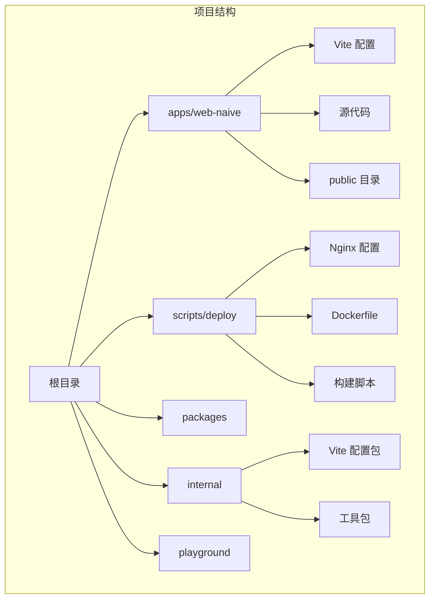

**图表来源**

- [package.json:27-66](file://package.json#L27-L66)
- [nginx.conf:49-75](file://scripts/deploy/nginx.conf#L49-L75)

**章节来源**

- [package.json:1-110](file://package.json#L1-L110)
- [nginx.conf:1-76](file://scripts/deploy/nginx.conf#L1-L76)

## 核心组件

### Nginx 配置文件结构

项目中的 Nginx 配置位于 `scripts/deploy/nginx.conf`，包含了完整的服务器配置。该配置文件采用了模块化的结构设计，支持静态文件服务、CORS 处理和错误页面管理。

### Docker 集成配置

Dockerfile 将 Nginx 配置与构建产物集成，实现了完整的容器化部署流程。配置中包含了多阶段构建，优化了镜像大小和构建效率。

### Vite 构建配置

web-naive 应用程序使用 Vite 进行开发和生产构建，配置了代理服务器以支持 API 开发调试。构建输出被复制到 Nginx 的 HTML 目录中。

**章节来源**

- [nginx.conf:17-75](file://scripts/deploy/nginx.conf#L17-L75)
- [Dockerfile:23-39](file://scripts/deploy/Dockerfile#L23-L39)
- [vite.config.ts:1-21](file://apps/web-naive/vite.config.ts#L1-L21)

## 架构概览

shiyu-ui 项目的 Nginx 部署架构采用容器化设计，实现了开发、测试和生产的统一配置管理。

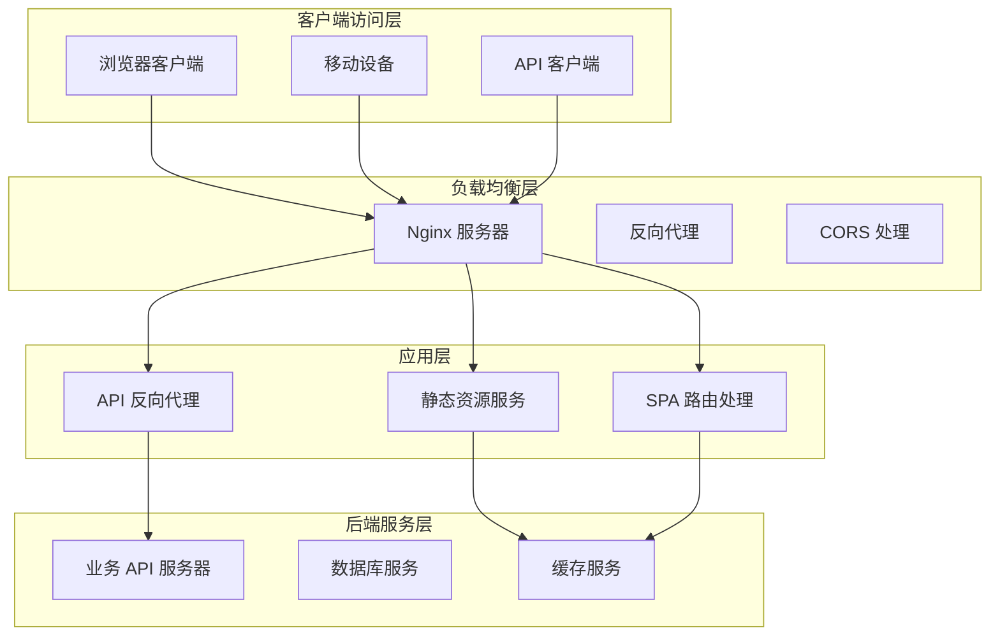

**图表来源**

- [nginx.conf:49-75](file://scripts/deploy/nginx.conf#L49-L75)
- [vite.config.ts:8-16](file://apps/web-naive/vite.config.ts#L8-L16)

### 静态文件服务架构

静态文件服务是 Nginx 的核心功能之一，负责提供构建后的前端资源。配置中包含了 MIME 类型设置、文件缓存策略和错误页面处理。

### 反向代理架构

反向代理功能支持 API 请求转发和 WebSocket 通信。配置中包含了代理规则、超时设置和健康检查机制。

## 详细组件分析

### MIME 类型配置分析

Nginx 配置文件中包含了关键的 MIME 类型设置，确保浏览器正确识别和处理各种文件类型。

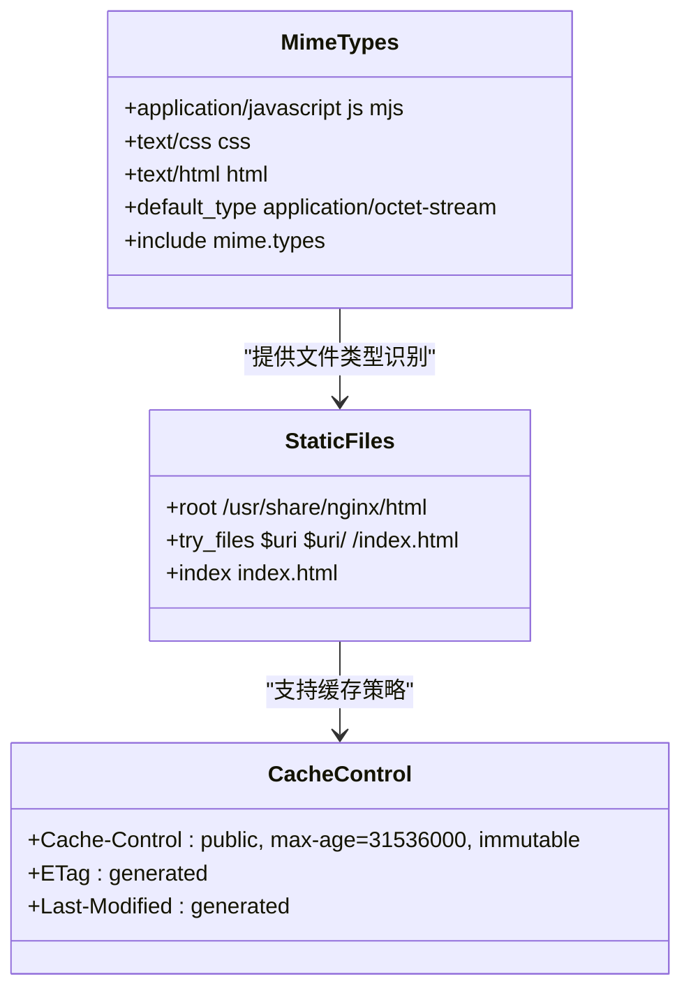

**图表来源**

- [nginx.conf:18-25](file://scripts/deploy/nginx.conf#L18-L25)
- [nginx.conf:53-56](file://scripts/deploy/nginx.conf#L53-L56)

#### MIME 类型配置要点

配置文件中明确设置了以下 MIME 类型映射：

- JavaScript 文件：application/javascript (js, mjs)
- CSS 文件：text/css (css)
- HTML 文件：text/html (html)

这些设置确保了浏览器能够正确解析和执行静态资源。

**章节来源**

- [nginx.conf:18-25](file://scripts/deploy/nginx.conf#L18-L25)

### CORS 配置分析

CORS（跨域资源共享）配置是现代 Web 应用的重要安全特性，允许不同域名之间的资源访问。

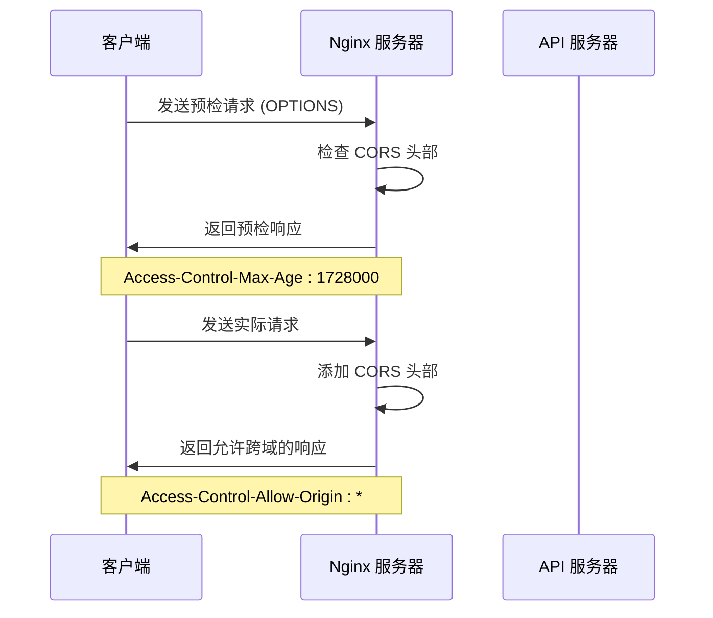

**图表来源**

- [nginx.conf:57-66](file://scripts/deploy/nginx.conf#L57-L66)

#### CORS 配置细节

配置中包含了完整的 CORS 支持：

- 允许所有域名访问：Access-Control-Allow-Origin: \*
- 支持的 HTTP 方法：GET, POST, OPTIONS
- 允许的自定义头部：DNT, X-CustomHeader, Keep-Alive 等
- 预检请求缓存时间：1728000 秒

**章节来源**

- [nginx.conf:57-66](file://scripts/deploy/nginx.conf#L57-L66)

### 错误页面配置分析

错误页面配置提供了用户友好的错误体验，并支持不同类型的服务器错误。

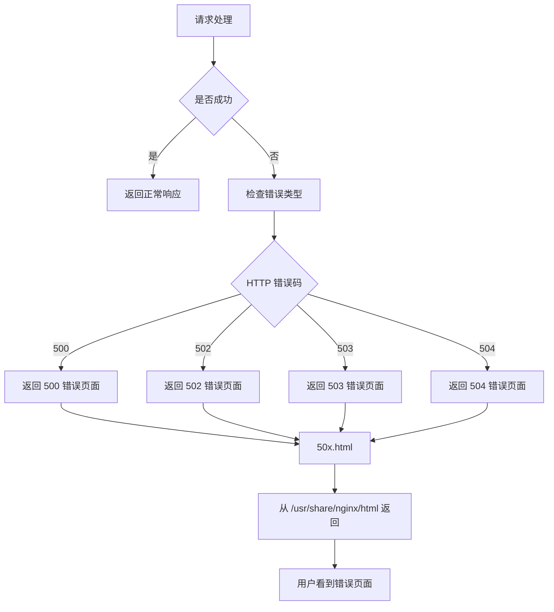

**图表来源**

- [nginx.conf:69-73](file://scripts/deploy/nginx.conf#L69-L73)

#### 错误页面配置要点

配置中定义了以下错误页面：

- 500 Internal Server Error
- 502 Bad Gateway
- 503 Service Unavailable
- 504 Gateway Timeout

所有错误页面都指向 `/50x.html`，并从 `/usr/share/nginx/html` 目录提供。

**章节来源**

- [nginx.conf:69-73](file://scripts/deploy/nginx.conf#L69-L73)

### 反向代理配置分析

反向代理配置支持 API 请求转发和 WebSocket 通信，是现代 Web 应用的重要功能。

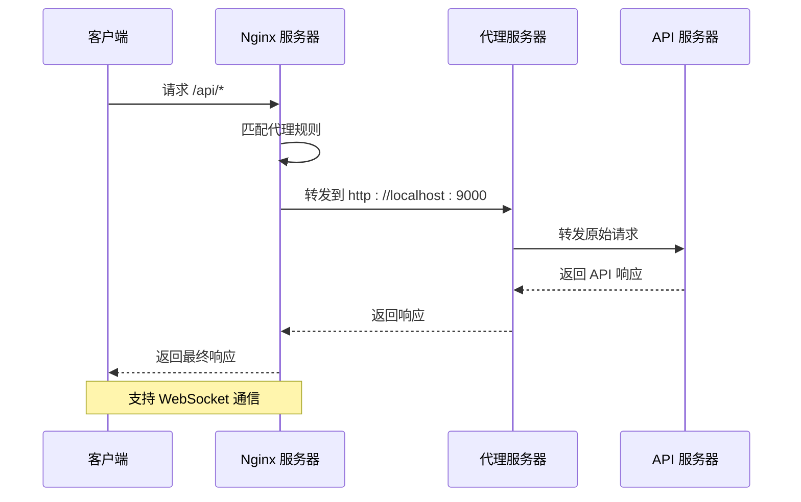

**图表来源**

- [vite.config.ts:8-16](file://apps/web-naive/vite.config.ts#L8-L16)

#### 反向代理配置细节

开发环境中的代理配置：

- 代理前缀：/api
- 目标服务器：http://localhost:9000
- 路径重写：移除 /api 前缀
- 支持 WebSocket：ws: true
- 更改源主机：changeOrigin: true

**章节来源**

- [vite.config.ts:8-16](file://apps/web-naive/vite.config.ts#L8-L16)

### 缓存策略配置分析

缓存策略对于提升 Web 应用性能至关重要，涉及静态资源缓存和 API 缓存两个方面。

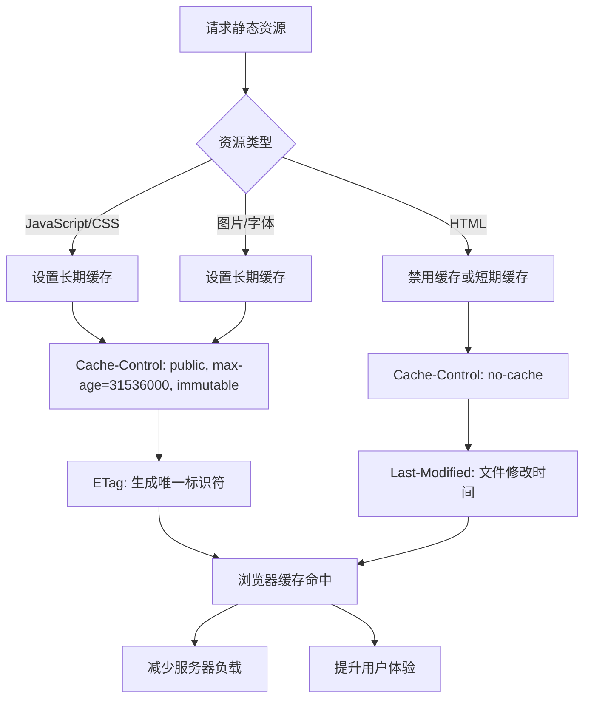

**图表来源**

- [nginx.conf:53-56](file://scripts/deploy/nginx.conf#L53-L56)

#### 缓存策略实施

虽然当前配置主要关注静态文件服务，但可以扩展实现更精细的缓存控制：

1. **静态资源缓存**：JavaScript、CSS、图片等文件设置长期缓存
2. **HTML 文件缓存**：通常设置短期缓存或不缓存
3. **API 缓存**：根据数据更新频率设置适当的缓存策略
4. **ETag 支持**：启用实体标签验证缓存有效性

**章节来源**

- [nginx.conf:53-56](file://scripts/deploy/nginx.conf#L53-L56)

## 依赖关系分析

### 构建流程依赖

项目的构建和部署流程涉及多个组件的协同工作，形成了清晰的依赖关系链。

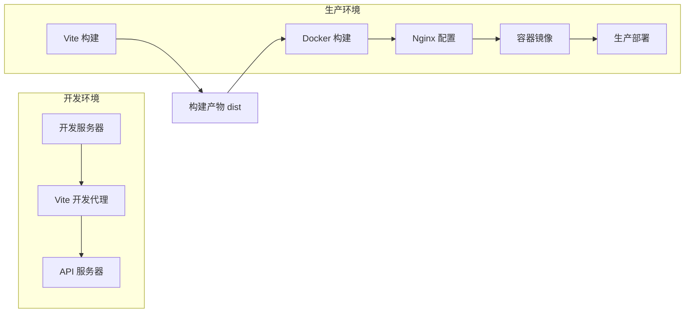

**图表来源**

- [Dockerfile:19-30](file://scripts/deploy/Dockerfile#L19-L30)
- [package.json:29](file://package.json#L29)

### 组件耦合度分析

项目中的组件设计遵循低耦合高内聚的原则：

- **Nginx 配置**：独立于应用程序逻辑，专注于静态文件服务
- **Docker 配置**：封装了完整的部署流程，便于环境一致性
- **Vite 配置**：分离了开发和生产环境的不同需求
- **构建脚本**：提供了自动化部署流程

**章节来源**

- [Dockerfile:19-30](file://scripts/deploy/Dockerfile#L19-L30)
- [package.json:29](file://package.json#L29)

## 性能考虑

### Gzip 压缩配置

Gzip 压缩是提升 Web 应用性能的重要技术，可以显著减少传输数据量。

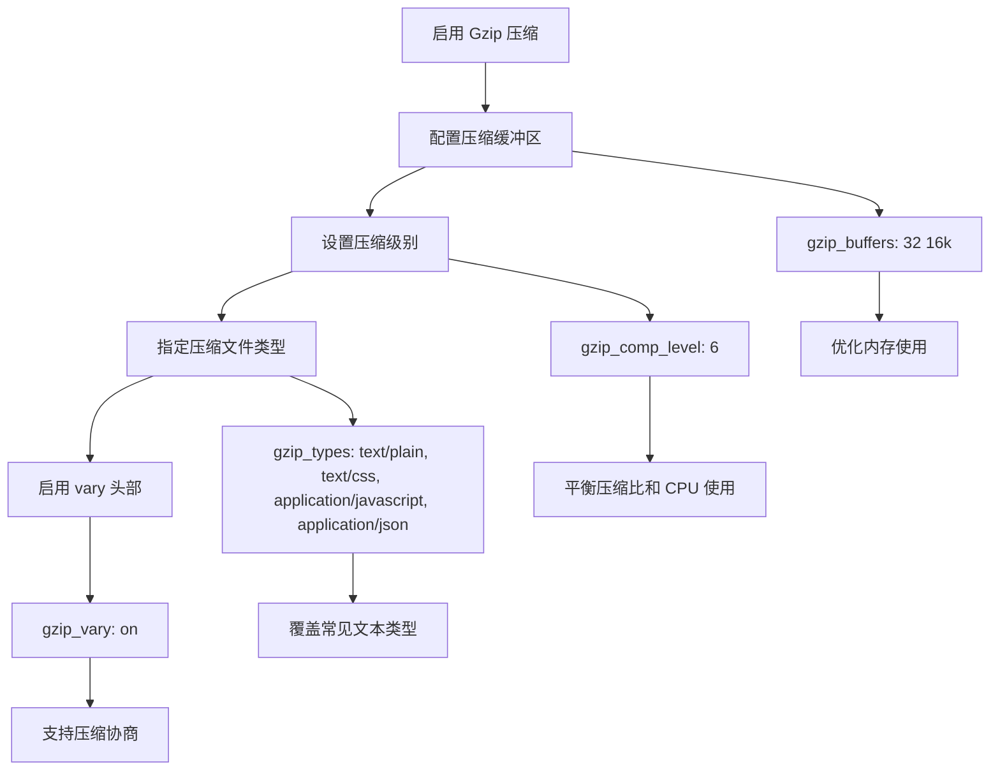

**图表来源**

- [nginx.conf:33-47](file://scripts/deploy/nginx.conf#L33-L47)

#### Gzip 配置建议

虽然当前配置注释掉了 Gzip 功能，但推荐启用以下配置：

1. **压缩缓冲区**：32 个 16KB 缓冲区
2. **压缩级别**：6（平衡压缩比和性能）
3. **压缩文件类型**：文本、CSS、JavaScript、JSON
4. **Vary 头部**：支持压缩协商

### 连接池和并发处理

Nginx 的事件模型和连接处理能力直接影响服务器性能。

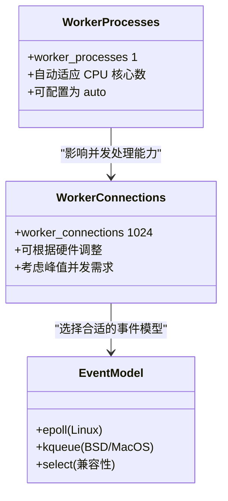

**图表来源**

- [nginx.conf:3](file://scripts/deploy/nginx.conf#L3)
- [nginx.conf:13](file://scripts/deploy/nginx.conf#L13)

#### 并发处理优化

1. **工作进程数量**：建议设置为 CPU 核心数
2. **连接数限制**：根据服务器硬件和预期流量调整
3. **事件模型选择**：Linux 系统推荐 epoll
4. **keepalive 超时**：合理设置保持连接时间

**章节来源**

- [nginx.conf:3](file://scripts/deploy/nginx.conf#L3)
- [nginx.conf:13](file://scripts/deploy/nginx.conf#L13)

### 静态文件优化

静态文件服务是 Nginx 的核心功能，需要特别关注性能优化。

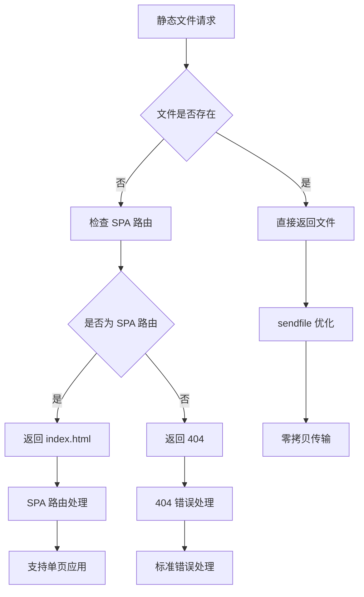

**图表来源**

- [nginx.conf:53-56](file://scripts/deploy/nginx.conf#L53-L56)

#### 静态文件优化要点

1. **sendfile 优化**：启用 sendfile 提升文件传输性能
2. **SPA 路由支持**：通过 try_files 实现单页应用路由
3. **文件缓存**：合理设置缓存策略减少重复请求
4. **压缩支持**：启用 Gzip 压缩减少传输体积

**章节来源**

- [nginx.conf:53-56](file://scripts/deploy/nginx.conf#L53-L56)

## 故障排除指南

### 常见问题诊断

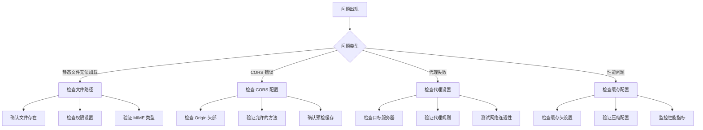

#### 静态文件问题排查

1. **文件路径检查**：确认静态文件存在于 `/usr/share/nginx/html` 目录
2. **权限验证**：确保 Nginx 用户具有读取权限
3. **MIME 类型验证**：检查文件扩展名与 MIME 类型匹配
4. **缓存清理**：清除浏览器缓存重新测试

#### CORS 问题排查

1. **Origin 头部检查**：验证客户端发送的 Origin 头部
2. **允许方法验证**：确认请求的 HTTP 方法在允许列表中
3. **预检请求测试**：检查 OPTIONS 预检请求的响应
4. **缓存时间验证**：确认 Access-Control-Max-Age 设置正确

#### 代理问题排查

1. **目标服务器状态**：验证 API 服务器是否正常运行
2. **网络连通性**：检查防火墙和网络配置
3. **代理规则验证**：确认代理路径和目标地址正确
4. **WebSocket 支持**：验证 WebSocket 代理配置

**章节来源**

- [nginx.conf:57-66](file://scripts/deploy/nginx.conf#L57-L66)
- [vite.config.ts:8-16](file://apps/web-naive/vite.config.ts#L8-L16)

### 日志配置和监控

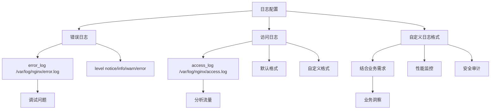

#### 日志配置建议

1. **错误日志**：配置适当的日志级别以便问题诊断
2. **访问日志**：记录重要的访问信息用于分析
3. **自定义格式**：根据业务需求定制日志格式
4. **轮转策略**：设置日志文件大小和保留策略

**章节来源**

- [nginx.conf:5](file://scripts/deploy/nginx.conf#L5)

## 结论

shiyu-ui 项目的 Nginx 配置展现了现代 Web 应用部署的最佳实践。通过容器化部署、模块化配置和性能优化，实现了高效稳定的静态文件服务和 API 反向代理。

### 关键优势

1. **容器化部署**：Docker 多阶段构建确保了环境一致性和部署效率
2. **模块化配置**：清晰的配置结构便于维护和扩展
3. **性能优化**：合理的缓存策略和压缩配置提升了用户体验
4. **安全考虑**：完整的 CORS 支持和错误页面处理增强了安全性

### 改进建议

1. **启用 Gzip 压缩**：提升静态资源传输性能
2. **优化缓存策略**：针对不同类型资源设置合适的缓存时间
3. **增强安全配置**：添加 HTTPS 支持和安全头部
4. **监控和日志**：完善日志记录和性能监控机制

该配置为 shiyu-ui 项目提供了坚实的技术基础，能够满足生产环境的高性能要求，同时保持了良好的可维护性和扩展性。
