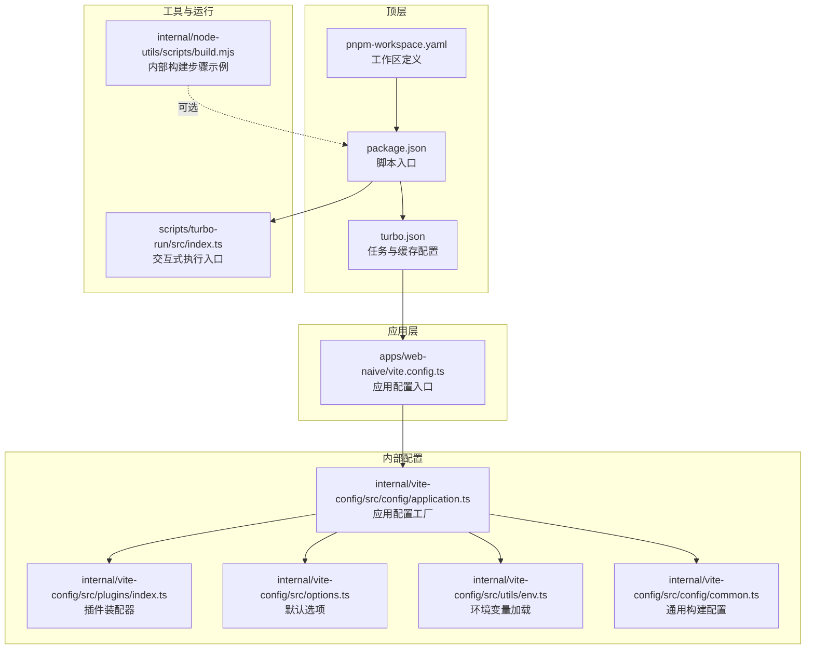
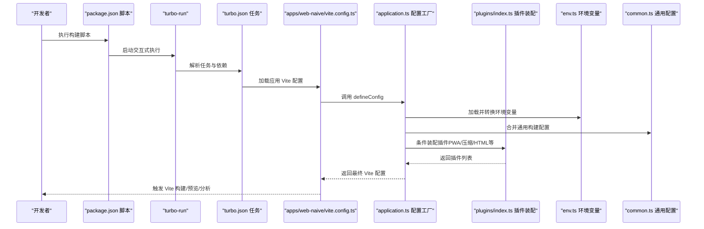
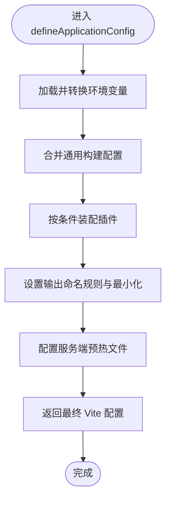
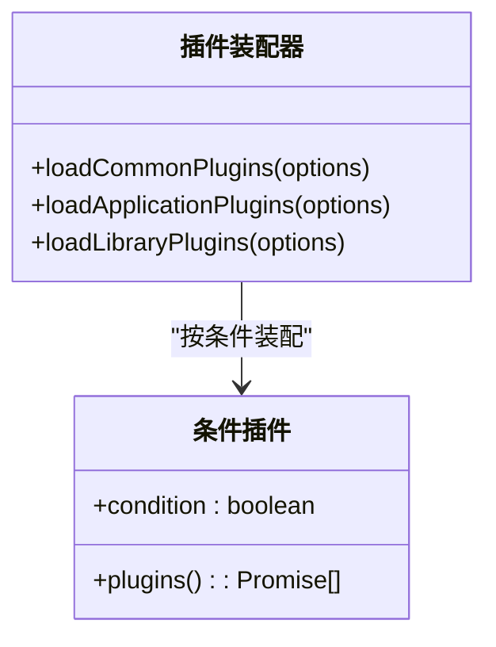
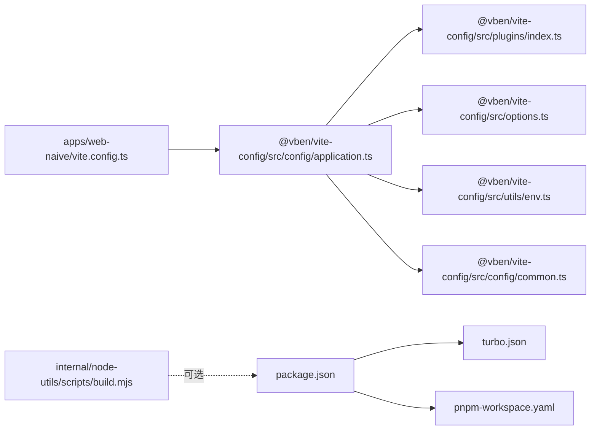

# 构建流程

<cite>
**本文引用的文件**
- [turbo.json](file://turbo.json)
- [package.json](file://package.json)
- [pnpm-workspace.yaml](file://pnpm-workspace.yaml)
- [apps/web-naive/vite.config.ts](file://apps/web-naive/vite.config.ts)
- [internal/vite-config/src/index.ts](file://internal/vite-config/src/index.ts)
- [internal/vite-config/src/config/application.ts](file://internal/vite-config/src/config/application.ts)
- [internal/vite-config/src/config/common.ts](file://internal/vite-config/src/config/common.ts)
- [internal/vite-config/src/plugins/index.ts](file://internal/vite-config/src/plugins/index.ts)
- [internal/vite-config/src/options.ts](file://internal/vite-config/src/options.ts)
- [internal/vite-config/src/utils/env.ts](file://internal/vite-config/src/utils/env.ts)
- [internal/node-utils/scripts/build.mjs](file://internal/node-utils/scripts/build.mjs)
- [internal/node-utils/src/monorepo.ts](file://internal/node-utils/src/monorepo.ts)
- [scripts/turbo-run/src/index.ts](file://scripts/turbo-run/src/index.ts)
- [internal/vite-config/package.json](file://internal/vite-config/package.json)
</cite>

## 目录

1. [简介](#简介)
2. [项目结构](#项目结构)
3. [核心组件](#核心组件)
4. [架构总览](#架构总览)
5. [详细组件分析](#详细组件分析)
6. [依赖关系分析](#依赖关系分析)
7. [性能考量](#性能考量)
8. [故障排查指南](#故障排查指南)
9. [结论](#结论)
10. [附录](#附录)

## 简介

本文件系统化梳理 shiyu-ui 项目的构建流程，覆盖以下关键主题：

- Vite 构建配置：开发与生产环境差异、插件装配、资源打包策略（代码分割、Tree Shaking、压缩）。
- Turbo Monorepo 构建策略与并行优化：任务依赖、输出缓存、持久化与增量构建。
- 静态资源打包：产物目录结构、文件命名规则、资源分块与压缩。
- 性能优化最佳实践：缓存、预热、可视化分析、增量构建。
- 常见失败原因与解决方案。

## 项目结构

本项目采用 pnpm + Turbo 的 Monorepo 架构，核心构建链路由以下部分组成：

- 应用层 Vite 配置：各应用在自身目录下导出 Vite 配置，统一通过内部 @vben/vite-config 提供的 defineConfig 组合应用级与通用配置。
- 内部配置与插件：@vben/vite-config 负责加载环境变量、合并通用配置、按需装配插件（PWA、压缩、HTML 注入、导入映射等）。
- 顶层脚本与缓存：Turbo 管理任务依赖与缓存；pnpm 管理工作区与依赖；可选的 node-utils 提供构建步骤封装。

图表来源

- [package.json:1-110](file://package.json#L1-L110)
- [turbo.json:1-49](file://turbo.json#L1-L49)
- [pnpm-workspace.yaml:1-192](file://pnpm-workspace.yaml#L1-L192)
- [apps/web-naive/vite.config.ts:1-21](file://apps/web-naive/vite.config.ts#L1-L21)
- [internal/vite-config/src/config/application.ts:1-124](file://internal/vite-config/src/config/application.ts#L1-L124)
- [internal/vite-config/src/plugins/index.ts:1-255](file://internal/vite-config/src/plugins/index.ts#L1-L255)
- [internal/vite-config/src/options.ts:1-46](file://internal/vite-config/src/options.ts#L1-L46)
- [internal/vite-config/src/utils/env.ts:1-111](file://internal/vite-config/src/utils/env.ts#L1-L111)
- [internal/vite-config/src/config/common.ts:1-14](file://internal/vite-config/src/config/common.ts#L1-L14)
- [scripts/turbo-run/src/index.ts:1-24](file://scripts/turbo-run/src/index.ts#L1-L24)
- [internal/node-utils/scripts/build.mjs:1-41](file://internal/node-utils/scripts/build.mjs#L1-L41)

章节来源

- [package.json:1-110](file://package.json#L1-L110)
- [turbo.json:1-49](file://turbo.json#L1-L49)
- [pnpm-workspace.yaml:1-192](file://pnpm-workspace.yaml#L1-L192)

## 核心组件

- 应用配置工厂：负责加载环境变量、合并通用配置、按命令（开发/构建）装配插件，并生成最终 Vite 配置。
- 插件装配器：根据条件动态启用插件，如 PWA、压缩、HTML 注入、导入映射、Nitro Mock、版权注入等。
- 通用构建配置：统一设置警告阈值、是否生成 Source Map、压缩报告等。
- 环境变量加载：从多份 .env 文件中解析以 VITE\_ 开头的变量，并转换为应用配置项。
- 顶层任务编排：Turbo 定义任务依赖、输出缓存、持久化与缓存开关，实现跨包并行与增量构建。

章节来源

- [internal/vite-config/src/config/application.ts:17-99](file://internal/vite-config/src/config/application.ts#L17-L99)
- [internal/vite-config/src/plugins/index.ts:94-223](file://internal/vite-config/src/plugins/index.ts#L94-L223)
- [internal/vite-config/src/config/common.ts:3-11](file://internal/vite-config/src/config/common.ts#L3-L11)
- [internal/vite-config/src/utils/env.ts:66-108](file://internal/vite-config/src/utils/env.ts#L66-L108)
- [turbo.json:15-47](file://turbo.json#L15-L47)

## 架构总览

下图展示从顶层脚本到应用配置、再到插件装配与构建产物的整体流程。

图表来源

- [package.json:27-66](file://package.json#L27-L66)
- [scripts/turbo-run/src/index.ts:7-23](file://scripts/turbo-run/src/index.ts#L7-L23)
- [turbo.json:15-47](file://turbo.json#L15-L47)
- [apps/web-naive/vite.config.ts:3-20](file://apps/web-naive/vite.config.ts#L3-L20)
- [internal/vite-config/src/config/application.ts:17-99](file://internal/vite-config/src/config/application.ts#L17-L99)
- [internal/vite-config/src/plugins/index.ts:94-223](file://internal/vite-config/src/plugins/index.ts#L94-L223)
- [internal/vite-config/src/utils/env.ts:66-108](file://internal/vite-config/src/utils/env.ts#L66-L108)
- [internal/vite-config/src/config/common.ts:3-11](file://internal/vite-config/src/config/common.ts#L3-L11)

## 详细组件分析

### Vite 应用配置工厂（defineApplicationConfig）

- 功能要点
  - 加载环境变量并转换为应用配置项（标题、基础路径、端口、压缩类型、PWA 开关等）。
  - 按命令区分开发/构建，动态启用/禁用插件（如开发工具、Nitro Mock）。
  - 合并通用构建配置（警告阈值、Source Map、压缩报告）。
  - 输出文件命名规则：资源、入口、分块文件名包含哈希，便于缓存与更新。
  - 生产构建启用最小化，移除调试语句。
  - 预热关键文件，加速首次启动。

图表来源

- [internal/vite-config/src/config/application.ts:17-99](file://internal/vite-config/src/config/application.ts#L17-L99)
- [internal/vite-config/src/config/common.ts:3-11](file://internal/vite-config/src/config/common.ts#L3-L11)
- [internal/vite-config/src/utils/env.ts:66-108](file://internal/vite-config/src/utils/env.ts#L66-L108)

章节来源

- [internal/vite-config/src/config/application.ts:17-99](file://internal/vite-config/src/config/application.ts#L17-L99)
- [internal/vite-config/src/config/common.ts:3-11](file://internal/vite-config/src/config/common.ts#L3-L11)
- [internal/vite-config/src/utils/env.ts:66-108](file://internal/vite-config/src/utils/env.ts#L66-L108)

### 插件装配器（loadApplicationPlugins）

- 功能要点
  - 通用插件：Vue、JSX、TailwindCSS、元数据注入等。
  - 开发期插件：Vue DevTools（仅开发）。
  - 构建期插件：可视化分析、压缩（Brotli/Gzip）、PWA、HTML 注入、导入映射、版权注入、归档等。
  - 条件装配：根据 isBuild、compressTypes、pwa、html、importmap 等选项决定启用哪些插件。
  - 插件顺序：通过 enforce 与 order 控制生成阶段（如版权注入在 post 阶段）。

图表来源

- [internal/vite-config/src/plugins/index.ts:36-223](file://internal/vite-config/src/plugins/index.ts#L36-L223)

章节来源

- [internal/vite-config/src/plugins/index.ts:94-223](file://internal/vite-config/src/plugins/index.ts#L94-L223)

### 环境变量加载与转换（loadAndConvertEnv）

- 功能要点
  - 自动识别模式对应的 .env 文件集合（.env、.env.local、.env.production、.env.production.local）。
  - 过滤以 VITE\_ 前缀的变量，转换布尔与数值类型。
  - 将压缩类型拆分为数组（brotli/gzip），并映射到构建配置。

章节来源

- [internal/vite-config/src/utils/env.ts:18-108](file://internal/vite-config/src/utils/env.ts#L18-L108)

### 通用构建配置（getCommonConfig）

- 功能要点
  - 设置较大的分块体积警告阈值，避免误报。
  - 关闭压缩报告与 Source Map，降低构建开销（可在应用层覆盖）。

章节来源

- [internal/vite-config/src/config/common.ts:3-11](file://internal/vite-config/src/config/common.ts#L3-L11)

### 应用层 Vite 配置（apps/web-naive/vite.config.ts）

- 功能要点
  - 通过 @vben/vite-config 的 defineConfig 组合应用级与通用配置。
  - 配置开发服务器代理（示例：/api 重写与后端目标地址）。

章节来源

- [apps/web-naive/vite.config.ts:1-21](file://apps/web-naive/vite.config.ts#L1-L21)

### 内部配置包导出（internal/vite-config/src/index.ts）

- 功能要点
  - 导出配置工厂、选项、插件与类型，供应用层使用。

章节来源

- [internal/vite-config/src/index.ts:1-6](file://internal/vite-config/src/index.ts#L1-L6)

### 顶层脚本与运行入口

- package.json
  - 构建入口：通过 cross-env 与 turbo 并行构建所有包。
  - 开发入口：turbo-run 提供交互式执行。
- turbo-run
  - 命令行入口，调用 run 执行任务。

章节来源

- [package.json:27-66](file://package.json#L27-L66)
- [scripts/turbo-run/src/index.ts:7-23](file://scripts/turbo-run/src/index.ts#L7-L23)

### Monorepo 工具（findMonorepoRoot 与包发现）

- 功能要点
  - 在任意子包内定位 pnpm 锁文件所在根目录，用于共享全局配置与资源。
  - 提供同步/异步获取包列表的能力，辅助工具链（如注入全局样式）。

章节来源

- [internal/node-utils/src/monorepo.ts:14-56](file://internal/node-utils/src/monorepo.ts#L14-L56)

### 内部构建步骤示例（internal/node-utils/scripts/build.mjs）

- 功能要点
  - 串行执行 tsdown 与 tsc 发射声明文件，作为内部包构建的参考步骤。
  - 使用 spawnSync 同步等待并处理错误与退出码。

章节来源

- [internal/node-utils/scripts/build.mjs:1-41](file://internal/node-utils/scripts/build.mjs#L1-L41)

## 依赖关系分析

- 包导出与入口
  - @vben/vite-config 通过 dist/index.mjs 暴露入口，供应用层 import defineConfig 使用。
- 顶层依赖与工作区
  - pnpm-workspace.yaml 定义了 internal/_、packages/_、apps/_、scripts/_ 等工作区范围。
  - catalog 字段集中管理版本与依赖，保证一致性。

图表来源

- [package.json:1-110](file://package.json#L1-L110)
- [turbo.json:1-49](file://turbo.json#L1-L49)
- [pnpm-workspace.yaml:1-192](file://pnpm-workspace.yaml#L1-L192)
- [apps/web-naive/vite.config.ts:1-21](file://apps/web-naive/vite.config.ts#L1-L21)
- [internal/vite-config/src/config/application.ts:1-124](file://internal/vite-config/src/config/application.ts#L1-L124)
- [internal/vite-config/src/plugins/index.ts:1-255](file://internal/vite-config/src/plugins/index.ts#L1-L255)
- [internal/vite-config/src/options.ts:1-46](file://internal/vite-config/src/options.ts#L1-L46)
- [internal/vite-config/src/utils/env.ts:1-111](file://internal/vite-config/src/utils/env.ts#L1-L111)
- [internal/vite-config/src/config/common.ts:1-14](file://internal/vite-config/src/config/common.ts#L1-L14)
- [internal/node-utils/scripts/build.mjs:1-41](file://internal/node-utils/scripts/build.mjs#L1-L41)

章节来源

- [internal/vite-config/package.json:1-61](file://internal/vite-config/package.json#L1-L61)
- [pnpm-workspace.yaml:1-192](file://pnpm-workspace.yaml#L1-L192)

## 性能考量

- 并行与增量
  - Turbo 通过 globalDependencies 与 tasks 配置，对构建任务进行依赖拓扑排序与缓存控制，显著提升大型 Monorepo 的构建效率。
  - 缓存命中：当依赖未变更时跳过任务；持久化任务（dev）保持长驻状态，减少冷启动成本。
- 预热与冷启动
  - 服务端预热配置提前编译关键文件，缩短首次启动时间。
- 资源体积与分块
  - 大体积警告阈值上调，避免误报干扰。
  - 输出命名包含哈希，结合浏览器缓存策略实现长效缓存。
- 压缩与分析
  - 构建期可启用 Brotli/Gzip 压缩，配合可视化分析工具定位大体积模块。
- Source Map 与报告
  - 默认关闭 Source Map 与压缩报告，降低构建时间；可在需要时开启。

章节来源

- [turbo.json:3-47](file://turbo.json#L3-L47)
- [internal/vite-config/src/config/application.ts:82-90](file://internal/vite-config/src/config/application.ts#L82-L90)
- [internal/vite-config/src/config/common.ts:5-11](file://internal/vite-config/src/config/common.ts#L5-L11)
- [internal/vite-config/src/plugins/index.ts:184-199](file://internal/vite-config/src/plugins/index.ts#L184-L199)

## 故障排查指南

- 构建失败（进程退出码非零）
  - 现象：构建脚本执行后直接退出，无详细日志。
  - 排查：检查内部构建步骤示例中的错误处理逻辑，确认子进程返回状态码与错误对象。
  - 解决：修复上游依赖或配置问题，确保子进程成功退出。
- 环境变量未生效
  - 现象：VITE\_ 前缀变量未被识别或类型转换异常。
  - 排查：确认 .env 文件存在且包含正确键值；检查模式匹配（如 production）；确认变量名以 VITE\_ 开头。
  - 解决：修正 .env 文件内容与键名，确保与 loadAndConvertEnv 的预期一致。
- 插件未按预期启用
  - 现象：PWA、压缩、HTML 注入等功能未生效。
  - 排查：核对 isBuild 与对应开关（如 compress、pwa、html）；确认条件判断逻辑。
  - 解决：在环境变量中开启相应开关，或在应用配置中显式传入。
- 依赖未变更但缓存未命中
  - 现象：修改了全局依赖（如 .env 或 tsconfig），但任务仍走缓存。
  - 排查：检查 turbo.json 中 globalDependencies 是否包含相关文件。
  - 解决：将新增的全局依赖加入 globalDependencies 列表。
- 开发服务器代理无效
  - 现象：/api 请求未被代理到目标地址。
  - 排查：确认应用层 vite.config.ts 中的 proxy 配置与目标地址正确。
  - 解决：修正 target、rewrite 与 changeOrigin 等参数。

章节来源

- [internal/node-utils/scripts/build.mjs:28-40](file://internal/node-utils/scripts/build.mjs#L28-L40)
- [internal/vite-config/src/utils/env.ts:37-64](file://internal/vite-config/src/utils/env.ts#L37-L64)
- [internal/vite-config/src/plugins/index.ts:94-223](file://internal/vite-config/src/plugins/index.ts#L94-L223)
- [turbo.json:3-13](file://turbo.json#L3-L13)
- [apps/web-naive/vite.config.ts:7-16](file://apps/web-naive/vite.config.ts#L7-L16)

## 结论

本项目通过 @vben/vite-config 统一管理 Vite 配置与插件装配，结合 Turbo 的任务编排与缓存机制，在 Monorepo 场景下实现了高效、可维护的构建体系。开发者可通过环境变量灵活切换功能与压缩策略，并利用可视化分析与预热机制持续优化构建性能。遇到问题时，建议从环境变量、插件条件、缓存配置与代理设置四个维度逐项排查。

## 附录

### 构建产物目录与命名规则

- 目录结构
  - 应用构建产物通常位于各应用的 dist 目录；部分任务会产出 dist.zip 或文档站点的 .vitepress/dist。
- 命名规则
  - 资源文件：[扩展名]/[文件名]-[哈希].[扩展名]
  - 分块文件：js/[文件名]-[哈希].js
  - 入口文件：jse/index-[文件名]-[哈希].js
- 最小化与压缩
  - 生产构建启用最小化，移除调试语句；可选启用 Brotli/Gzip 压缩（通过插件与环境变量控制）。

章节来源

- [internal/vite-config/src/config/application.ts:60-76](file://internal/vite-config/src/config/application.ts#L60-L76)
- [internal/vite-config/src/plugins/index.ts:184-199](file://internal/vite-config/src/plugins/index.ts#L184-L199)

### 开发与生产环境差异

- 开发环境
  - 启用 Vue DevTools（开发期）、Nitro Mock（开发期）、元数据注入、PWA（可选）。
  - 关闭压缩报告与 Source Map，提高开发体验。
- 生产环境
  - 启用最小化、压缩（Brotli/Gzip）、可视化分析（可选）、版权注入（post 阶段）。
  - 输出命名包含哈希，便于缓存与更新。

章节来源

- [internal/vite-config/src/config/application.ts:27-54](file://internal/vite-config/src/config/application.ts#L27-L54)
- [internal/vite-config/src/plugins/index.ts:70-87](file://internal/vite-config/src/plugins/index.ts#L70-L87)
- [internal/vite-config/src/plugins/index.ts:167-182](file://internal/vite-config/src/plugins/index.ts#L167-L182)
- [internal/vite-config/src/config/common.ts:5-11](file://internal/vite-config/src/config/common.ts#L5-L11)
