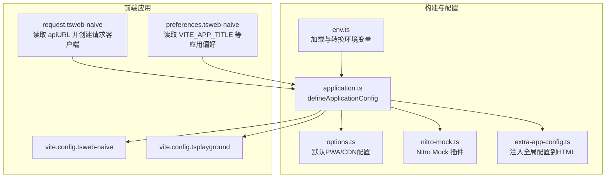
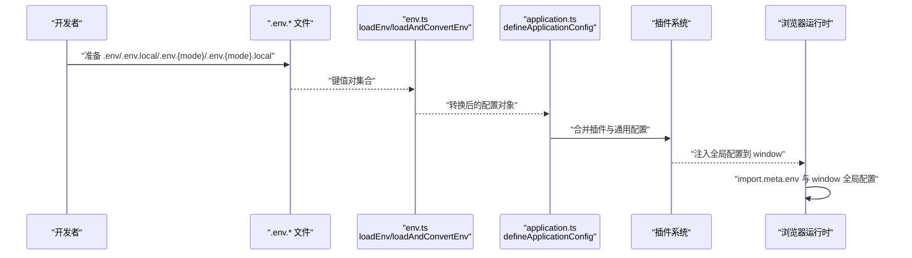
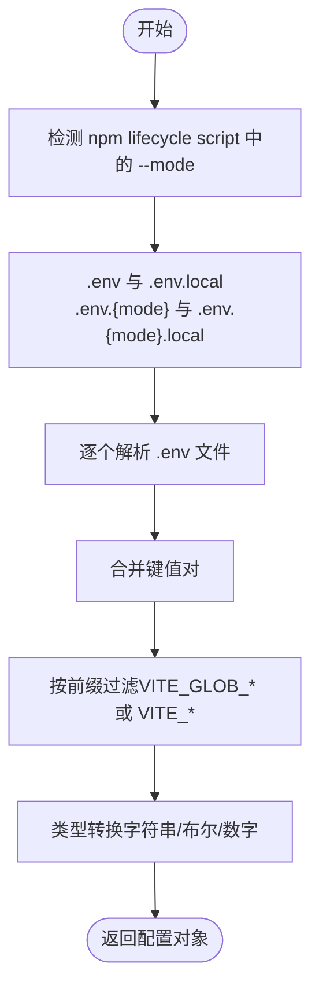
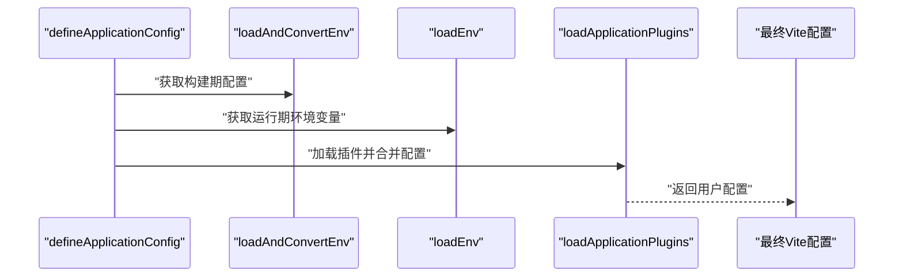
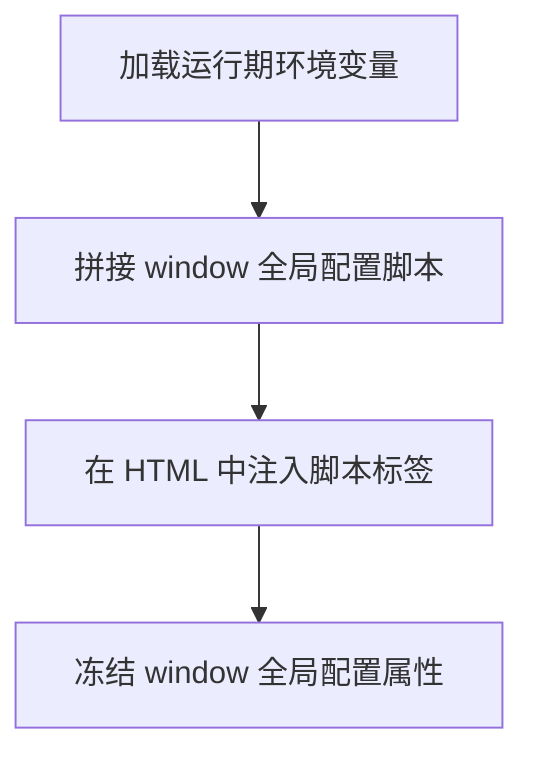
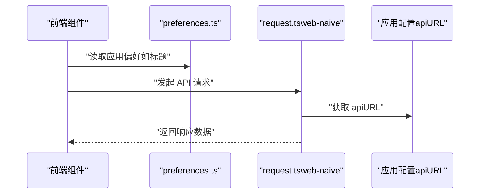
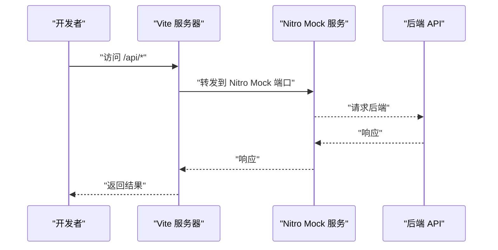
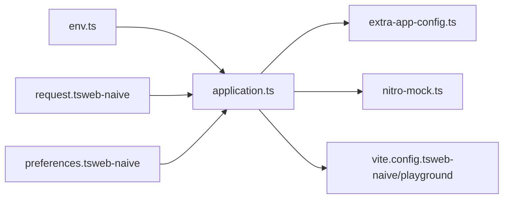

# 环境管理

<cite>
**本文引用的文件**
- [env.ts](file://internal/vite-config/src/utils/env.ts)
- [application.ts](file://internal/vite-config/src/config/application.ts)
- [request.ts（web-naive）](file://apps/web-naive/src/api/request.ts)
- [preferences.ts（web-naive）](file://apps/web-naive/src/preferences.ts)
- [nitro-mock.ts](file://internal/vite-config/src/plugins/nitro-mock.ts)
- [options.ts](file://internal/vite-config/src/options.ts)
- [vite.config.ts（web-naive）](file://apps/web-naive/vite.config.ts)
- [vite.config.ts（playground）](file://playground/vite.config.ts)
- [extra-app-config.ts](file://internal/vite-config/src/plugins/extra-app-config.ts)
- [types.ts（@core/preferences）](file://packages/@core/preferences/src/types.ts)
</cite>

## 目录

1. [简介](#简介)
2. [项目结构](#项目结构)
3. [核心组件](#核心组件)
4. [架构总览](#架构总览)
5. [详细组件分析](#详细组件分析)
6. [依赖关系分析](#依赖关系分析)
7. [性能考量](#性能考量)
8. [故障排查指南](#故障排查指南)
9. [结论](#结论)
10. [附录](#附录)

## 简介

本文件系统化梳理 shiyu-ui 项目的环境变量管理机制，覆盖开发、测试与生产三类环境的配置文件结构与加载流程；解释前端运行时环境变量的命名规范与使用方式；说明 API 端点、构建参数等关键配置如何通过环境变量注入；并给出敏感信息保护、自动化部署注入、最佳实践与常见陷阱、以及调试排错建议，帮助开发团队在多环境中安全高效地管理配置。

## 项目结构

- 环境变量加载与转换由内部 Vite 配置工具统一实现，位于 internal/vite-config/src/utils/env.ts。
- 应用级 Vite 配置通过 defineApplicationConfig 聚合加载环境变量，并注入到插件与构建参数中。
- 前端应用通过 import.meta.env 读取构建时注入的只读配置；同时通过额外注入的 window 全局对象暴露部分配置。
- API 请求客户端从应用配置中读取后端 API 根路径，支持开发代理与 Nitro Mock 服务联动。
- Playground 与 web-naive 应用共享同一套 Vite 配置与环境变量体系。

图表来源

- [env.ts:1-111](file://internal/vite-config/src/utils/env.ts#L1-L111)
- [application.ts:1-124](file://internal/vite-config/src/config/application.ts#L1-L124)
- [options.ts:1-46](file://internal/vite-config/src/options.ts#L1-L46)
- [nitro-mock.ts:1-98](file://internal/vite-config/src/plugins/nitro-mock.ts#L1-L98)
- [extra-app-config.ts:63-92](file://internal/vite-config/src/plugins/extra-app-config.ts#L63-L92)
- [request.ts（web-naive）:1-114](file://apps/web-naive/src/api/request.ts#L1-L114)
- [preferences.ts（web-naive）:1-17](file://apps/web-naive/src/preferences.ts#L1-L17)
- [vite.config.ts（web-naive）:1-21](file://apps/web-naive/vite.config.ts#L1-L21)
- [vite.config.ts（playground）:1-20](file://playground/vite.config.ts#L1-L20)

章节来源

- [env.ts:1-111](file://internal/vite-config/src/utils/env.ts#L1-L111)
- [application.ts:1-124](file://internal/vite-config/src/config/application.ts#L1-L124)
- [options.ts:1-46](file://internal/vite-config/src/options.ts#L1-L46)
- [nitro-mock.ts:1-98](file://internal/vite-config/src/plugins/nitro-mock.ts#L1-L98)
- [extra-app-config.ts:63-92](file://internal/vite-config/src/plugins/extra-app-config.ts#L63-L92)
- [request.ts（web-naive）:1-114](file://apps/web-naive/src/api/request.ts#L1-L114)
- [preferences.ts（web-naive）:1-17](file://apps/web-naive/src/preferences.ts#L1-L17)
- [vite.config.ts（web-naive）:1-21](file://apps/web-naive/vite.config.ts#L1-L21)
- [vite.config.ts（playground）:1-20](file://playground/vite.config.ts#L1-L20)

## 核心组件

- 环境变量加载与过滤：按当前 npm lifecycle script 解析 --mode，生成 .env.\* 文件列表，逐个解析并仅保留匹配前缀的键值。
- 环境变量转换：将字符串/布尔/数字等类型转换为适合应用配置的值，并映射到构建参数（如端口、基础路径、PWA、可视化等）。
- 应用配置聚合：defineApplicationConfig 统一加载环境变量，合并插件与通用配置，输出最终 Vite 用户配置。
- 全局配置注入：通过 extra-app-config 插件将环境变量以只读形式注入到浏览器 window 对象，供前端运行时读取。
- API 客户端与偏好设置：前端通过 useAppConfig 读取 apiURL，preferences 读取应用标题等运行时偏好。

章节来源

- [env.ts:18-108](file://internal/vite-config/src/utils/env.ts#L18-L108)
- [application.ts:17-99](file://internal/vite-config/src/config/application.ts#L17-L99)
- [extra-app-config.ts:73-86](file://internal/vite-config/src/plugins/extra-app-config.ts#L73-L86)
- [request.ts（web-naive）:21-21](file://apps/web-naive/src/api/request.ts#L21-L21)
- [preferences.ts（web-naive）:8-16](file://apps/web-naive/src/preferences.ts#L8-L16)

## 架构总览

下图展示从环境变量文件到前端运行时配置的整体链路，包括构建期注入与运行期读取。

图表来源

- [env.ts:37-108](file://internal/vite-config/src/utils/env.ts#L37-L108)
- [application.ts:17-99](file://internal/vite-config/src/config/application.ts#L17-L99)
- [extra-app-config.ts:73-86](file://internal/vite-config/src/plugins/extra-app-config.ts#L73-L86)

## 详细组件分析

### 环境变量加载与转换（env.ts）

- 文件加载顺序：优先级从低到高依次为 .env → .env.local → .env.{mode} → .env.{mode}.local，后读取的键值覆盖先前同名键。
- 命名规范：
  - 构建期过滤前缀：默认匹配 VITE*GLOB*\*，用于生成构建期配置。
  - 运行期过滤前缀：默认匹配 VITE\_\*，用于注入到浏览器 window 与 import.meta.env。
- 类型转换：
  - 字符串：支持回退值。
  - 布尔：仅当值严格等于 "true" 时视为真。
  - 数字：非数值回退为默认值。
- 返回值：构建期返回 ApplicationPluginOptions 与基础应用参数（如 appTitle/base/port），运行期返回 window 全局配置对象。

图表来源

- [env.ts:21-108](file://internal/vite-config/src/utils/env.ts#L21-L108)

章节来源

- [env.ts:18-108](file://internal/vite-config/src/utils/env.ts#L18-L108)

### 应用配置聚合（application.ts）

- 加载顺序：先 loadAndConvertEnv，再 loadEnv（获取运行期环境变量），最后合并插件与通用配置。
- 关键行为：
  - 读取 appTitle/base/port 等基础参数。
  - 启用/禁用插件（如 PWA、压缩、可视化、导入映射、Nitro Mock 等）。
  - 设置开发服务器 host/port、预热文件、构建输出命名规则等。
- 与 extra-app-config 插件协作：将运行期环境变量注入到 HTML 的 window 对象，保证只读与冻结。

图表来源

- [application.ts:17-99](file://internal/vite-config/src/config/application.ts#L17-L99)

章节来源

- [application.ts:17-99](file://internal/vite-config/src/config/application.ts#L17-L99)

### 全局配置注入（extra-app-config.ts）

- 将运行期环境变量以只读形式注入到浏览器 window 对象，防止运行时篡改。
- 注入时机：在 HTML transform 阶段追加脚本标签，动态设置 window 上的全局配置对象并冻结其属性。

图表来源

- [extra-app-config.ts:73-86](file://internal/vite-config/src/plugins/extra-app-config.ts#L73-L86)

章节来源

- [extra-app-config.ts:63-92](file://internal/vite-config/src/plugins/extra-app-config.ts#L63-L92)

### API 客户端与偏好设置（web-naive）

- API 客户端：
  - 从应用配置中读取 apiURL，创建请求客户端实例。
  - 统一添加请求头（鉴权令牌、语言）、响应拦截器（默认数据结构、刷新令牌、错误提示）。
- 偏好设置：
  - 读取 VITE_APP_TITLE 等运行期配置，覆盖默认偏好。

图表来源

- [request.ts（web-naive）:21-21](file://apps/web-naive/src/api/request.ts#L21-L21)
- [preferences.ts（web-naive）:8-16](file://apps/web-naive/src/preferences.ts#L8-L16)

章节来源

- [request.ts（web-naive）:1-114](file://apps/web-naive/src/api/request.ts#L1-L114)
- [preferences.ts（web-naive）:1-17](file://apps/web-naive/src/preferences.ts#L1-L17)

### Nitro Mock 插件（开发代理与本地后端）

- 在开发阶段启用 Nitro Mock 服务，监听指定端口，自动重启与热更新。
- 与 Vite 代理配合：前端 /api 前缀请求可经由代理或 Nitro Mock 服务转发至后端。

图表来源

- [nitro-mock.ts:12-46](file://internal/vite-config/src/plugins/nitro-mock.ts#L12-L46)
- [vite.config.ts（web-naive）:7-17](file://apps/web-naive/vite.config.ts#L7-L17)

章节来源

- [nitro-mock.ts:1-98](file://internal/vite-config/src/plugins/nitro-mock.ts#L1-L98)
- [vite.config.ts（web-naive）:1-21](file://apps/web-naive/vite.config.ts#L1-L21)

## 依赖关系分析

- 环境变量工具（env.ts）被应用配置（application.ts）调用，后者决定插件启用与构建参数。
- extra-app-config 插件依赖运行期环境变量，将其注入到浏览器窗口。
- API 客户端依赖应用配置提供的 apiURL，preferences 依赖运行期环境变量（如应用标题）。
- Nitro Mock 插件与 Vite 代理共同服务于开发阶段的 API 访问。

图表来源

- [env.ts:1-111](file://internal/vite-config/src/utils/env.ts#L1-L111)
- [application.ts:1-124](file://internal/vite-config/src/config/application.ts#L1-L124)
- [extra-app-config.ts:63-92](file://internal/vite-config/src/plugins/extra-app-config.ts#L63-L92)
- [nitro-mock.ts:1-98](file://internal/vite-config/src/plugins/nitro-mock.ts#L1-L98)
- [vite.config.ts（web-naive）:1-21](file://apps/web-naive/vite.config.ts#L1-L21)
- [vite.config.ts（playground）:1-20](file://playground/vite.config.ts#L1-L20)
- [request.ts（web-naive）:1-114](file://apps/web-naive/src/api/request.ts#L1-L114)
- [preferences.ts（web-naive）:1-17](file://apps/web-naive/src/preferences.ts#L1-L17)

章节来源

- [application.ts:17-99](file://internal/vite-config/src/config/application.ts#L17-L99)
- [extra-app-config.ts:73-86](file://internal/vite-config/src/plugins/extra-app-config.ts#L73-L86)
- [request.ts（web-naive）:21-21](file://apps/web-naive/src/api/request.ts#L21-L21)
- [preferences.ts（web-naive）:8-16](file://apps/web-naive/src/preferences.ts#L8-L16)

## 性能考量

- 构建期配置转换：仅在开发与构建阶段执行一次，避免重复解析与转换开销。
- 插件启用策略：按需启用压缩、可视化、PWA 等插件，减少不必要的打包与注入成本。
- 预热与缓存：开发服务器预热关键入口文件，缩短首次启动时间。
- CDN 导入映射：默认提供常用库的 CDN 导入映射，提升冷启动速度（需注意网络稳定性）。

## 故障排查指南

- 环境变量未生效
  - 检查 .env 文件是否位于项目根目录，且文件名符合约定（含 --mode）。
  - 确认键名前缀是否匹配（构建期为 VITE*GLOB*\_，运行期为 VITE\_\_）。
  - 查看控制台是否有解析错误日志。
- API 请求失败
  - 确认 apiURL 是否正确（来自应用配置），开发阶段是否通过代理或 Nitro Mock 正常转发。
  - 检查鉴权头是否正确注入（Authorization）。
- 运行期配置不可写
  - 确认 extra-app-config 插件已注入 window 全局配置且被冻结。
- 开发代理异常
  - 检查 Vite 代理配置与 Nitro Mock 端口占用情况，必要时更换端口或关闭冲突服务。

章节来源

- [env.ts:43-56](file://internal/vite-config/src/utils/env.ts#L43-L56)
- [request.ts（web-naive）:63-71](file://apps/web-naive/src/api/request.ts#L63-L71)
- [nitro-mock.ts:18-42](file://internal/vite-config/src/plugins/nitro-mock.ts#L18-L42)
- [vite.config.ts（web-naive）:7-17](file://apps/web-naive/vite.config.ts#L7-L17)

## 结论

本项目通过统一的环境变量加载与转换机制，将构建期与运行期配置清晰分离，并以只读方式注入到浏览器运行时，既满足了多环境差异化配置的需求，又保障了安全性与一致性。结合 Nitro Mock 与 Vite 代理，开发体验与调试效率得到显著提升。建议在团队内明确 .env 文件命名与前缀规范，避免键名冲突，并在 CI/CD 中严格区分环境注入，确保生产环境零明文泄露。

## 附录

### 不同环境的配置文件结构与差异

- 开发环境（development）
  - 文件：.env、.env.local、.env.development、.env.development.local
  - 特点：启用 Nitro Mock、PWA、可视化等插件；端口与基础路径可自定义；允许本地覆盖。
- 测试环境（test）
  - 文件：.env、.env.local、.env.test、.env.test.local
  - 特点：通常关闭 PWA 与可视化；代理指向测试后端；日志级别适中。
- 生产环境（production）
  - 文件：.env、.env.local、.env.production、.env.production.local
  - 特点：启用压缩与归档；禁用开发工具与可视化；基础路径与端口固定；敏感信息必须通过 CI/CD 注入。

章节来源

- [env.ts:21-29](file://internal/vite-config/src/utils/env.ts#L21-L29)
- [application.ts:20-54](file://internal/vite-config/src/config/application.ts#L20-L54)

### 环境变量定义与使用方法

- 构建期（VITE*GLOB*\*）
  - 用途：影响构建参数与插件开关（如 appTitle/base/port、compressTypes、devtools 等）。
  - 示例路径：[构建期转换逻辑:66-108](file://internal/vite-config/src/utils/env.ts#L66-L108)
- 运行期（VITE\_\*）
  - 用途：注入到浏览器 window 与 import.meta.env，供前端读取（如应用标题、API 根路径）。
  - 示例路径：[运行期注入:73-86](file://internal/vite-config/src/plugins/extra-app-config.ts#L73-L86)，[偏好读取:8-16](file://apps/web-naive/src/preferences.ts#L8-L16)，[API 客户端读取:21-21](file://apps/web-naive/src/api/request.ts#L21-L21)

章节来源

- [env.ts:37-108](file://internal/vite-config/src/utils/env.ts#L37-L108)
- [extra-app-config.ts:73-86](file://internal/vite-config/src/plugins/extra-app-config.ts#L73-L86)
- [preferences.ts（web-naive）:8-16](file://apps/web-naive/src/preferences.ts#L8-L16)
- [request.ts（web-naive）:21-21](file://apps/web-naive/src/api/request.ts#L21-L21)

### 敏感信息安全管理

- 原则
  - 不将任何敏感信息（如密钥、密码、私有域名）提交到版本库。
  - 使用 .env.local 与 .env.{mode}.local 仅存放本地覆盖项，且加入 .gitignore。
  - 在 CI/CD 中通过受控渠道注入环境变量，避免明文暴露。
- 加密与传输
  - 使用 HTTPS 传输 API 与静态资源。
  - 对于第三方服务凭据，采用平台提供的安全注入方式（如密钥管理服务）。
- 最小权限
  - 仅注入前端运行所需变量，避免暴露后端内部配置。

### 环境切换与自动化部署注入

- 环境切换
  - 通过 npm scripts 的 --mode 参数选择对应 .env 文件集。
  - 示例路径：[模式解析:21-29](file://internal/vite-config/src/utils/env.ts#L21-L29)
- 自动化部署
  - 在流水线中设置环境变量（CI/CD 平台的密钥管理功能）。
  - 构建阶段使用 defineApplicationConfig 聚合配置，运行时通过 extra-app-config 注入只读配置。

章节来源

- [env.ts:21-29](file://internal/vite-config/src/utils/env.ts#L21-L29)
- [application.ts:17-54](file://internal/vite-config/src/config/application.ts#L17-L54)
- [extra-app-config.ts:73-86](file://internal/vite-config/src/plugins/extra-app-config.ts#L73-L86)

### 最佳实践与常见陷阱

- 最佳实践
  - 明确前缀与作用域：VITE*GLOB*\_ 仅用于构建期，VITE\_\_ 用于运行期。
  - 分层覆盖：通用配置放 .env，本地覆盖放 .env.local，环境特定放 .env.{mode}。
  - 固定生产参数：生产环境的基础路径、端口与插件应保持稳定。
  - 文档化：在 README 或变更记录中标注新增/变更的环境变量。
- 常见陷阱
  - 键名大小写与前缀错误导致变量未被识别。
  - 将敏感信息放入 .env 文件并纳入版本控制。
  - 在生产环境开启开发工具与可视化，增加攻击面。
  - 忘记清理浏览器缓存导致旧配置生效。

### 偏好设置与运行时配置要点

- 偏好设置类型与默认值参考：
  - 应用名称、语言、登录过期模式、是否启用刷新令牌、布局方式、紧凑模式等。
- 前端读取方式：
  - 通过 preferences 读取应用偏好（如应用标题）。
  - 通过 useAppConfig 读取 apiURL 等运行时配置。

章节来源

- [types.ts（@core/preferences）:99-168](file://packages/@core/preferences/src/types.ts#L99-L168)
- [preferences.ts（web-naive）:8-16](file://apps/web-naive/src/preferences.ts#L8-L16)
- [request.ts（web-naive）:21-21](file://apps/web-naive/src/api/request.ts#L21-L21)
