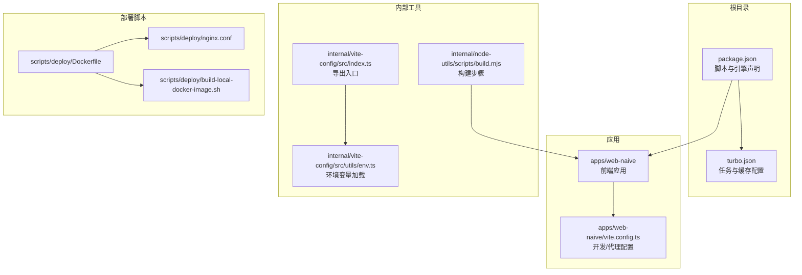
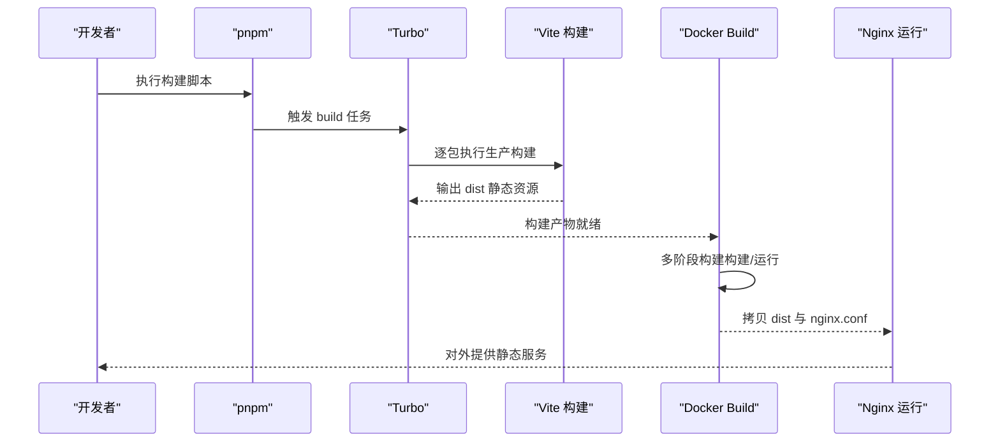
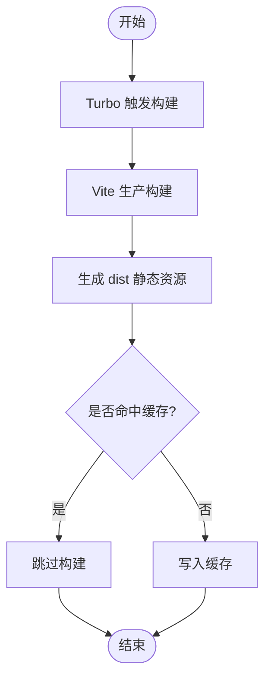
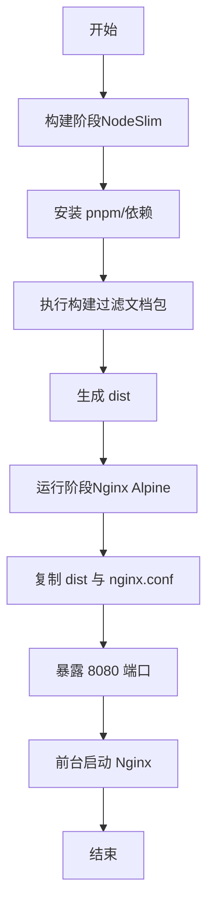
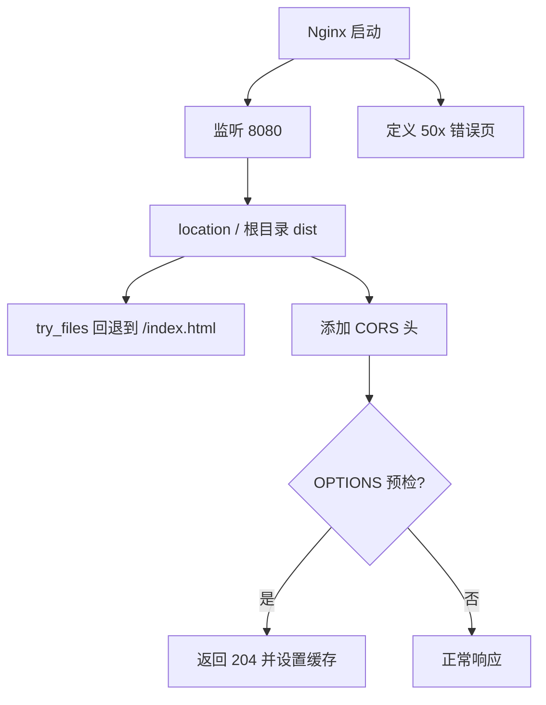
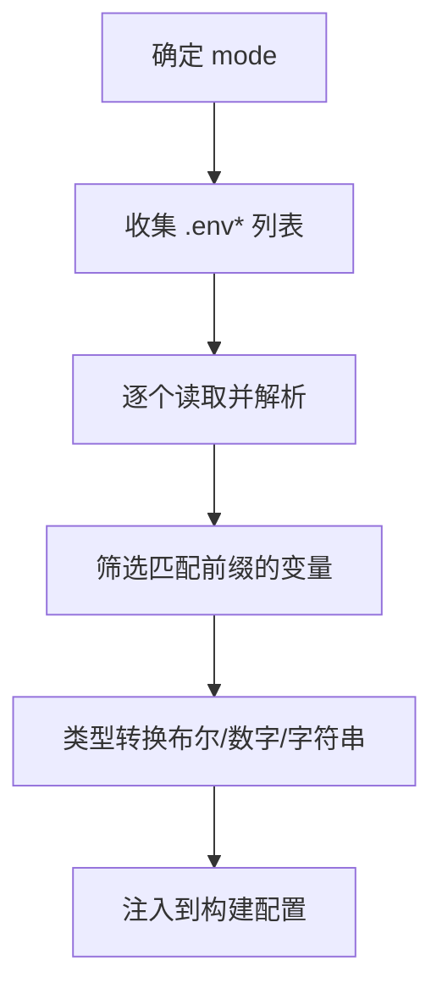
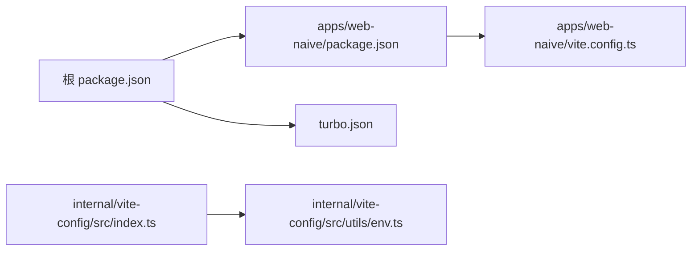

# 部署配置

<cite>
**本文引用的文件**
- [Dockerfile](file://scripts/deploy/Dockerfile)
- [nginx.conf](file://scripts/deploy/nginx.conf)
- [build-local-docker-image.sh](file://scripts/deploy/build-local-docker-image.sh)
- [package.json](file://package.json)
- [turbo.json](file://turbo.json)
- [apps/web-naive/package.json](file://apps/web-naive/package.json)
- [apps/web-naive/vite.config.ts](file://apps/web-naive/vite.config.ts)
- [internal/vite-config/src/index.ts](file://internal/vite-config/src/index.ts)
- [internal/vite-config/src/utils/env.ts](file://internal/vite-config/src/utils/env.ts)
- [internal/node-utils/scripts/build.mjs](file://internal/node-utils/scripts/build.mjs)
</cite>

## 目录

1. [简介](#简介)
2. [项目结构](#项目结构)
3. [核心组件](#核心组件)
4. [架构总览](#架构总览)
5. [详细组件分析](#详细组件分析)
6. [依赖关系分析](#依赖关系分析)
7. [性能考量](#性能考量)
8. [故障排查指南](#故障排查指南)
9. [结论](#结论)
10. [附录](#附录)

## 简介

本文件面向运维与开发团队，系统性说明 shiyu-ui 在生产环境的部署配置与最佳实践，覆盖以下主题：

- 生产构建流程：静态资源打包、代码优化与版本管理
- Docker 容器化：镜像构建与运行
- Nginx 配置：静态文件服务、CORS、反向代理与缓存策略
- 环境变量：加载机制与命名规范
- 不同部署场景：云服务器、容器平台、CDN
- 部署监控与日志管理建议

## 项目结构

该项目采用多包（monorepo）结构，前端应用位于 apps/web-naive，构建与部署相关脚本集中在 scripts/deploy，核心构建工具链由 pnpm、Turbo 与 Vite 组成。

图表来源

- [package.json:1-110](file://package.json#L1-L110)
- [turbo.json:1-49](file://turbo.json#L1-L49)
- [apps/web-naive/vite.config.ts:1-21](file://apps/web-naive/vite.config.ts#L1-L21)
- [internal/vite-config/src/index.ts:1-6](file://internal/vite-config/src/index.ts#L1-L6)
- [internal/vite-config/src/utils/env.ts:1-111](file://internal/vite-config/src/utils/env.ts#L1-L111)
- [internal/node-utils/scripts/build.mjs:1-41](file://internal/node-utils/scripts/build.mjs#L1-L41)
- [scripts/deploy/Dockerfile:1-39](file://scripts/deploy/Dockerfile#L1-L39)
- [scripts/deploy/nginx.conf:1-76](file://scripts/deploy/nginx.conf#L1-L76)
- [scripts/deploy/build-local-docker-image.sh:1-56](file://scripts/deploy/build-local-docker-image.sh#L1-L56)

章节来源

- [package.json:1-110](file://package.json#L1-L110)
- [turbo.json:1-49](file://turbo.json#L1-L49)

## 核心组件

- 构建与打包
  - 使用 pnpm 作为包管理器，Turbo 进行任务编排与缓存；应用层通过 Vite 执行生产构建。
  - 关键脚本与配置见下方“详细组件分析”。
- 容器化
  - 单一 Dockerfile 实现两阶段构建：构建阶段安装依赖并产出静态产物，第二阶段以 Nginx 提供静态服务。
- 反向代理与静态服务
  - Nginx 负责提供静态文件服务、CORS 支持与错误页；支持 SPA 回退到 index.html。
- 环境变量
  - 基于 Vite 配置加载 .env\* 文件，仅注入以指定前缀开头的变量，并进行类型转换。

章节来源

- [apps/web-naive/package.json:1-51](file://apps/web-naive/package.json#L1-L51)
- [apps/web-naive/vite.config.ts:1-21](file://apps/web-naive/vite.config.ts#L1-L21)
- [internal/vite-config/src/utils/env.ts:1-111](file://internal/vite-config/src/utils/env.ts#L1-L111)
- [scripts/deploy/Dockerfile:1-39](file://scripts/deploy/Dockerfile#L1-L39)
- [scripts/deploy/nginx.conf:1-76](file://scripts/deploy/nginx.conf#L1-L76)

## 架构总览

下图展示从源码到生产镜像与运行时的整体流程。

图表来源

- [package.json:27-67](file://package.json#L27-L67)
- [turbo.json:15-47](file://turbo.json#L15-L47)
- [apps/web-naive/package.json:18-24](file://apps/web-naive/package.json#L18-L24)
- [scripts/deploy/Dockerfile:1-39](file://scripts/deploy/Dockerfile#L1-L39)
- [scripts/deploy/nginx.conf:49-74](file://scripts/deploy/nginx.conf#L49-L74)

## 详细组件分析

### 生产构建流程

- 任务编排与缓存
  - Turbo 将构建任务与输出路径纳入缓存范围，避免重复构建。
  - 全局依赖包含锁文件、tsconfig 与内部配置变更，确保一致性。
- 应用构建
  - 应用层通过 Vite 的生产模式生成静态资源；开发代理与后端 mock 地址在开发阶段生效。
- 版本管理
  - 仓库版本号在根 package.json 中统一声明，发布与变更集流程由工作流与脚本配合完成。

图表来源

- [turbo.json:15-47](file://turbo.json#L15-L47)
- [apps/web-naive/package.json:18-24](file://apps/web-naive/package.json#L18-L24)

章节来源

- [turbo.json:1-49](file://turbo.json#L1-L49)
- [apps/web-naive/package.json:1-51](file://apps/web-naive/package.json#L1-L51)
- [apps/web-naive/vite.config.ts:1-21](file://apps/web-naive/vite.config.ts#L1-L21)

### Docker 容器化部署

- 多阶段构建
  - 构建阶段：基于 NodeSlim 安装 pnpm、安装依赖并执行构建，产物输出至 dist。
  - 运行阶段：基于 Nginx Alpine，复制构建产物与自定义 nginx.conf，暴露 8080 并以前台方式启动 Nginx。
- 本地镜像构建脚本
  - 自动停止/删除旧容器与镜像、安装依赖、构建镜像，并输出运行示例命令。
- 运行参数
  - 映射宿主端口与容器端口，容器内监听 8080。

图表来源

- [scripts/deploy/Dockerfile:1-39](file://scripts/deploy/Dockerfile#L1-L39)
- [scripts/deploy/build-local-docker-image.sh:1-56](file://scripts/deploy/build-local-docker-image.sh#L1-L56)

章节来源

- [scripts/deploy/Dockerfile:1-39](file://scripts/deploy/Dockerfile#L1-L39)
- [scripts/deploy/build-local-docker-image.sh:1-56](file://scripts/deploy/build-local-docker-image.sh#L1-L56)

### Nginx 服务器配置

- MIME 类型与静态文件
  - 显式声明 JS/MJS/CSS/HTML 类型，启用 sendfile，设置默认类型。
- 服务与路由
  - 监听 8080，根目录指向 dist；try_files 回退到 index.html，适配 SPA。
- CORS 与安全
  - 开放跨域头，对预检请求返回 204 并设置缓存时间。
- 错误页
  - 定义 50x 错误页位置，根目录指向 dist。

图表来源

- [scripts/deploy/nginx.conf:49-74](file://scripts/deploy/nginx.conf#L49-L74)

章节来源

- [scripts/deploy/nginx.conf:1-76](file://scripts/deploy/nginx.conf#L1-L76)

### 环境变量配置与管理

- 加载机制
  - 依据生命周期脚本解析当前 mode，按顺序读取 .env、.env.local、.env.{mode}、.env.{mode}.local。
  - 仅保留以指定前缀开头的变量（默认 VITE\_），并进行布尔/数字/字符串转换。
- 常用变量（示例）
  - 应用标题、基础路径、压缩类型、PWA、可视化等开关与参数。
- 使用建议
  - 在 CI/CD 中通过密钥管理注入敏感变量，避免硬编码在仓库中。

图表来源

- [internal/vite-config/src/utils/env.ts:21-108](file://internal/vite-config/src/utils/env.ts#L21-L108)
- [internal/vite-config/src/index.ts:5](file://internal/vite-config/src/index.ts#L5)

章节来源

- [internal/vite-config/src/utils/env.ts:1-111](file://internal/vite-config/src/utils/env.ts#L1-L111)
- [internal/vite-config/src/index.ts:1-6](file://internal/vite-config/src/index.ts#L1-L6)

### 不同部署场景配置指南

- 云服务器（裸金属/虚拟机）
  - 在目标主机安装 Nginx，将 dist 目录与 nginx.conf 部署到对应路径，重启服务。
  - 若需反向代理后端 API，可在 Nginx 中新增 upstream 与 location 规则。
- 容器平台（Kubernetes/Docker Swarm）
  - 使用 scripts/deploy/Dockerfile 构建镜像，推送至私有仓库；在编排清单中暴露 8080 端口并挂载持久化存储（如需要）。
  - 如需灰度发布，可结合滚动更新策略与健康检查。
- CDN 部署
  - 将 dist 上传至对象存储或 CDN，配置回源至自有域名或边缘节点；注意缓存键与缓存头策略，避免静态资源版本不一致。

[本节为通用实践说明，不直接分析具体文件，故无章节来源]

### 部署监控与日志管理

- 访问日志与错误日志
  - Nginx 默认未开启 error_log，可在生产环境中启用并配置日志轮转。
- 健康检查
  - 在容器编排中配置 liveness/readiness 探针，探测 / 或 /index.html。
- 性能观测
  - 结合浏览器性能分析与构建产物可视化工具，持续优化首屏与资源体积。

[本节为通用实践说明，不直接分析具体文件，故无章节来源]

## 依赖关系分析

- 包管理与脚本
  - 根 package.json 定义了构建、预览、开发等脚本；apps/web-naive/package.json 定义了应用层构建脚本。
- 任务编排
  - turbo.json 声明构建任务依赖与输出缓存，确保增量构建与一致性。
- 内部工具链
  - Vite 配置导出入口与环境变量加载函数，为构建与运行提供统一入口。

图表来源

- [package.json:27-67](file://package.json#L27-L67)
- [apps/web-naive/package.json:18-24](file://apps/web-naive/package.json#L18-L24)
- [turbo.json:15-47](file://turbo.json#L15-L47)
- [internal/vite-config/src/index.ts:1-6](file://internal/vite-config/src/index.ts#L1-L6)
- [internal/vite-config/src/utils/env.ts:66-108](file://internal/vite-config/src/utils/env.ts#L66-L108)
- [apps/web-naive/vite.config.ts:1-21](file://apps/web-naive/vite.config.ts#L1-L21)

章节来源

- [package.json:1-110](file://package.json#L1-L110)
- [apps/web-naive/package.json:1-51](file://apps/web-naive/package.json#L1-L51)
- [turbo.json:1-49](file://turbo.json#L1-L49)
- [internal/vite-config/src/index.ts:1-6](file://internal/vite-config/src/index.ts#L1-L6)
- [internal/vite-config/src/utils/env.ts:1-111](file://internal/vite-config/src/utils/env.ts#L1-L111)
- [apps/web-naive/vite.config.ts:1-21](file://apps/web-naive/vite.config.ts#L1-L21)

## 性能考量

- 构建优化
  - 使用 Turbo 缓存构建产物，减少重复工作；按需启用压缩与可视化分析。
- 静态资源
  - 合理设置缓存头与版本化文件名，结合 CDN 缓存策略提升访问速度。
- Nginx
  - 启用 sendfile、合理 worker 连接数与进程数；必要时开启 gzip（参考注释段落）。

[本节提供通用指导，不直接分析具体文件，故无章节来源]

## 故障排查指南

- 构建失败
  - 检查 pnpm 锁文件与 Node 版本要求；确认 Turbo 缓存一致性。
- 镜像构建异常
  - 查看本地构建脚本日志文件；确认 Dockerfile 中的复制路径与 Nginx 配置。
- SPA 路由 404
  - 确认 Nginx 的 try_files 回退规则与 index 设置。
- CORS 问题
  - 检查预检请求处理与允许的头部/方法列表。

章节来源

- [scripts/deploy/build-local-docker-image.sh:1-56](file://scripts/deploy/build-local-docker-image.sh#L1-L56)
- [scripts/deploy/nginx.conf:53-67](file://scripts/deploy/nginx.conf#L53-L67)

## 结论

通过多阶段 Docker 构建与 Nginx 静态服务，结合 Turbo 与 Vite 的高效构建体系，shiyu-ui 能够在多种部署场景中实现快速、稳定与可维护的上线流程。建议在生产环境中完善日志与监控策略，并根据业务流量与缓存需求调优 Nginx 与 CDN 配置。

## 附录

- 快速命令参考
  - 本地构建镜像：参见本地构建脚本输出的示例命令。
  - 运行容器：映射宿主端口到容器 8080。
- 变更与发布
  - 版本号与变更集流程由仓库脚本与工作流共同维护。

[本节为补充信息，不直接分析具体文件，故无章节来源]
