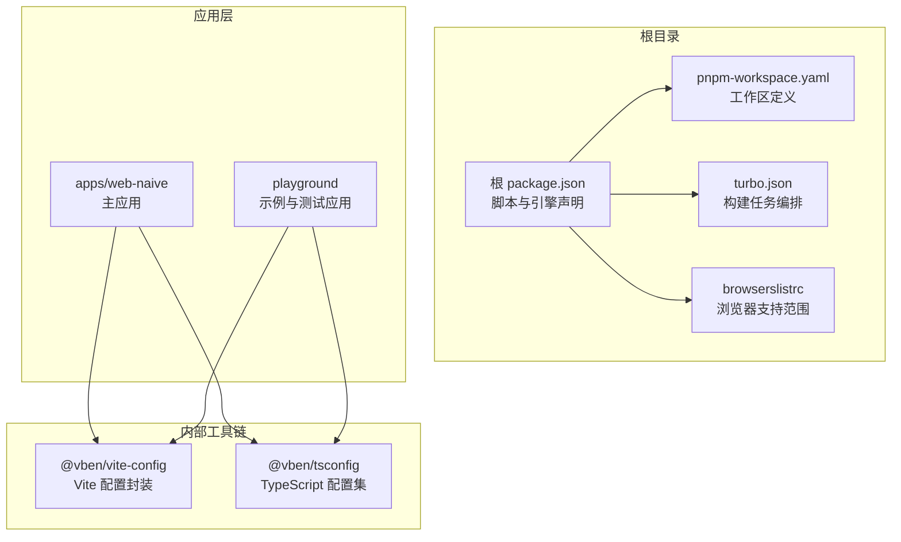
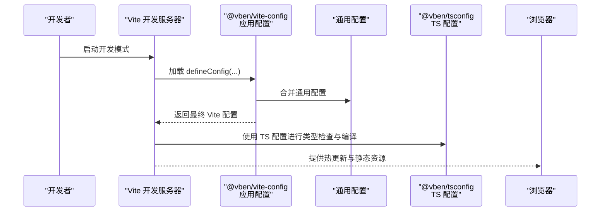
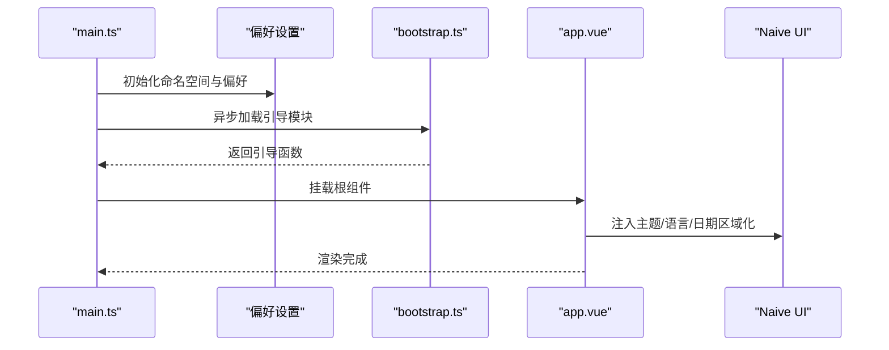
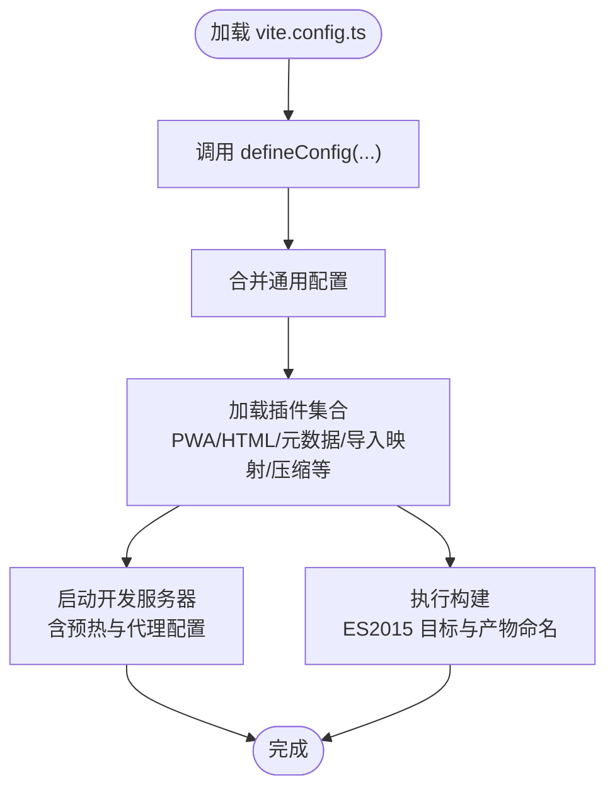
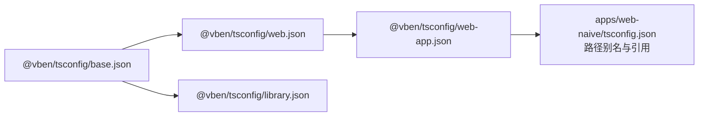
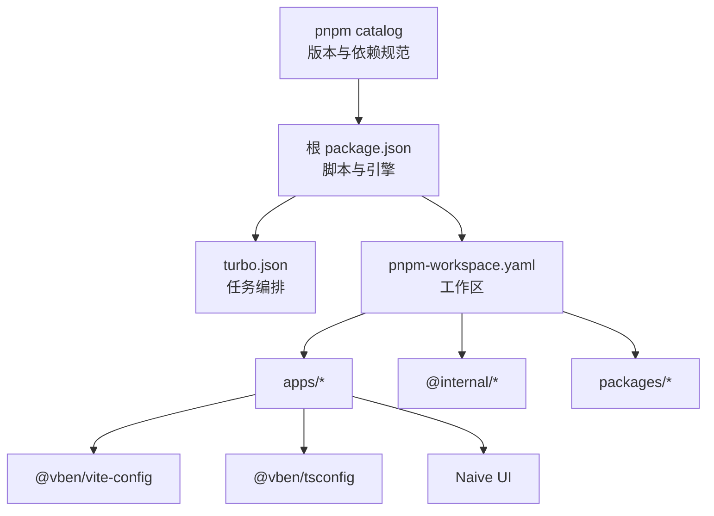

# 技术栈概览

<cite>
**本文档引用的文件**
- [package.json](file://package.json)
- [pnpm-workspace.yaml](file://pnpm-workspace.yaml)
- [turbo.json](file://turbo.json)
- [.browserslistrc](file://.browserslistrc)
- [apps/web-naive/package.json](file://apps/web-naive/package.json)
- [apps/web-naive/vite.config.ts](file://apps/web-naive/vite.config.ts)
- [apps/web-naive/tsconfig.json](file://apps/web-naive/tsconfig.json)
- [apps/web-naive/src/main.ts](file://apps/web-naive/src/main.ts)
- [apps/web-naive/src/app.vue](file://apps/web-naive/src/app.vue)
- [internal/vite-config/package.json](file://internal/vite-config/package.json)
- [internal/vite-config/src/config/application.ts](file://internal/vite-config/src/config/application.ts)
- [internal/tsconfig/web.json](file://internal/tsconfig/web.json)
- [internal/tsconfig/web-app.json](file://internal/tsconfig/web-app.json)
- [README.md](file://README.md)
</cite>

## 目录

1. [引言](#引言)
2. [项目结构](#项目结构)
3. [核心组件](#核心组件)
4. [架构总览](#架构总览)
5. [详细组件分析](#详细组件分析)
6. [依赖分析](#依赖分析)
7. [性能考量](#性能考量)
8. [故障排查指南](#故障排查指南)
9. [结论](#结论)
10. [附录](#附录)

## 引言

本技术栈概览面向 shiyu-ui（基于 Vben Admin 的多包管理仓库）项目，系统梳理其前端技术选型与实现方式，重点覆盖 Vue 3、Vite、TypeScript 等核心技术，并解释它们在项目中的职责、协作关系与优化策略。文档同时给出版本信息、兼容性与浏览器支持、学习路径建议，帮助开发者快速理解并高效参与开发。

## 项目结构

该项目采用 pnpm workspaces + Turbo 的 Monorepo 架构，核心应用位于 apps/web-naive，内部工具链与配置位于 internal 目录，业务与通用包位于 packages 目录。整体通过统一的 catalog 版本管理与类型配置，确保跨包一致性与可维护性。

图表来源

- [package.json:1-110](file://package.json#L1-L110)
- [pnpm-workspace.yaml:1-192](file://pnpm-workspace.yaml#L1-L192)
- [turbo.json:1-49](file://turbo.json#L1-L49)
- [.browserslistrc:1-5](file://.browserslistrc#L1-L5)
- [apps/web-naive/package.json:1-51](file://apps/web-naive/package.json#L1-L51)
- [internal/vite-config/package.json:1-61](file://internal/vite-config/package.json#L1-L61)
- [internal/tsconfig/web.json:1-14](file://internal/tsconfig/web.json#L1-L14)

章节来源

- [package.json:1-110](file://package.json#L1-L110)
- [pnpm-workspace.yaml:1-192](file://pnpm-workspace.yaml#L1-L192)
- [turbo.json:1-49](file://turbo.json#L1-L49)
- [.browserslistrc:1-5](file://.browserslistrc#L1-L5)

## 核心组件

- Vue 3：作为应用框架，提供响应式与组合式 API，配合 TypeScript 提供强类型支持；在应用入口与配置中广泛使用。
- Vite：作为构建与开发服务器，提供快速冷启动、热更新与按需打包能力；通过 @vben/vite-config 封装统一配置。
- TypeScript：通过 @vben/tsconfig 提供 Web 应用与库的标准配置，结合 vue-tsc 进行类型检查。
- Pinia：状态管理方案，与 Vue Router 协同管理应用状态。
- Naive UI：UI 组件库，提供主题、国际化与设计令牌集成。
- Turbo：构建任务编排，加速多包构建与缓存复用。
- pnpm：包管理器，结合 workspaces 实现去重与链接安装。

章节来源

- [apps/web-naive/package.json:28-49](file://apps/web-naive/package.json#L28-L49)
- [apps/web-naive/src/app.vue:1-57](file://apps/web-naive/src/app.vue#L1-L57)
- [apps/web-naive/src/main.ts:1-32](file://apps/web-naive/src/main.ts#L1-L32)
- [internal/vite-config/package.json:29-61](file://internal/vite-config/package.json#L29-L61)
- [internal/tsconfig/web.json:1-14](file://internal/tsconfig/web.json#L1-L14)
- [turbo.json:15-48](file://turbo.json#L15-L48)

## 架构总览

下图展示从开发到构建的关键流程：Vite 加载 @vben/vite-config 的应用配置，合并通用配置后启动开发服务器；TypeScript 配置由 @vben/tsconfig 提供；浏览器支持通过 browserslist 指定；Turbo 负责多包构建任务编排。

图表来源

- [apps/web-naive/vite.config.ts:1-21](file://apps/web-naive/vite.config.ts#L1-L21)
- [internal/vite-config/src/config/application.ts:17-99](file://internal/vite-config/src/config/application.ts#L17-L99)
- [internal/tsconfig/web-app.json:1-9](file://internal/tsconfig/web-app.json#L1-L9)

章节来源

- [apps/web-naive/vite.config.ts:1-21](file://apps/web-naive/vite.config.ts#L1-L21)
- [internal/vite-config/src/config/application.ts:17-99](file://internal/vite-config/src/config/application.ts#L17-L99)
- [internal/tsconfig/web-app.json:1-9](file://internal/tsconfig/web-app.json#L1-L9)

## 详细组件分析

### Vue 3 与应用启动

- 入口文件负责初始化偏好设置、命名空间与全局加载态，随后异步加载引导模块并挂载应用。
- 应用根组件通过 Naive UI 的 ConfigProvider 注入主题、语言与日期区域化，实现统一的 UI 外观与本地化。

图表来源

- [apps/web-naive/src/main.ts:9-32](file://apps/web-naive/src/main.ts#L9-L32)
- [apps/web-naive/src/app.vue:23-56](file://apps/web-naive/src/app.vue#L23-L56)

章节来源

- [apps/web-naive/src/main.ts:1-32](file://apps/web-naive/src/main.ts#L1-L32)
- [apps/web-naive/src/app.vue:1-57](file://apps/web-naive/src/app.vue#L1-L57)

### Vite 配置与插件体系

- 应用通过 @vben/vite-config 的 defineConfig 加载统一配置，启用 PWA、HTML 注入、元数据注入、Nitro Mock、导入映射、压缩与可视化等插件。
- 开发服务器默认开启预热与代理（示例指向本地后端），构建目标为 ES2015，输出文件名包含哈希以利于缓存。

图表来源

- [apps/web-naive/vite.config.ts:3-20](file://apps/web-naive/vite.config.ts#L3-L20)
- [internal/vite-config/src/config/application.ts:27-99](file://internal/vite-config/src/config/application.ts#L27-L99)

章节来源

- [apps/web-naive/vite.config.ts:1-21](file://apps/web-naive/vite.config.ts#L1-L21)
- [internal/vite-config/src/config/application.ts:17-99](file://internal/vite-config/src/config/application.ts#L17-L99)

### TypeScript 配置与类型检查

- Web 应用与库分别使用 @vben/tsconfig 下的 web-app.json 与 library.json 扩展基础配置，统一 JSX、模块解析与类型声明。
- 应用层 tsconfig.json 通过路径别名 #/\* 指向 src，便于跨包引用与模块化组织。

图表来源

- [internal/tsconfig/web.json:1-14](file://internal/tsconfig/web.json#L1-L14)
- [internal/tsconfig/web-app.json:1-9](file://internal/tsconfig/web-app.json#L1-L9)
- [apps/web-naive/tsconfig.json:1-12](file://apps/web-naive/tsconfig.json#L1-L12)

章节来源

- [internal/tsconfig/web.json:1-14](file://internal/tsconfig/web.json#L1-L14)
- [internal/tsconfig/web-app.json:1-9](file://internal/tsconfig/web-app.json#L1-L9)
- [apps/web-naive/tsconfig.json:1-12](file://apps/web-naive/tsconfig.json#L1-L12)

### 浏览器支持与兼容性

- 浏览器支持范围通过 browserslistrc 指定：全球份额 > 1%、最近两个版本、排除已停止维护与 IE 11。
- 构建目标为 ES2015，确保现代浏览器具备良好兼容性；同时通过 PWA 插件提升离线与缓存体验。

章节来源

- [.browserslistrc:1-5](file://.browserslistrc#L1-L5)
- [internal/vite-config/src/config/application.ts:75-76](file://internal/vite-config/src/config/application.ts#L75-L76)

### 依赖版本与生态

- 项目通过 pnpm catalog 统一管理依赖版本，核心依赖包括 Vue 3、Vite、TypeScript、Pinia、Naive UI 等。
- 根 package.json 声明 Node 与 pnpm 版本要求，确保开发环境一致性。

章节来源

- [pnpm-workspace.yaml:23-192](file://pnpm-workspace.yaml#L23-L192)
- [package.json:104-109](file://package.json#L104-L109)

## 依赖分析

- 包管理：pnpm workspaces + catalog，集中管理版本与依赖冲突。
- 构建：Turbo 编排多包构建，Vite + 自定义插件链路提供开发与生产优化。
- 类型：@vben/tsconfig 提供 Web 应用与库的标准化 TS 配置。
- UI：Naive UI 与主题令牌集成，统一设计语言与本地化。

图表来源

- [pnpm-workspace.yaml:1-14](file://pnpm-workspace.yaml#L1-L14)
- [package.json:27-66](file://package.json#L27-L66)
- [turbo.json:1-49](file://turbo.json#L1-L49)
- [internal/vite-config/package.json:29-61](file://internal/vite-config/package.json#L29-L61)
- [internal/tsconfig/web.json:1-14](file://internal/tsconfig/web.json#L1-L14)

章节来源

- [pnpm-workspace.yaml:1-192](file://pnpm-workspace.yaml#L1-L192)
- [package.json:1-110](file://package.json#L1-L110)
- [turbo.json:1-49](file://turbo.json#L1-L49)

## 性能考量

- 构建目标与产物命名：ES2015 目标与带哈希的文件名有利于缓存与 CDN 分发。
- 插件链：PWA、压缩、可视化与 Nitro Mock 在开发与生产阶段分别提供缓存、体积优化与接口模拟能力。
- 预热：开发服务器预热关键文件，缩短首次启动时间。
- 类型检查：通过 vue-tsc 与 TS 配置分离检查任务，避免阻塞开发流。

章节来源

- [internal/vite-config/src/config/application.ts:60-99](file://internal/vite-config/src/config/application.ts#L60-L99)
- [apps/web-naive/package.json:18-24](file://apps/web-naive/package.json#L18-L24)
- [internal/tsconfig/web-app.json:1-9](file://internal/tsconfig/web-app.json#L1-L9)

## 故障排查指南

- 开发服务器无法访问或端口占用：检查 Vite 配置中的 server.port 与 host 设置。
- 代理请求失败：确认 vite.config.ts 中的代理规则与后端服务地址一致。
- 类型检查报错：核对 @vben/tsconfig 的扩展与应用层 tsconfig.json 的 include/references。
- 浏览器兼容问题：根据 browserslistrc 调整构建目标或引入 polyfill。
- 构建失败或缓存异常：清理缓存与 node_modules 后重新安装，必要时降低 Node 内存限制参数。

章节来源

- [apps/web-naive/vite.config.ts:7-17](file://apps/web-naive/vite.config.ts#L7-L17)
- [apps/web-naive/tsconfig.json:3-11](file://apps/web-naive/tsconfig.json#L3-L11)
- [.browserslistrc:1-5](file://.browserslistrc#L1-L5)
- [package.json:28-66](file://package.json#L28-L66)

## 结论

本项目以 Vue 3、Vite、TypeScript 为核心，结合 pnpm catalog、Turbo 与 @vben/vite-config/@vben/tsconfig，形成高一致性、高性能且易维护的前端技术栈。通过统一的配置与严格的版本管理，既保证了开发体验，也兼顾了生产环境的稳定性与可扩展性。

## 附录

### 学习路径建议

- Vue 3 基础：响应式系统、组合式 API、组件通信与生命周期。
- TypeScript：类型系统、泛型、装饰器与配置扩展。
- Vite：插件机制、开发服务器、构建优化与环境变量。
- 状态管理：Pinia 的 Store 设计与最佳实践。
- UI 组件库：Naive UI 的主题、令牌与本地化集成。
- Monorepo 工具链：pnpm workspaces、Turbo 任务编排与 catalog 版本治理。

章节来源

- [README.md:17-19](file://README.md#L17-L19)
- [apps/web-naive/package.json:28-49](file://apps/web-naive/package.json#L28-L49)
- [internal/vite-config/package.json:29-61](file://internal/vite-config/package.json#L29-L61)
- [pnpm-workspace.yaml:23-192](file://pnpm-workspace.yaml#L23-L192)
