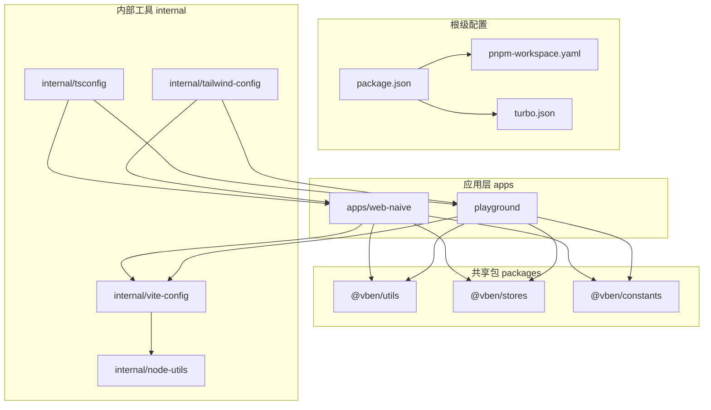
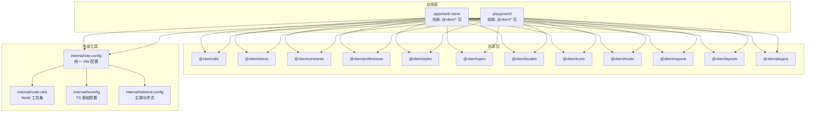
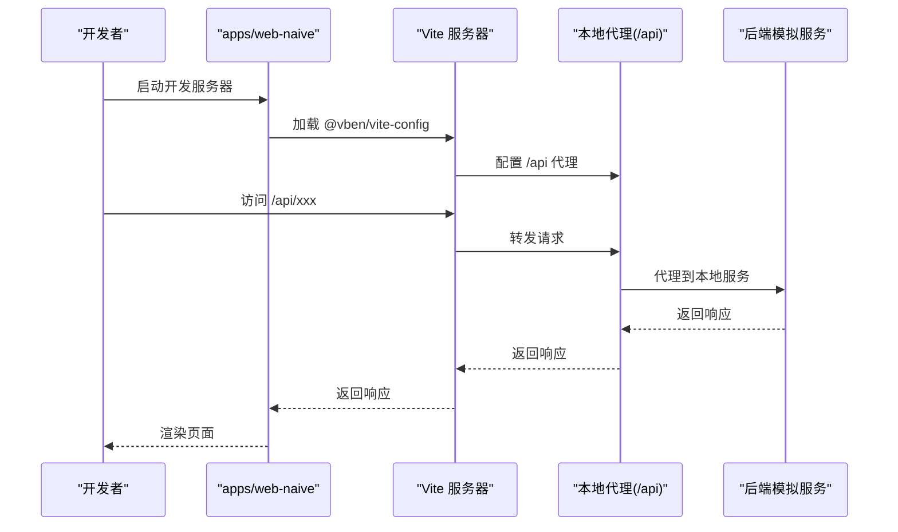
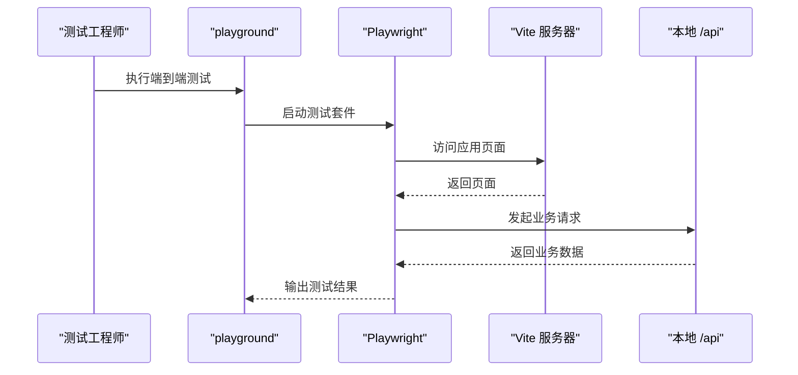
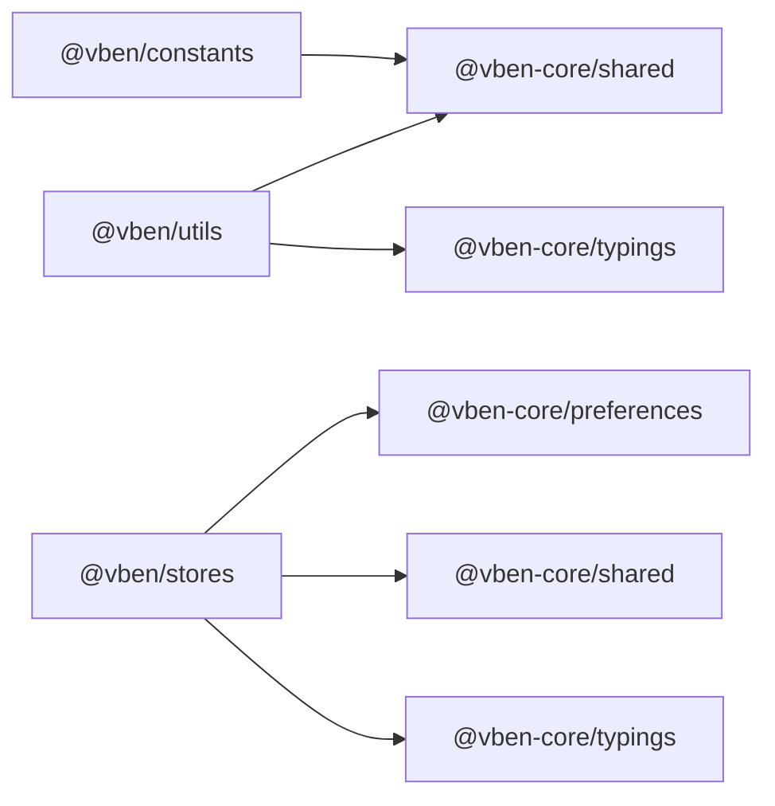
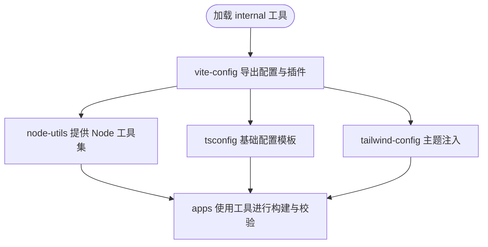
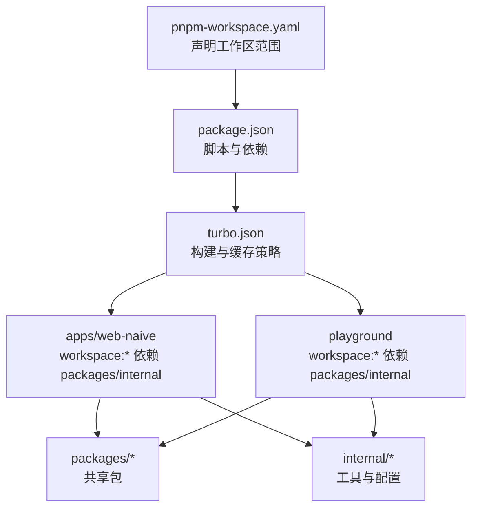

# 架构概览

<cite>
**本文引用的文件**
- [package.json](file://package.json)
- [pnpm-workspace.yaml](file://pnpm-workspace.yaml)
- [turbo.json](file://turbo.json)
- [README.md](file://README.md)
- [apps/web-naive/package.json](file://apps/web-naive/package.json)
- [apps/web-naive/vite.config.ts](file://apps/web-naive/vite.config.ts)
- [playground/package.json](file://playground/package.json)
- [playground/vite.config.ts](file://playground/vite.config.ts)
- [internal/vite-config/src/index.ts](file://internal/vite-config/src/index.ts)
- [internal/node-utils/src/index.ts](file://internal/node-utils/src/index.ts)
- [internal/tsconfig/base.json](file://internal/tsconfig/base.json)
- [internal/tailwind-config/src/index.ts](file://internal/tailwind-config/src/index.ts)
- [packages/utils/package.json](file://packages/utils/package.json)
- [packages/stores/package.json](file://packages/stores/package.json)
- [packages/constants/package.json](file://packages/constants/package.json)
</cite>

## 目录

1. [引言](#引言)
2. [项目结构](#项目结构)
3. [核心组件](#核心组件)
4. [架构总览](#架构总览)
5. [详细组件分析](#详细组件分析)
6. [依赖分析](#依赖分析)
7. [性能考虑](#性能考虑)
8. [故障排查指南](#故障排查指南)
9. [结论](#结论)
10. [附录](#附录)

## 引言

本文件面向 shiyu-ui 项目的架构概览与设计说明，重点阐述其 Monorepo 架构设计与各目录职责：apps 应用层（web-naive、playground）、packages 共享包、internal 内部工具与配置体系。文档结合实际目录结构与配置文件，给出系统架构图、组件关系与数据流示意，并总结技术决策与可扩展性设计。

## 项目结构

shiyu-ui 采用 pnpm workspaces + Turbo 的 Monorepo 架构，通过统一的工作区定义与构建编排，实现多应用与多包的协同开发与发布。整体结构由以下几部分组成：

- apps：应用层，包含具体业务前端应用（如 web-naive、playground）
- packages：共享包，提供通用能力（常量、工具、状态管理、样式等）
- internal：内部工具与配置，封装构建、类型、样式、脚手架等基础设施
- 根级配置：package.json、pnpm-workspace.yaml、turbo.json 等，统一脚本、工作区与缓存策略

**图表来源**

- [package.json:1-110](file://package.json#L1-L110)
- [pnpm-workspace.yaml:1-192](file://pnpm-workspace.yaml#L1-L192)
- [turbo.json:1-49](file://turbo.json#L1-L49)
- [apps/web-naive/package.json:1-51](file://apps/web-naive/package.json#L1-L51)
- [playground/package.json:1-63](file://playground/package.json#L1-L63)
- [internal/vite-config/src/index.ts:1-6](file://internal/vite-config/src/index.ts#L1-L6)
- [internal/node-utils/src/index.ts:1-20](file://internal/node-utils/src/index.ts#L1-L20)
- [internal/tsconfig/base.json:1-40](file://internal/tsconfig/base.json#L1-L40)
- [internal/tailwind-config/src/index.ts:1-2](file://internal/tailwind-config/src/index.ts#L1-L2)

**章节来源**

- [package.json:1-110](file://package.json#L1-L110)
- [pnpm-workspace.yaml:1-192](file://pnpm-workspace.yaml#L1-L192)
- [turbo.json:1-49](file://turbo.json#L1-L49)
- [README.md:1-158](file://README.md#L1-L158)

## 核心组件

本节从架构视角拆解三大核心区域及其职责边界与协作关系。

- 应用层（apps）
  - web-naive：基于 Naive UI 的完整后台管理应用，负责路由、权限、国际化、API 请求、布局与视图等端到端功能。
  - playground：示例与演示应用，用于展示组件能力、集成示例与端到端测试环境。
  - 两者均通过 @vben/vite-config 统一构建配置，共享 internal 工具链与类型体系。

- 共享包（packages）
  - @vben/utils：通用工具函数与类型导出，供应用与内部工具复用。
  - @vben/stores：基于 Pinia 的状态管理封装，含持久化与偏好设置。
  - @vben/constants：全局常量定义，统一业务与 UI 常量来源。
  - 其他包（icons、locales、preferences、styles、types 等）在工作区中统一管理，按需被应用与工具使用。

- 内部工具（internal）
  - vite-config：统一 Vite 配置入口与插件集合，屏蔽应用差异，提供可组合的构建能力。
  - node-utils：Node 工具集，封装路径、Git、格式化、哈希、执行命令等常用能力。
  - tsconfig：基础 TypeScript 配置模板，确保类型检查一致性与构建行为可控。
  - tailwind-config：Tailwind 主题与样式入口，统一设计系统与主题变量。

**章节来源**

- [apps/web-naive/package.json:1-51](file://apps/web-naive/package.json#L1-L51)
- [playground/package.json:1-63](file://playground/package.json#L1-L63)
- [packages/utils/package.json:1-28](file://packages/utils/package.json#L1-L28)
- [packages/stores/package.json:1-33](file://packages/stores/package.json#L1-L33)
- [packages/constants/package.json:1-26](file://packages/constants/package.json#L1-L26)
- [internal/vite-config/src/index.ts:1-6](file://internal/vite-config/src/index.ts#L1-L6)
- [internal/node-utils/src/index.ts:1-20](file://internal/node-utils/src/index.ts#L1-L20)
- [internal/tsconfig/base.json:1-40](file://internal/tsconfig/base.json#L1-L40)
- [internal/tailwind-config/src/index.ts:1-2](file://internal/tailwind-config/src/index.ts#L1-L2)

## 架构总览

下图展示了 Monorepo 的总体架构：应用层通过共享包与内部工具实现解耦；内部工具通过统一配置与类型模板保障一致性和可维护性；Turbo 负责增量构建与缓存，提升整体开发效率。

**图表来源**

- [apps/web-naive/package.json:28-49](file://apps/web-naive/package.json#L28-L49)
- [playground/package.json:31-57](file://playground/package.json#L31-L57)
- [internal/vite-config/src/index.ts:1-6](file://internal/vite-config/src/index.ts#L1-L6)
- [internal/node-utils/src/index.ts:1-20](file://internal/node-utils/src/index.ts#L1-L20)
- [internal/tsconfig/base.json:1-40](file://internal/tsconfig/base.json#L1-L40)
- [internal/tailwind-config/src/index.ts:1-2](file://internal/tailwind-config/src/index.ts#L1-L2)

## 详细组件分析

### 应用层：web-naive

- 角色与定位：完整后台管理应用，承载认证、菜单、系统管理、仪表盘、演示页面等功能。
- 技术栈：Vue 3、Naive UI、Pinia、Vue Router、TypeScript。
- 配置与代理：通过 @vben/vite-config 注入 Vite 配置，本地开发时对 /api 进行代理至本地后端服务。
- 数据流：路由守卫与权限控制 → Store 状态管理 → API 请求 → 视图渲染。

**图表来源**

- [apps/web-naive/vite.config.ts:1-21](file://apps/web-naive/vite.config.ts#L1-L21)
- [apps/web-naive/package.json:18-24](file://apps/web-naive/package.json#L18-L24)

**章节来源**

- [apps/web-naive/package.json:1-51](file://apps/web-naive/package.json#L1-L51)
- [apps/web-naive/vite.config.ts:1-21](file://apps/web-naive/vite.config.ts#L1-L21)

### 应用层：playground

- 角色与定位：示例与演示应用，覆盖组件能力、集成示例与端到端测试场景。
- 测试支持：内置 Playwright 测试脚本，便于 UI 自动化验证。
- 配置与代理：与 web-naive 类似的 Vite 代理配置，便于联调与演示。

**图表来源**

- [playground/vite.config.ts:1-21](file://playground/vite.config.ts#L1-L21)
- [playground/package.json:18-27](file://playground/package.json#L18-L27)

**章节来源**

- [playground/package.json:1-63](file://playground/package.json#L1-L63)
- [playground/vite.config.ts:1-21](file://playground/vite.config.ts#L1-L21)

### 共享包：utils、stores、constants

- 设计原则：最小依赖、纯函数优先、明确导出面、副作用显式声明（如 CSS）。
- 复用机制：通过 workspace:_ 与 catalog:_ 组合，既可在本地快速迭代，又能在版本升级时统一收敛。
- 依赖关系：utils 与 stores 依赖 @vben-core 下的基础共享模块；constants 依赖共享常量模块。

**图表来源**

- [packages/utils/package.json:22-26](file://packages/utils/package.json#L22-L26)
- [packages/stores/package.json:22-31](file://packages/stores/package.json#L22-L31)
- [packages/constants/package.json:22-24](file://packages/constants/package.json#L22-L24)

**章节来源**

- [packages/utils/package.json:1-28](file://packages/utils/package.json#L1-L28)
- [packages/stores/package.json:1-33](file://packages/stores/package.json#L1-L33)
- [packages/constants/package.json:1-26](file://packages/constants/package.json#L1-L26)

### 内部工具：vite-config、node-utils、tsconfig、tailwind-config

- vite-config：统一导出配置、选项与插件，屏蔽应用差异，支持按需扩展。
- node-utils：提供路径、Git、格式化、哈希、执行命令等能力，支撑脚手架与 CI。
- tsconfig：提供基础 TS 配置模板，严格模式与隔离模块，减少类型检查偏差。
- tailwind-config：集中注入主题与样式，统一设计语言。

**图表来源**

- [internal/vite-config/src/index.ts:1-6](file://internal/vite-config/src/index.ts#L1-L6)
- [internal/node-utils/src/index.ts:1-20](file://internal/node-utils/src/index.ts#L1-L20)
- [internal/tsconfig/base.json:1-40](file://internal/tsconfig/base.json#L1-L40)
- [internal/tailwind-config/src/index.ts:1-2](file://internal/tailwind-config/src/index.ts#L1-L2)

**章节来源**

- [internal/vite-config/src/index.ts:1-6](file://internal/vite-config/src/index.ts#L1-L6)
- [internal/node-utils/src/index.ts:1-20](file://internal/node-utils/src/index.ts#L1-L20)
- [internal/tsconfig/base.json:1-40](file://internal/tsconfig/base.json#L1-L40)
- [internal/tailwind-config/src/index.ts:1-2](file://internal/tailwind-config/src/index.ts#L1-L2)

## 依赖分析

- 工作区与版本管理
  - pnpm-workspace.yaml 明确声明工作区范围，包含 internal、packages、apps、scripts、playground 等。
  - catalog 字段统一管理第三方依赖版本，避免重复与漂移。
- 构建与缓存
  - turbo.json 定义全局依赖与任务输出，启用增量构建与缓存，加速多包并行构建。
- 应用与包的依赖关系
  - apps/web-naive 与 playground 均通过 workspace:\* 依赖 packages 与 internal，形成“应用消费包”的单向依赖。

**图表来源**

- [pnpm-workspace.yaml:1-192](file://pnpm-workspace.yaml#L1-L192)
- [package.json:27-66](file://package.json#L27-L66)
- [turbo.json:15-46](file://turbo.json#L15-L46)

**章节来源**

- [pnpm-workspace.yaml:1-192](file://pnpm-workspace.yaml#L1-L192)
- [package.json:1-110](file://package.json#L1-L110)
- [turbo.json:1-49](file://turbo.json#L1-L49)

## 性能考虑

- 增量构建与缓存
  - Turbo 通过 globalDependencies 与任务输出定义，仅在依赖变更时重建，显著缩短构建时间。
- 并行执行
  - 多应用与多包可并行构建，充分利用多核资源。
- 开发体验
  - Vite 快速冷启动与热更新，配合代理与插件生态，降低调试成本。
- 类型检查与静态分析
  - 统一 tsconfig 与严格模式，减少运行时错误与类型不一致导致的性能问题。

## 故障排查指南

- 依赖解析失败
  - 检查 pnpm-workspace.yaml 中是否遗漏包路径，确认 workspace:\* 是否指向正确包。
- 构建缓存异常
  - 清理 .turbo 缓存或调整 turbo.json 的 globalDependencies，确保变更被正确感知。
- 代理与跨域问题
  - 校验 apps/web-naive 与 playground 的 /api 代理配置，确认目标服务可达。
- 类型检查报错
  - 统一使用 internal/tsconfig 的基础配置，避免不同包间 TS 行为差异。

**章节来源**

- [turbo.json:3-13](file://turbo.json#L3-L13)
- [apps/web-naive/vite.config.ts:6-18](file://apps/web-naive/vite.config.ts#L6-L18)
- [playground/vite.config.ts:6-18](file://playground/vite.config.ts#L6-L18)
- [internal/tsconfig/base.json:4-36](file://internal/tsconfig/base.json#L4-L36)

## 结论

shiyu-ui 以 pnpm workspaces + Turbo 为核心，结合 internal 工具与 packages 共享包，实现了高内聚、低耦合的 Monorepo 架构。应用层通过统一配置与工具链获得一致的开发体验，同时具备良好的扩展性与可维护性。未来可在以下方向持续演进：

- 引入更细粒度的包拆分与版本策略，进一步提升复用与发布灵活性。
- 在 internal 中沉淀更多可复用的插件与脚手架能力，降低新应用接入成本。
- 优化 Turbo 任务图谱，结合依赖分析实现更智能的并行与缓存策略。

## 附录

- 关键配置文件位置
  - 根级：package.json、pnpm-workspace.yaml、turbo.json
  - 应用：apps/web-naive/package.json、apps/web-naive/vite.config.ts；playground/package.json、playground/vite.config.ts
  - 内部工具：internal/vite-config/src/index.ts、internal/node-utils/src/index.ts、internal/tsconfig/base.json、internal/tailwind-config/src/index.ts
  - 共享包：packages/utils/package.json、packages/stores/package.json、packages/constants/package.json
