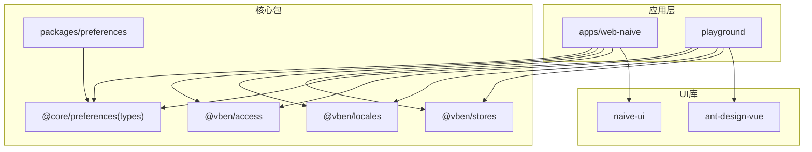
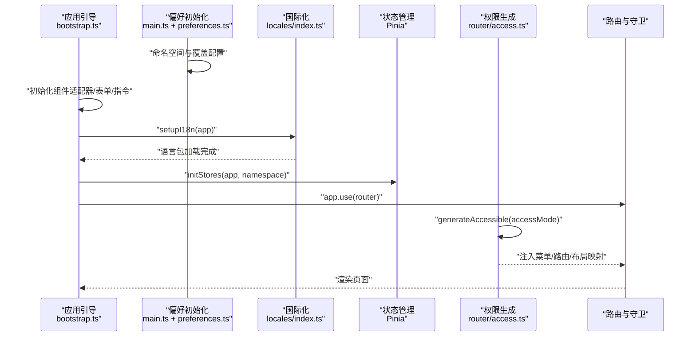
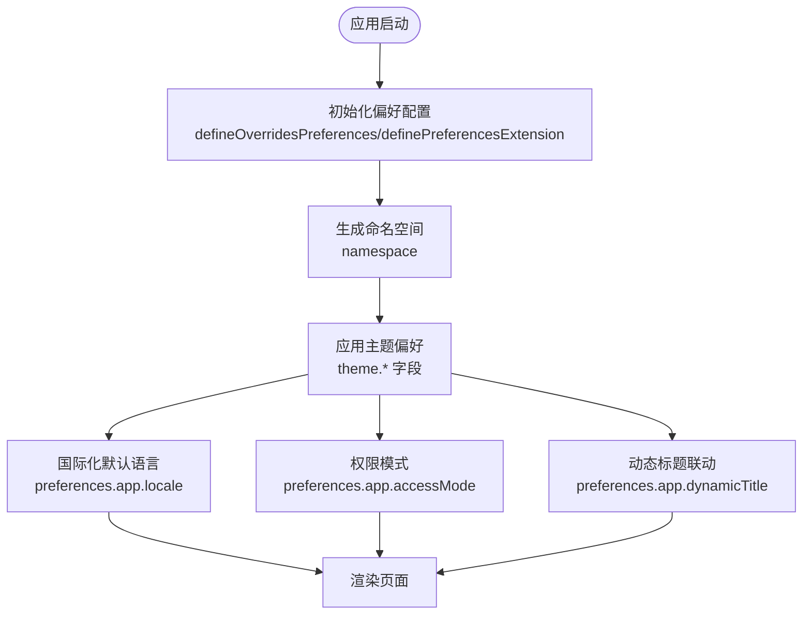
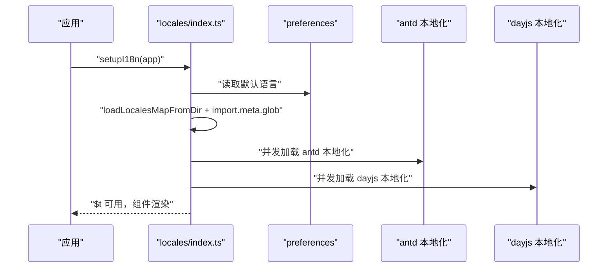
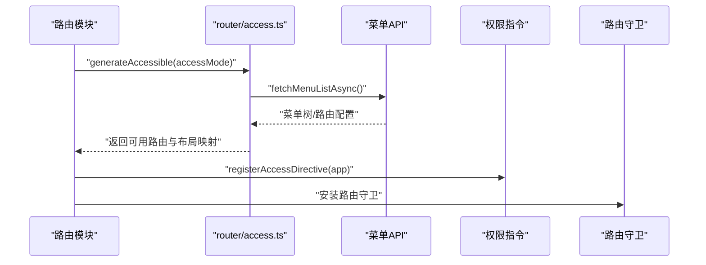
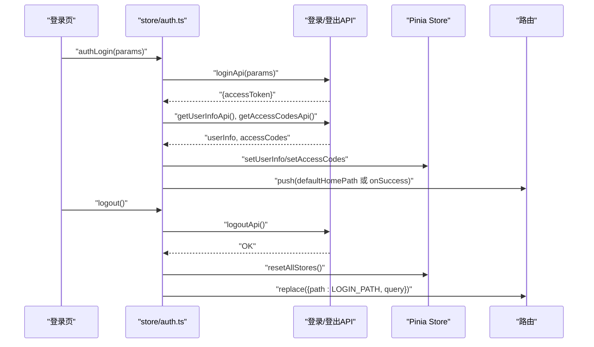
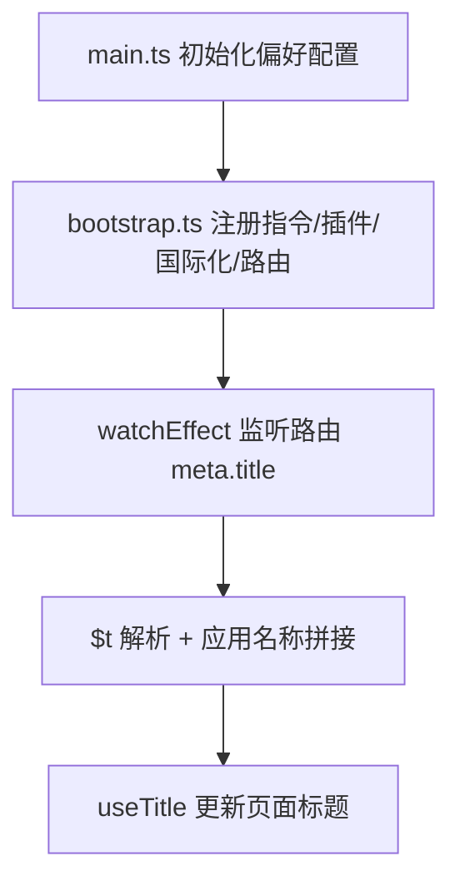
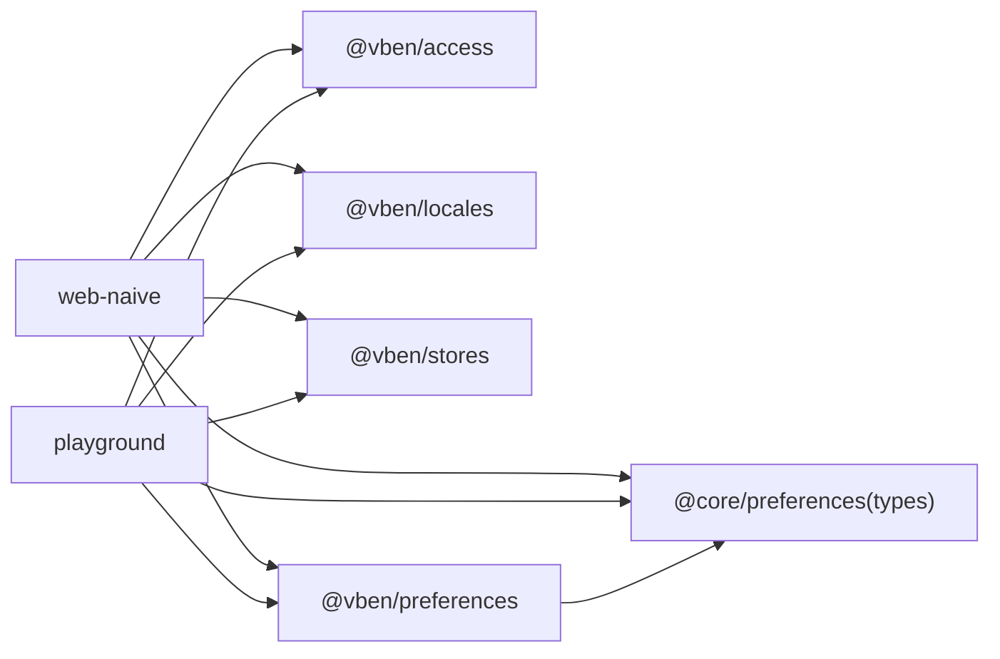

# 核心特性

<cite>
**本文引用的文件**
- [apps/web-naive/package.json](file://apps/web-naive/package.json)
- [playground/package.json](file://playground/package.json)
- [apps/web-naive/src/preferences.ts](file://apps/web-naive/src/preferences.ts)
- [playground/src/preferences.ts](file://playground/src/preferences.ts)
- [apps/web-naive/src/main.ts](file://apps/web-naive/src/main.ts)
- [playground/src/main.ts](file://playground/src/main.ts)
- [apps/web-naive/src/locales/index.ts](file://apps/web-naive/src/locales/index.ts)
- [playground/src/locales/index.ts](file://playground/src/locales/index.ts)
- [apps/web-naive/src/router/access.ts](file://apps/web-naive/src/router/access.ts)
- [playground/src/router/access.ts](file://playground/src/router/access.ts)
- [packages/preferences/src/index.ts](file://packages/preferences/src/index.ts)
- [packages/@core/preferences/src/types.ts](file://packages/@core/preferences/src/types.ts)
- [apps/web-naive/src/store/auth.ts](file://apps/web-naive/src/store/auth.ts)
- [playground/src/store/auth.ts](file://playground/src/store/auth.ts)
- [apps/web-naive/src/bootstrap.ts](file://apps/web-naive/src/bootstrap.ts)
- [README.md](file://README.md)
</cite>

## 目录

1. [简介](#简介)
2. [项目结构](#项目结构)
3. [核心组件](#核心组件)
4. [架构总览](#架构总览)
5. [详细组件分析](#详细组件分析)
6. [依赖分析](#依赖分析)
7. [性能考虑](#性能考虑)
8. [故障排查指南](#故障排查指南)
9. [结论](#结论)
10. [附录](#附录)

## 简介

本文件聚焦于 shiyu-ui 的核心特性与实现机制，围绕以下方面展开：

- 最新技术栈支持（Vue 3、Vite、TypeScript）
- TypeScript 类型系统与强类型约束
- 多主题颜色方案与偏好配置
- 国际化系统（含第三方组件库本地化）
- 动态权限控制（前端/混合/后端三种模式）

内容基于仓库中的实际实现，提供特性原理、使用场景、配置方法、协同机制与最佳实践，帮助读者在真实项目中高效落地。

## 项目结构

该项目采用多包工作区（monorepo）组织，核心应用位于 apps/web-naive 与 playground，偏好配置与类型定义集中在 packages/@core/preferences，国际化、权限、状态管理等能力通过统一的 @vben-\* 包提供。

图表来源

- [apps/web-naive/package.json:1-51](file://apps/web-naive/package.json#L1-L51)
- [playground/package.json:1-63](file://playground/package.json#L1-L63)
- [packages/@core/preferences/src/types.ts:1-441](file://packages/@core/preferences/src/types.ts#L1-L441)

章节来源

- [apps/web-naive/package.json:1-51](file://apps/web-naive/package.json#L1-L51)
- [playground/package.json:1-63](file://playground/package.json#L1-L63)
- [README.md:25-32](file://README.md#L25-L32)

## 核心组件

- 偏好配置中心：负责应用级配置覆盖、扩展字段与命名空间隔离，支撑主题、国际化、权限模式、水印等能力的统一入口。
- 国际化引擎：内置 i18n 初始化流程，支持按需加载语言包，并可扩展第三方组件库（如 antd/dayjs）本地化资源。
- 权限生成器：根据配置的 accessMode（前端/混合/后端），动态生成菜单与路由，支持 403 无权限页面与布局映射。
- 认证与用户态：基于 Pinia 的认证 Store，封装登录、登出、获取用户信息与访问码，配合权限指令与路由守卫实现细粒度控制。
- 应用引导：在 main.ts 中初始化偏好配置、命名空间、引导应用启动；在 bootstrap.ts 中注册指令、插件、国际化、路由与标题联动。

章节来源

- [apps/web-naive/src/preferences.ts:1-17](file://apps/web-naive/src/preferences.ts#L1-L17)
- [playground/src/preferences.ts:1-88](file://playground/src/preferences.ts#L1-L88)
- [apps/web-naive/src/locales/index.ts:1-39](file://apps/web-naive/src/locales/index.ts#L1-L39)
- [playground/src/locales/index.ts:1-103](file://playground/src/locales/index.ts#L1-L103)
- [apps/web-naive/src/router/access.ts:1-41](file://apps/web-naive/src/router/access.ts#L1-L41)
- [playground/src/router/access.ts:1-43](file://playground/src/router/access.ts#L1-L43)
- [apps/web-naive/src/store/auth.ts:1-119](file://apps/web-naive/src/store/auth.ts#L1-L119)
- [playground/src/store/auth.ts:1-127](file://playground/src/store/auth.ts#L1-L127)
- [apps/web-naive/src/main.ts:1-32](file://apps/web-naive/src/main.ts#L1-L32)
- [playground/src/main.ts:1-33](file://playground/src/main.ts#L1-L33)
- [apps/web-naive/src/bootstrap.ts:1-77](file://apps/web-naive/src/bootstrap.ts#L1-L77)

## 架构总览

下图展示了从应用启动到路由生成、国际化与权限控制的关键交互路径。

图表来源

- [apps/web-naive/src/main.ts:1-32](file://apps/web-naive/src/main.ts#L1-L32)
- [apps/web-naive/src/bootstrap.ts:1-77](file://apps/web-naive/src/bootstrap.ts#L1-L77)
- [apps/web-naive/src/locales/index.ts:1-39](file://apps/web-naive/src/locales/index.ts#L1-L39)
- [apps/web-naive/src/router/access.ts:1-41](file://apps/web-naive/src/router/access.ts#L1-L41)

## 详细组件分析

### 偏好配置与多主题颜色方案

- 配置覆盖与扩展：通过 defineOverridesPreferences 与 definePreferencesExtension 定义应用覆盖项与自定义扩展字段，支持在设置面板中可视化编辑。
- 主题偏好：Preferences.types.ts 定义了主题相关字段（主色、成功/警告/破坏色、字号、圆角、明暗模式、半深色 header/sidebar 等）。
- 命名空间隔离：main.ts 中基于环境变量与版本号生成 namespace，避免多项目或多版本间偏好冲突。
- 使用场景：
  - 企业后台系统：通过扩展字段增加报表标题、默认可见行数、高亮色调等个性化配置。
  - 多租户/多版本：通过 namespace 隔离用户偏好与缓存键。
- 配置方法：
  - 在应用入口 preferences.ts 中覆盖 app._ 与 theme._ 字段。
  - 如需扩展设置面板字段，使用 definePreferencesExtension 并在 main.ts 中传入 extension。
- 协同机制：
  - 偏好变更影响国际化默认语言、权限模式、标题动态更新、主题渲染等模块。
  - 建议：将常用主题色与字号固化在覆盖配置中，扩展字段仅用于业务个性化。

图表来源

- [apps/web-naive/src/preferences.ts:1-17](file://apps/web-naive/src/preferences.ts#L1-L17)
- [playground/src/preferences.ts:18-26](file://playground/src/preferences.ts#L18-L26)
- [packages/preferences/src/index.ts:15-25](file://packages/preferences/src/index.ts#L15-L25)
- [packages/@core/preferences/src/types.ts:317-340](file://packages/@core/preferences/src/types.ts#L317-L340)
- [apps/web-naive/src/main.ts:14-20](file://apps/web-naive/src/main.ts#L14-L20)
- [playground/src/main.ts:17-21](file://playground/src/main.ts#L17-L21)

章节来源

- [apps/web-naive/src/preferences.ts:1-17](file://apps/web-naive/src/preferences.ts#L1-L17)
- [playground/src/preferences.ts:1-88](file://playground/src/preferences.ts#L1-L88)
- [packages/preferences/src/index.ts:15-25](file://packages/preferences/src/index.ts#L15-L25)
- [packages/@core/preferences/src/types.ts:1-441](file://packages/@core/preferences/src/types.ts#L1-L441)
- [apps/web-naive/src/main.ts:14-20](file://apps/web-naive/src/main.ts#L14-L20)
- [playground/src/main.ts:17-21](file://playground/src/main.ts#L17-L21)

### 国际化系统（含第三方本地化）

- 语言包加载：通过 loadLocalesMapFromDir 与 import.meta.glob 自动扫描 langs 目录下的 JSON 文件，按需加载应用语言包。
- 第三方本地化：playground 示例中同时加载 ant-design-vue 与 dayjs 的本地化资源，保证 UI 组件与日期格式一致。
- 默认语言：setupI18n 使用 preferences.app.locale 作为默认语言，开发环境下开启缺失警告便于调试。
- 使用场景：
  - 多语言后台：按模块拆分语言包，运行时动态加载。
  - 与 UI 库联动：确保表格、弹窗、日期选择器等组件的文案与格式符合目标语言。
- 配置方法：
  - 在 locales/index.ts 中实现 loadMessages，并在 setupI18n 中传入。
  - 如需第三方本地化，在 loadMessages 中并发加载 antd 与 dayjs 语言包。
- 协同机制：
  - 国际化与动态标题、权限提示、错误页面等文本联动。
  - 建议：将语言包按功能域拆分（如 system/page/demos），提升维护性。

图表来源

- [apps/web-naive/src/locales/index.ts:14-36](file://apps/web-naive/src/locales/index.ts#L14-L36)
- [playground/src/locales/index.ts:33-91](file://playground/src/locales/index.ts#L33-L91)
- [apps/web-naive/src/locales/index.ts:29-36](file://apps/web-naive/src/locales/index.ts#L29-L36)
- [playground/src/locales/index.ts:93-100](file://playground/src/locales/index.ts#L93-L100)

章节来源

- [apps/web-naive/src/locales/index.ts:1-39](file://apps/web-naive/src/locales/index.ts#L1-L39)
- [playground/src/locales/index.ts:1-103](file://playground/src/locales/index.ts#L1-L103)

### 动态权限控制

- 权限模式：由 preferences.app.accessMode 决定（前端/混合/后端），通过 generateAccessible 生成菜单与路由。
- 菜单拉取：在 generateAccess 中通过 fetchMenuListAsync 拉取菜单列表，期间显示加载提示。
- 无权限处理：可指定 forbiddenComponent 渲染 403 页面，或保留菜单但禁用访问。
- 指令与布局：registerAccessDirective 提供按钮级权限指令，BasicLayout/IFrameView 作为布局映射。
- 使用场景：
  - RBAC 系统：后端返回菜单树，前端按权限过滤并生成路由。
  - 混合模式：前端预置部分菜单，后端补充策略控制。
- 配置方法：
  - 在 access.ts 中配置 pageMap/layoutMap/forbiddenComponent 等。
  - 在 preferences 中设置 accessMode 与登录过期模式。
- 协同机制：
  - 权限与国际化、动态标题、面包屑、标签页联动，确保用户体验一致性。
  - 建议：将菜单 API 与权限码分离，减少耦合。

图表来源

- [apps/web-naive/src/router/access.ts:16-38](file://apps/web-naive/src/router/access.ts#L16-L38)
- [playground/src/router/access.ts:17-40](file://playground/src/router/access.ts#L17-L40)
- [apps/web-naive/src/router/access.ts:24-31](file://apps/web-naive/src/router/access.ts#L24-L31)
- [playground/src/router/access.ts:25-32](file://playground/src/router/access.ts#L25-L32)

章节来源

- [apps/web-naive/src/router/access.ts:1-41](file://apps/web-naive/src/router/access.ts#L1-L41)
- [playground/src/router/access.ts:1-43](file://playground/src/router/access.ts#L1-L43)
- [apps/web-naive/src/preferences.ts:10-15](file://apps/web-naive/src/preferences.ts#L10-L15)
- [playground/src/preferences.ts:20-25](file://playground/src/preferences.ts#L20-L25)

### 认证与用户态（登录/登出/用户信息）

- 登录流程：authLogin 并发获取 accessToken、用户信息与权限码，成功后写入 Pinia Store 并跳转首页或回调。
- 登出流程：调用后端登出接口，重置所有 Store，清除登录过期标记，并携带当前路由地址回登录页。
- 通知与国际化：登录成功后使用 $t 输出国际化文案，通知组件展示欢迎语。
- 使用场景：
  - 多角色后台：登录后根据 homePath 与权限码动态生成菜单与路由。
  - 登录过期处理：结合 preferences.app.loginExpiredMode 控制页面级或全局过期行为。
- 配置方法：
  - 在 auth.ts 中配置登录/登出 API 与回调逻辑。
  - 在 preferences 中设置默认首页、登录过期模式等。
- 协同机制：
  - 认证状态驱动权限生成与页面渲染，国际化贯穿提示与错误信息。
  - 建议：对登出过程加防重复保护，避免死循环。

图表来源

- [apps/web-naive/src/store/auth.ts:28-79](file://apps/web-naive/src/store/auth.ts#L28-L79)
- [playground/src/store/auth.ts:29-79](file://playground/src/store/auth.ts#L29-L79)
- [apps/web-naive/src/store/auth.ts:81-99](file://apps/web-naive/src/store/auth.ts#L81-L99)
- [playground/src/store/auth.ts:83-107](file://playground/src/store/auth.ts#L83-L107)

章节来源

- [apps/web-naive/src/store/auth.ts:1-119](file://apps/web-naive/src/store/auth.ts#L1-L119)
- [playground/src/store/auth.ts:1-127](file://playground/src/store/auth.ts#L1-L127)

### 应用引导与标题联动

- 引导流程：在 main.ts 中初始化偏好配置与命名空间，随后在 bootstrap.ts 中注册指令、国际化、状态管理、权限指令、路由与 Motion 插件。
- 标题联动：当 preferences.app.dynamicTitle 为真时，watchEffect 监听路由 meta.title，结合 $t 与应用名称动态更新页面标题。
- 使用场景：
  - 多语言标题：meta.title 通过 $t 解析，确保标题随语言切换而变化。
  - 多页面导航：结合标签页与面包屑，保持一致的页面认知。
- 配置方法：
  - 在 preferences 中开启 dynamicTitle，并在路由 meta 中设置 title。
  - 在 bootstrap.ts 中注册所需插件与指令。
- 协同机制：
  - 偏好配置影响国际化与标题联动，权限控制决定菜单与路由生成，三者共同决定最终渲染结果。
  - 建议：在路由设计阶段统一 meta.title 的命名规范。

图表来源

- [apps/web-naive/src/main.ts:9-29](file://apps/web-naive/src/main.ts#L9-L29)
- [apps/web-naive/src/bootstrap.ts:19-71](file://apps/web-naive/src/bootstrap.ts#L19-L71)

章节来源

- [apps/web-naive/src/main.ts:1-32](file://apps/web-naive/src/main.ts#L1-L32)
- [apps/web-naive/src/bootstrap.ts:1-77](file://apps/web-naive/src/bootstrap.ts#L1-L77)

## 依赖分析

- 应用依赖：apps/web-naive 与 playground 均依赖 @vben/\* 核心包，分别接入 naive-ui 与 ant-design-vue。
- 偏好配置：通过 packages/preferences 与 @core/preferences/types 定义统一的配置模型与扩展机制。
- 权限与国际化：@vben/access 与 @vben/locales 分别提供权限生成与国际化能力，二者均消费 preferences.app.\* 与 $t。
- 状态管理：@vben/stores 提供统一的 Store 初始化与重置能力，auth.ts 作为具体业务 Store 的示例。

图表来源

- [apps/web-naive/package.json:28-49](file://apps/web-naive/package.json#L28-L49)
- [playground/package.json:31-57](file://playground/package.json#L31-L57)
- [packages/preferences/src/index.ts:1-28](file://packages/preferences/src/index.ts#L1-L28)
- [packages/@core/preferences/src/types.ts:1-441](file://packages/@core/preferences/src/types.ts#L1-L441)

章节来源

- [apps/web-naive/package.json:1-51](file://apps/web-naive/package.json#L1-L51)
- [playground/package.json:1-63](file://playground/package.json#L1-L63)

## 性能考虑

- 按需加载：国际化语言包与第三方本地化资源采用 import.meta.glob 与动态 import，减少首屏体积。
- 并发优化：登录流程中用户信息与权限码并发获取，缩短白屏时间。
- 缓存与命名空间：通过命名空间隔离偏好与缓存键，避免跨项目/版本污染，间接提升稳定性。
- 插件懒加载：Motion 插件与 tippy 等在引导阶段按需引入，降低初始开销。
- 建议：
  - 对大型语言包进行分块加载；
  - 对菜单树进行分层加载与缓存；
  - 在权限模式为“后端”时，结合本地兜底策略提升体验。

## 故障排查指南

- 国际化未生效
  - 检查 locales/index.ts 中 loadMessages 返回值与默认语言设置。
  - 确认 import.meta.env.PROD 下 missingWarn 行为与语言包路径匹配。
- 权限页面空白或 403
  - 检查 access.ts 中 forbiddenComponent 是否正确注册；
  - 确认 fetchMenuListAsync 返回的菜单结构与 generateAccessible 的期望一致。
- 登录后无法跳转
  - 检查 auth.ts 中 onSuccess 与 preferences.app.defaultHomePath；
  - 确认用户信息返回的 homePath 是否存在。
- 偏好设置不生效
  - 清理浏览器缓存与 localStorage；
  - 确认命名空间 namespace 与覆盖配置是否正确；
  - 检查 definePreferencesExtension 的字段类型与默认值。
- 标题未动态更新
  - 确认 preferences.app.dynamicTitle 已开启；
  - 检查路由 meta.title 是否存在且可被 $t 解析。

章节来源

- [apps/web-naive/src/locales/index.ts:24-36](file://apps/web-naive/src/locales/index.ts#L24-L36)
- [apps/web-naive/src/router/access.ts:14-37](file://apps/web-naive/src/router/access.ts#L14-L37)
- [apps/web-naive/src/store/auth.ts:54-62](file://apps/web-naive/src/store/auth.ts#L54-L62)
- [apps/web-naive/src/preferences.ts:8-16](file://apps/web-naive/src/preferences.ts#L8-L16)
- [apps/web-naive/src/bootstrap.ts:64-71](file://apps/web-naive/src/bootstrap.ts#L64-L71)

## 结论

shiyu-ui 的核心特性以“偏好配置中心 + 国际化 + 权限生成 + 认证状态”为主线，形成可配置、可扩展、可维护的前台解决方案。通过 TypeScript 类型系统与统一的 @vben-\* 包，项目在功能完整性与工程化质量上达到较高水准。建议在实际项目中遵循“配置优先、按需加载、并发优化”的原则，结合命名空间与扩展字段，快速落地多主题、多语言与动态权限的复杂后台需求。

## 附录

- 最新技术栈支持：Vue 3、Vite、TypeScript
- 国际化：内置 i18n 与第三方本地化（antd/dayjs）
- 权限：前端/混合/后端三种模式，支持 403 页面与布局映射
- 主题：多主题颜色方案与偏好扩展，命名空间隔离
- 认证：登录/登出/用户信息一体化，通知与国际化联动

章节来源

- [README.md:25-32](file://README.md#L25-L32)
