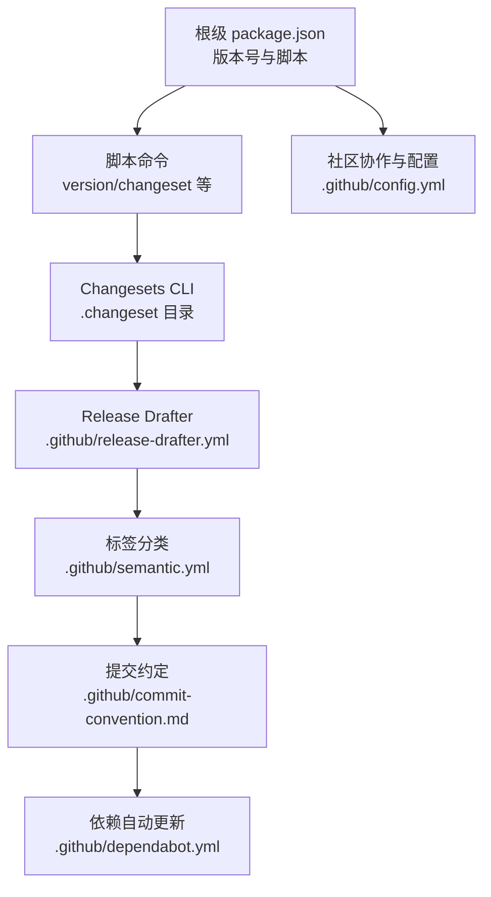
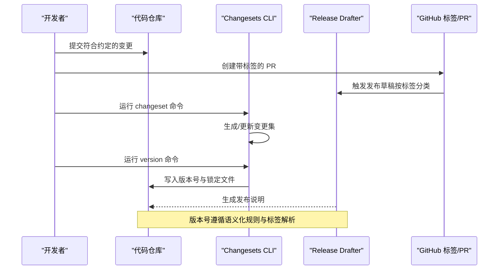
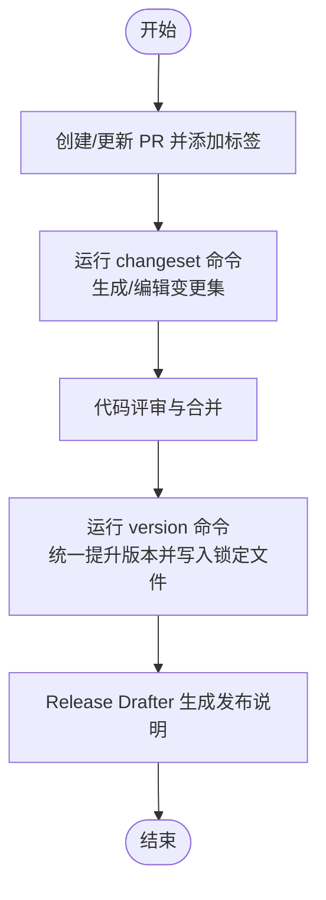
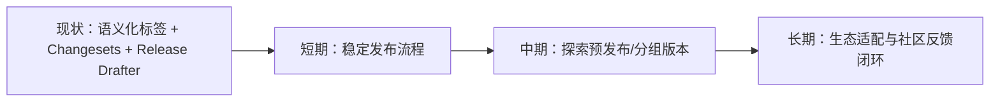
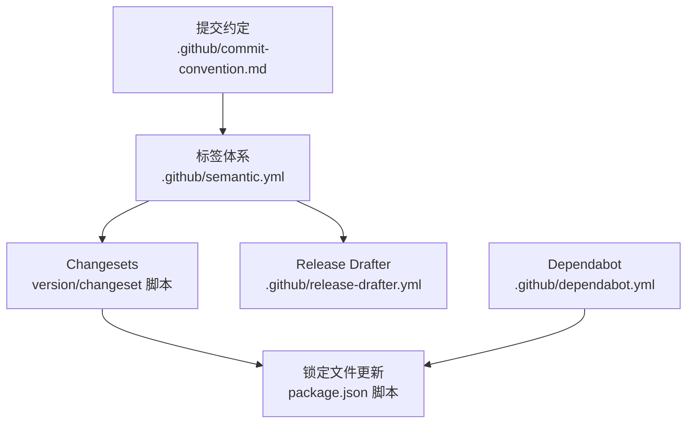

# 版本信息

<cite>
**本文引用的文件**
- [package.json](file://package.json)
- [.github/release-drafter.yml](file://.github/release-drafter.yml)
- [.github/semantic.yml](file://.github/semantic.yml)
- [.github/commit-convention.md](file://.github/commit-convention.md)
- [.github/pull_request_template.md](file://.github/pull_request_template.md)
- [.github/dependabot.yml](file://.github/dependabot.yml)
- [.github/config.yml](file://.github/config.yml)
</cite>

## 目录

1. [简介](#简介)
2. [项目结构](#项目结构)
3. [核心组件](#核心组件)
4. [架构总览](#架构总览)
5. [详细组件分析](#详细组件分析)
6. [依赖分析](#依赖分析)
7. [性能考虑](#性能考虑)
8. [故障排查指南](#故障排查指南)
9. [结论](#结论)
10. [附录](#附录)

## 简介

本文件面向 shiyu-ui（基于 Vben Admin 的多包仓库）项目的版本管理与发布体系，围绕当前版本（5.7.0）展开，系统阐述版本规则、变更集（Changeset）工作流、发布周期与策略、升级注意事项、不兼容项说明以及未来规划与社区协作机制。内容严格依据仓库内现有配置与规范文件整理，确保准确性与时效性。

## 项目结构

本项目采用 monorepo 架构，根目录通过脚本与工具链统一管理多应用与内部包。版本号由根级 package.json 维护，发布与变更集由 GitHub Actions 与 Changesets 配合完成。

图表来源

- [package.json:1-110](file://package.json#L1-L110)
- [.github/release-drafter.yml:1-62](file://.github/release-drafter.yml#L1-L62)
- [.github/semantic.yml:1-14](file://.github/semantic.yml#L1-L14)
- [.github/commit-convention.md:1-90](file://.github/commit-convention.md#L1-L90)
- [.github/dependabot.yml:1-18](file://.github/dependabot.yml#L1-L18)
- [.github/config.yml:1-40](file://.github/config.yml#L1-L40)

章节来源

- [package.json:1-110](file://package.json#L1-L110)

## 核心组件

- 版本号与脚本：根级 package.json 定义了项目名称、版本号（5.7.0）、Node/PNPM 引擎要求与常用脚本（如 changeset、version）。版本号在发布前通过 Changesets 命令进行统一修订与锁定文件同步。
- 变更集（Changesets）：通过 Changesets CLI 管理变更集，生成变更日志并驱动版本提升；根脚本中包含 changeset 与 version 命令。
- 发布草稿（Release Drafter）：根据 PR 标签自动汇总变更，生成发布说明，支持主/次/补丁版本解析与分类。
- 提交约定与语义化标签：定义可识别的提交类型与标签体系，用于自动化版本解析与变更分类。
- 自动化依赖更新：Dependabot 按日/周扫描依赖，分组更新非破坏性变更。
- 社区协作：GitHub Issues/讨论、PR 模板、欢迎评论等，保障贡献流程规范化。

章节来源

- [package.json:27-66](file://package.json#L27-L66)
- [.github/release-drafter.yml:37-54](file://.github/release-drafter.yml#L37-L54)
- [.github/semantic.yml:1-14](file://.github/semantic.yml#L1-L14)
- [.github/commit-convention.md:1-90](file://.github/commit-convention.md#L1-L90)
- [.github/dependabot.yml:1-18](file://.github/dependabot.yml#L1-L18)
- [.github/config.yml:1-40](file://.github/config.yml#L1-L40)

## 架构总览

下图展示从“提交/PR”到“版本发布”的端到端流程，映射至仓库中的实际配置文件。

图表来源

- [.github/release-drafter.yml:12-36](file://.github/release-drafter.yml#L12-L36)
- [.github/semantic.yml:2-12](file://.github/semantic.yml#L2-L12)
- [.github/commit-convention.md:45-55](file://.github/commit-convention.md#L45-L55)
- [package.json:38-66](file://package.json#L38-L66)

## 详细组件分析

### 当前版本与重要变更概览（5.7.0）

- 当前版本：5.7.0（由根级 package.json 维护）
- 版本定位：主版本 5 的持续迭代，聚焦稳定性、性能与生态适配
- 升级建议：优先执行依赖更新与类型检查，再进行功能回归测试

章节来源

- [package.json:3](file://package.json#L3)

### 版本发布频率与周期

- 发布节奏：无固定月度/季度发布计划声明，采用“变更驱动 + 标签驱动”的敏捷发布模式
- 触发方式：通过 PR 标签与 Changesets 工作流驱动版本提升与发布草稿生成
- 依赖更新：Dependabot 对 npm 与 GitHub Actions 分别按日/周进行非破坏性更新，辅助稳定发布

章节来源

- [.github/dependabot.yml:5-14](file://.github/dependabot.yml#L5-L14)
- [.github/release-drafter.yml:12-36](file://.github/release-drafter.yml#L12-L36)

### 版本管理策略（语义化版本与标签解析）

- 语义化类型：支持 feat、fix、docs、chore、style、refactor、perf、test、build、ci、revert 等
- 标签解析规则：major/minor/patch/breaking 等标签映射到版本提升级别
- 变更分类：按功能、缺陷修复、性能增强、文档、维护、测试等标签归类
- 排除标签：skip-changelog、no-changelog、changelog、bump versions、reverted、invalid 等不会进入变更日志

章节来源

- [.github/semantic.yml:2-12](file://.github/semantic.yml#L2-L12)
- [.github/release-drafter.yml:37-54](file://.github/release-drafter.yml#L37-L54)
- [.github/release-drafter.yml:55-62](file://.github/release-drafter.yml#L55-L62)

### 变更集（Changeset）工作流

- 变更集生成：开发者在 PR 中使用 Changesets CLI 生成变更描述，选择版本提升级别
- 版本提升：运行 version 命令后，统一更新各包版本与锁定文件
- 变更日志：结合 Release Drafter 与标签，自动生成发布说明
- PR 要求：PR 描述需清晰表达变更动机，变更集消息需以标准前缀开头（如 feat:/fix:/perf:/docs:/chore:）

图表来源

- [package.json:38-66](file://package.json#L38-L66)
- [.github/release-drafter.yml:12-36](file://.github/release-drafter.yml#L12-L36)
- [.github/pull_request_template.md:23-25](file://.github/pull_request_template.md#L23-L25)

章节来源

- [package.json:38-66](file://package.json#L38-L66)
- [.github/pull_request_template.md:23-25](file://.github/pull_request_template.md#L23-L25)

### 提交信息约定与破坏性变更标注

- 提交格式：包含 type(scope): subject，并允许在正文或页脚标注破坏性变更
- 约定示例：feat、fix、docs、style、refactor、perf、test、workflow、build、ci、chore、types、wip 等
- 破坏性变更：若存在 BREAKING CHANGE，则该提交必显式出现在变更日志中

章节来源

- [.github/commit-convention.md:45-55](file://.github/commit-convention.md#L45-L55)
- [.github/commit-convention.md:63-67](file://.github/commit-convention.md#L63-L67)
- [.github/commit-convention.md:85-90](file://.github/commit-convention.md#L85-L90)

### 不兼容性说明（基于现有配置的解读）

- 破坏性变更标签：当 PR 标签包含 breaking 或 major 时，版本将按主版本提升
- 提交约定：任何带有破坏性变更说明的提交都会被纳入变更日志
- 实操建议：升级前关注变更日志中的“Breaking”分类与标签，评估对业务的影响范围

章节来源

- [.github/release-drafter.yml:34-41](file://.github/release-drafter.yml#L34-L41)
- [.github/semantic.yml:2-12](file://.github/semantic.yml#L2-L12)
- [.github/commit-convention.md:85-90](file://.github/commit-convention.md#L85-L90)

### 版本升级指南（从旧版本迁移）

- 备份与隔离：升级前备份当前环境与依赖锁文件，建议在独立分支验证
- 依赖更新：优先执行依赖更新（Dependabot 规则已启用），确保生态兼容
- 类型检查与构建：运行类型检查与构建，修复类型错误与构建问题
- 回归测试：重点验证登录、菜单、权限、国际化、主题等核心模块
- 合并与发布：通过 Changesets 生成变更集，version 提升版本，Release Drafter 生成发布说明

章节来源

- [.github/dependabot.yml:5-14](file://.github/dependabot.yml#L5-L14)
- [package.json:27-66](file://package.json#L27-L66)
- [.github/release-drafter.yml:12-36](file://.github/release-drafter.yml#L12-L36)

### 版本路线图与未来规划（基于现有机制的推演）

- 短期：保持语义化标签与提交约定的稳定性，完善发布草稿的自动化
- 中期：探索更细粒度的版本分组与预发布通道（如需要）
- 长期：结合社区反馈与依赖生态变化，持续优化 Changesets 与 Release Drafter 的配置

说明：路线图为概念性示意，不直接映射具体源码文件

（本节为概念性说明，无需图表来源）

### 社区反馈机制

- 讨论与交流：Discord 与 GitHub Discussions 提供实时沟通渠道
- 问题模板：强制使用模板，要求提供必要信息以便快速定位
- PR 模板：明确变更类型、测试与变更集要求，减少沟通成本
- 新人引导：首次 PR/Issue 欢迎评论，帮助贡献者快速融入

章节来源

- [.github/config.yml:6-28](file://.github/config.yml#L6-L28)
- [.github/pull_request_template.md:1-34](file://.github/pull_request_template.md#L1-L34)
- [.github/config.yml:15-28](file://.github/config.yml#L15-L28)

## 依赖分析

- 版本提升依赖：Changesets CLI、Release Drafter、语义化标签与提交约定共同决定版本号
- 自动化依赖：Dependabot 按日/周扫描，降低依赖风险
- 质量门禁：PR 模板要求测试与变更集，保证发布质量

图表来源

- [.github/commit-convention.md:45-55](file://.github/commit-convention.md#L45-L55)
- [.github/semantic.yml:2-12](file://.github/semantic.yml#L2-L12)
- [package.json:38-66](file://package.json#L38-L66)
- [.github/release-drafter.yml:12-36](file://.github/release-drafter.yml#L12-L36)
- [.github/dependabot.yml:1-18](file://.github/dependabot.yml#L1-L18)

章节来源

- [package.json:38-66](file://package.json#L38-L66)
- [.github/release-drafter.yml:12-36](file://.github/release-drafter.yml#L12-L36)
- [.github/semantic.yml:2-12](file://.github/semantic.yml#L2-L12)
- [.github/commit-convention.md:45-55](file://.github/commit-convention.md#L45-L55)
- [.github/dependabot.yml:1-18](file://.github/dependabot.yml#L1-L18)

## 性能考虑

- 发布流程性能：Changesets 与 Release Drafter 的组合减少了人工维护成本，提升发布效率
- 依赖更新：Dependabot 的定期扫描有助于提前发现潜在性能与安全问题
- 开发体验：统一的脚本与配置降低了团队学习成本，提升了协作效率

（本节为通用指导，无需章节来源）

## 故障排查指南

- 变更集未生效：确认是否正确运行 changeset 与 version 命令，检查 PR 是否包含有效标签
- 版本未提升：核对标签是否匹配语义化规则，检查 release-drafter 的版本解析配置
- 提交信息不合规：遵循提交约定格式，避免因格式问题导致的自动化失败
- 依赖冲突：利用 Dependabot 的非破坏性更新策略，逐步排查锁定文件差异

章节来源

- [package.json:38-66](file://package.json#L38-L66)
- [.github/release-drafter.yml:37-54](file://.github/release-drafter.yml#L37-L54)
- [.github/commit-convention.md:45-55](file://.github/commit-convention.md#L45-L55)
- [.github/dependabot.yml:5-14](file://.github/dependabot.yml#L5-L14)

## 结论

本项目采用“提交约定 + 标签解析 + Changesets + Release Drafter”的版本管理方案，配合 Dependabot 的自动化依赖更新与社区协作规范，形成高效、透明且可追溯的发布流程。当前版本为 5.7.0，升级时应重点关注破坏性变更与生态依赖的兼容性，遵循变更集与 PR 模板要求，确保平滑过渡。

## 附录

- 关键脚本与命令
  - changeset：生成/管理变更集
  - version：统一提升版本并更新锁定文件
- 参考文件
  - 提交约定与示例
  - PR 模板与社区配置
  - 依赖自动更新策略

章节来源

- [package.json:38-66](file://package.json#L38-L66)
- [.github/commit-convention.md:1-90](file://.github/commit-convention.md#L1-L90)
- [.github/pull_request_template.md:1-34](file://.github/pull_request_template.md#L1-L34)
- [.github/config.yml:1-40](file://.github/config.yml#L1-L40)
- [.github/dependabot.yml:1-18](file://.github/dependabot.yml#L1-L18)
