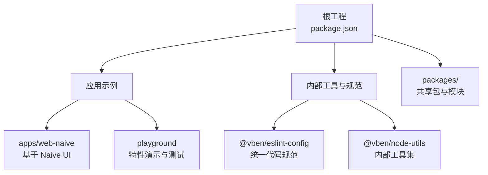
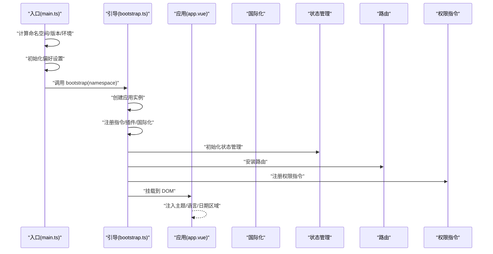
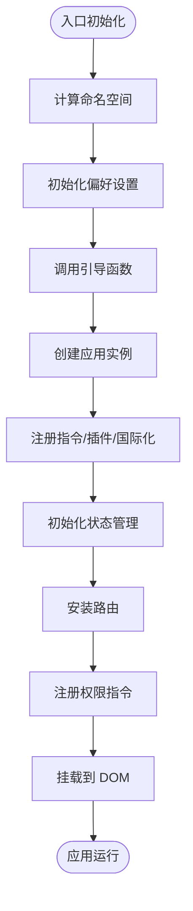
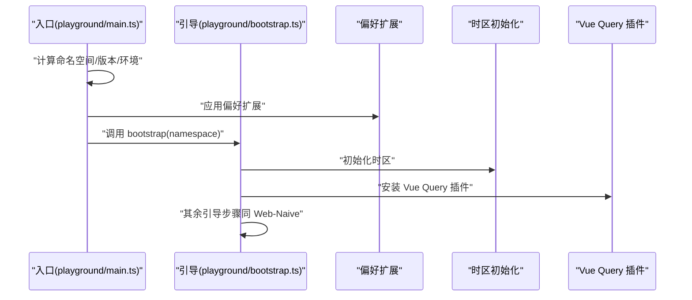
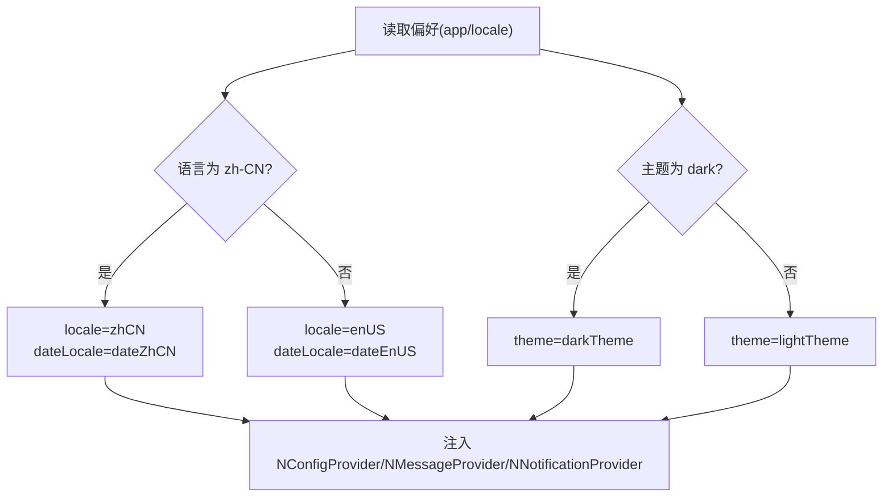
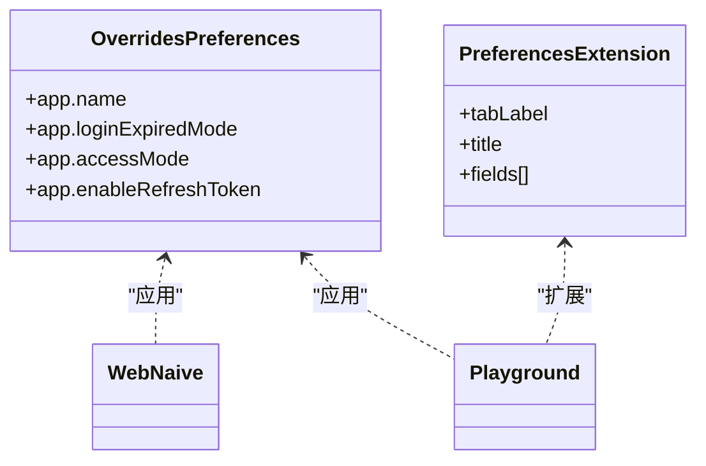
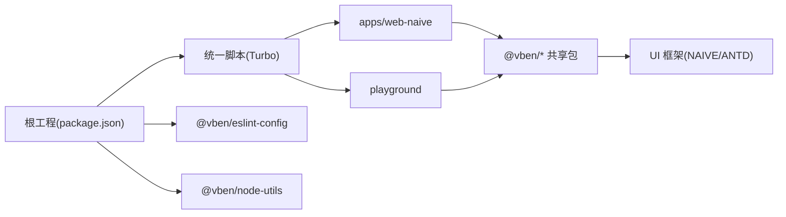

# 项目介绍

<cite>
**本文引用的文件**
- [README.md](file://README.md)
- [package.json](file://package.json)
- [apps/web-naive/package.json](file://apps/web-naive/package.json)
- [playground/package.json](file://playground/package.json)
- [apps/web-naive/src/main.ts](file://apps/web-naive/src/main.ts)
- [playground/src/main.ts](file://playground/src/main.ts)
- [apps/web-naive/src/app.vue](file://apps/web-naive/src/app.vue)
- [playground/src/app.vue](file://playground/src/app.vue)
- [apps/web-naive/src/bootstrap.ts](file://apps/web-naive/src/bootstrap.ts)
- [playground/src/bootstrap.ts](file://playground/src/bootstrap.ts)
- [apps/web-naive/src/preferences.ts](file://apps/web-naive/src/preferences.ts)
- [playground/src/preferences.ts](file://playground/src/preferences.ts)
- [internal/lint-configs/eslint-config/package.json](file://internal/lint-configs/eslint-config/package.json)
- [internal/node-utils/package.json](file://internal/node-utils/package.json)
</cite>

## 目录

1. [引言](#引言)
2. [项目结构](#项目结构)
3. [核心组件](#核心组件)
4. [架构总览](#架构总览)
5. [详细组件分析](#详细组件分析)
6. [依赖分析](#依赖分析)
7. [性能考虑](#性能考虑)
8. [故障排查指南](#故障排查指南)
9. [结论](#结论)
10. [附录](#附录)

## 引言

本项目是基于 Vue 3 的现代化中后台前端解决方案，定位为免费开源的中后台模板，采用最新的前端技术栈（Vue 3、Vite、TypeScript），提供开箱即用的企业级能力，既可用于实际项目快速落地，也可作为学习与参考的范例。项目当前版本为 5.0，强调与历史版本不兼容，建议新项目直接采用最新版本；如需参考旧版，可切换至 v2 分支。

项目具备以下核心价值主张：

- 技术前沿：采用 Vue 3、Vite、TypeScript 等主流技术，确保开发体验与运行性能。
- 主题与国际化：内置多主题色与国际化支持，满足多语言与品牌定制需求。
- 权限体系：提供动态路由权限生成方案，便于构建细粒度的访问控制。
- 开源与社区：MIT 许可证，欢迎社区贡献，提供完善的贡献流程与规范。

**章节来源**

- [README.md:17-32](file://README.md#L17-L32)
- [README.md:21-24](file://README.md#L21-L24)

## 项目结构

本仓库采用 Monorepo 结构组织，核心由以下部分组成：

- 根工程与工作区
  - 根 package.json 统一管理脚本、引擎与工作区配置，集中声明 Turbo、ESLint、Stylelint、Vite 等工具链。
  - pnpm 工作区通过 packages 与 internal 子目录承载共享包与内部工具。
- 应用示例
  - apps/web-naive：基于 Naive UI 的 Web 应用示例，展示完整的中后台功能与最佳实践。
  - playground：多组件/特性演示与集成验证的 Playground 应用，支持 E2E 测试与特性开关。
- 内部工具与规范
  - internal/lint-configs：统一的 ESLint、Oxlint、Stylelint、Oxfmt 等配置包，保障团队一致性。
  - internal/node-utils：内部 Node 工具集，提供构建、校验、路径等通用能力。

**图表来源**

- [package.json:1-110](file://package.json#L1-L110)
- [apps/web-naive/package.json:1-51](file://apps/web-naive/package.json#L1-L51)
- [playground/package.json:1-63](file://playground/package.json#L1-L63)
- [internal/lint-configs/eslint-config/package.json:1-48](file://internal/lint-configs/eslint-config/package.json#L1-L48)
- [internal/node-utils/package.json:1-43](file://internal/node-utils/package.json#L1-L43)

**章节来源**

- [package.json:27-67](file://package.json#L27-L67)
- [apps/web-naive/package.json:17-27](file://apps/web-naive/package.json#L17-L27)
- [playground/package.json:17-29](file://playground/package.json#L17-L29)

## 核心组件

- 应用入口与启动流程
  - apps/web-naive 与 playground 均通过 main.ts 进行应用初始化，包括偏好设置命名空间计算、偏好初始化、引导函数调用与全局 Loading 销毁。
  - bootstrap.ts 负责创建应用实例、注册指令与插件、初始化国际化、状态管理、路由、权限指令、消息/通知提供者、动态标题等。
- 主题与国际化
  - app.vue 将主题、语言与日期区域设置注入到全局配置提供者，实现按偏好动态切换。
- 偏好设置与扩展
  - preferences.ts 提供覆盖默认偏好的能力，支持应用名、登录过期处理方式、权限模式、刷新令牌等关键配置；playground 还提供扩展字段以演示偏好系统的可扩展性。

**章节来源**

- [apps/web-naive/src/main.ts:9-31](file://apps/web-naive/src/main.ts#L9-L31)
- [playground/src/main.ts:9-32](file://playground/src/main.ts#L9-L32)
- [apps/web-naive/src/bootstrap.ts:19-77](file://apps/web-naive/src/bootstrap.ts#L19-L77)
- [playground/src/bootstrap.ts:21-91](file://playground/src/bootstrap.ts#L21-L91)
- [apps/web-naive/src/app.vue:42-56](file://apps/web-naive/src/app.vue#L42-L56)
- [playground/src/app.vue:33-39](file://playground/src/app.vue#L33-L39)
- [apps/web-naive/src/preferences.ts:8-16](file://apps/web-naive/src/preferences.ts#L8-L16)
- [playground/src/preferences.ts:18-26](file://playground/src/preferences.ts#L18-L26)
- [playground/src/preferences.ts:30-87](file://playground/src/preferences.ts#L30-L87)

## 架构总览

下图展示了应用从入口到运行的关键交互：入口初始化偏好与命名空间 → 引导函数装配应用 → 注入国际化、状态、路由、权限与插件 → 渲染全局配置提供者与路由视图。

**图表来源**

- [apps/web-naive/src/main.ts:9-31](file://apps/web-naive/src/main.ts#L9-L31)
- [apps/web-naive/src/bootstrap.ts:19-77](file://apps/web-naive/src/bootstrap.ts#L19-L77)
- [apps/web-naive/src/app.vue:42-56](file://apps/web-naive/src/app.vue#L42-L56)

**章节来源**

- [apps/web-naive/src/main.ts:9-31](file://apps/web-naive/src/main.ts#L9-L31)
- [apps/web-naive/src/bootstrap.ts:19-77](file://apps/web-naive/src/bootstrap.ts#L19-L77)
- [apps/web-naive/src/app.vue:42-56](file://apps/web-naive/src/app.vue#L42-L56)

## 详细组件分析

### 应用入口与引导流程（Web-Naive）

- 入口职责
  - 计算命名空间（结合命名空间、版本与环境）。
  - 初始化偏好设置（覆盖默认偏好）。
  - 异步加载引导函数并执行，随后移除全局 Loading。
- 引导职责
  - 初始化组件适配器与表单适配。
  - 注册 v-loading 指令与权限指令。
  - 初始化国际化、状态管理、路由、Motion 插件。
  - 动态更新页面标题（根据路由 meta 与偏好）。

**图表来源**

- [apps/web-naive/src/main.ts:9-31](file://apps/web-naive/src/main.ts#L9-L31)
- [apps/web-naive/src/bootstrap.ts:19-77](file://apps/web-naive/src/bootstrap.ts#L19-L77)

**章节来源**

- [apps/web-naive/src/main.ts:9-31](file://apps/web-naive/src/main.ts#L9-L31)
- [apps/web-naive/src/bootstrap.ts:19-77](file://apps/web-naive/src/bootstrap.ts#L19-L77)

### 应用入口与引导流程（Playground）

- 入口差异
  - 支持偏好扩展（preferencesExtension），允许在界面中新增配置项。
  - 注入插件全局选项（providePluginsOptions），并初始化时区处理。
  - 安装 @tanstack/vue-query 插件以支持查询相关能力。
- 引导差异
  - 注入插件全局选项与时区初始化。
  - 安装 Vue Query 插件与 Motion 插件。

**图表来源**

- [playground/src/main.ts:9-32](file://playground/src/main.ts#L9-L32)
- [playground/src/bootstrap.ts:21-91](file://playground/src/bootstrap.ts#L21-L91)

**章节来源**

- [playground/src/main.ts:9-32](file://playground/src/main.ts#L9-L32)
- [playground/src/bootstrap.ts:21-91](file://playground/src/bootstrap.ts#L21-L91)

### 主题与国际化（Web-Naive）

- 主题
  - 根据偏好选择明暗主题，并通过全局主题覆盖注入设计令牌。
- 国际化与日期区域
  - 根据偏好选择语言与日期区域，注入到全局配置提供者。

**图表来源**

- [apps/web-naive/src/app.vue:25-39](file://apps/web-naive/src/app.vue#L25-L39)

**章节来源**

- [apps/web-naive/src/app.vue:25-39](file://apps/web-naive/src/app.vue#L25-L39)

### 偏好设置与扩展（Web-Naive 与 Playground）

- Web-Naive
  - 覆盖应用名、登录过期处理方式、权限模式、刷新令牌等关键偏好。
- Playground
  - 在覆盖基础上，定义扩展字段（报告标题、默认可见行数、快捷操作开关、高亮色调等），并通过偏好扩展机制在界面中呈现与编辑。

**图表来源**

- [apps/web-naive/src/preferences.ts:8-16](file://apps/web-naive/src/preferences.ts#L8-L16)
- [playground/src/preferences.ts:18-26](file://playground/src/preferences.ts#L18-L26)
- [playground/src/preferences.ts:30-87](file://playground/src/preferences.ts#L30-L87)

**章节来源**

- [apps/web-naive/src/preferences.ts:8-16](file://apps/web-naive/src/preferences.ts#L8-L16)
- [playground/src/preferences.ts:18-26](file://playground/src/preferences.ts#L18-L26)
- [playground/src/preferences.ts:30-87](file://playground/src/preferences.ts#L30-L87)

### 应用场景与目标用户

- 场景
  - 快速搭建企业级中后台系统（仪表盘、系统管理、权限控制、国际化等）。
  - 作为学习与参考，掌握现代前端工程化与最佳实践。
- 用户
  - 前端/全栈工程师、技术负责人、高校学生与开源爱好者。
- 学习参考价值
  - Monorepo 工程组织、统一规范与工具链、组件适配与插件化架构、权限与国际化实现思路。

**章节来源**

- [README.md:17-32](file://README.md#L17-L32)

## 依赖分析

- 工作区与脚本
  - 根工程通过 Turbo 管理构建与开发任务，统一脚本入口，支持多应用并行开发与构建。
- 应用依赖
  - apps/web-naive 与 playground 均依赖 @vben/\* 共享包（布局、样式、hooks、stores、plugins 等），并引入对应 UI 框架（Naive UI 或 Ant Design Vue）与 Vue3 生态。
- 内部工具
  - @vben/eslint-config 与 @vben/node-utils 作为内部包被根工程统一引用，保障代码质量与工程效率。

**图表来源**

- [package.json:27-67](file://package.json#L27-L67)
- [apps/web-naive/package.json:28-49](file://apps/web-naive/package.json#L28-L49)
- [playground/package.json:31-57](file://playground/package.json#L31-L57)
- [internal/lint-configs/eslint-config/package.json:23-28](file://internal/lint-configs/eslint-config/package.json#L23-L28)
- [internal/node-utils/package.json:23-29](file://internal/node-utils/package.json#L23-L29)

**章节来源**

- [package.json:27-67](file://package.json#L27-L67)
- [apps/web-naive/package.json:28-49](file://apps/web-naive/package.json#L28-L49)
- [playground/package.json:31-57](file://playground/package.json#L31-L57)

## 性能考虑

- 构建与打包
  - 使用 Vite 与 Turbo 并行构建，提升开发与生产构建效率。
- 运行时优化
  - 通过插件化与按需加载（如引导阶段异步导入插件与适配器），减少首屏负担。
- 工程化
  - 统一的 ESLint/Oxlint、Stylelint、格式化与类型检查，降低维护成本，间接提升稳定性与性能。

**章节来源**

- [package.json:29-31](file://package.json#L29-L31)
- [apps/web-naive/src/bootstrap.ts:53-61](file://apps/web-naive/src/bootstrap.ts#L53-L61)
- [playground/src/bootstrap.ts:69-75](file://playground/src/bootstrap.ts#L69-L75)

## 故障排查指南

- 偏好设置不生效
  - 更改偏好后需清理浏览器缓存，确保覆盖配置生效。
- 登录过期或权限异常
  - 检查偏好中的登录过期处理方式与权限模式配置。
- 国际化显示异常
  - 确认偏好语言设置与 app.vue 中注入的语言/日期区域一致。
- 构建失败或依赖问题
  - 使用根工程提供的统一脚本与引擎版本要求，避免版本不匹配导致的问题。

**章节来源**

- [apps/web-naive/src/preferences.ts:6](file://apps/web-naive/src/preferences.ts#L6)
- [apps/web-naive/src/app.vue:25-39](file://apps/web-naive/src/app.vue#L25-L39)
- [package.json:104-108](file://package.json#L104-L108)

## 结论

Shiyu-UI 以 Vue 3 为核心，结合 Vite、TypeScript 与现代化工程化工具，提供了可直接用于企业级中后台开发的模板与参考。其 Monorepo 架构、统一规范与插件化设计，既保证了工程的可维护性，也为二次开发与扩展提供了清晰路径。对于初学者而言，它既是快速上手的脚手架，也是深入理解现代前端工程化与最佳实践的学习范本。

## 附录

- 版本与升级
  - 当前版本为 5.0，与历史版本不兼容，建议新项目直接采用最新版本。
- 社区与贡献
  - 采用 MIT 许可证，欢迎提交 Issue 与 Pull Request；遵循约定式提交规范与贡献流程。

**章节来源**

- [README.md:21-24](file://README.md#L21-L24)
- [README.md:87-114](file://README.md#L87-L114)
