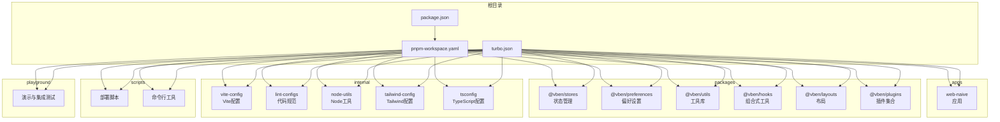
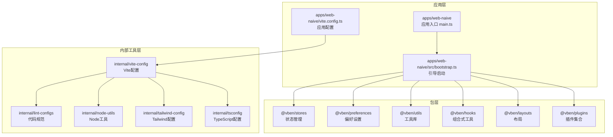
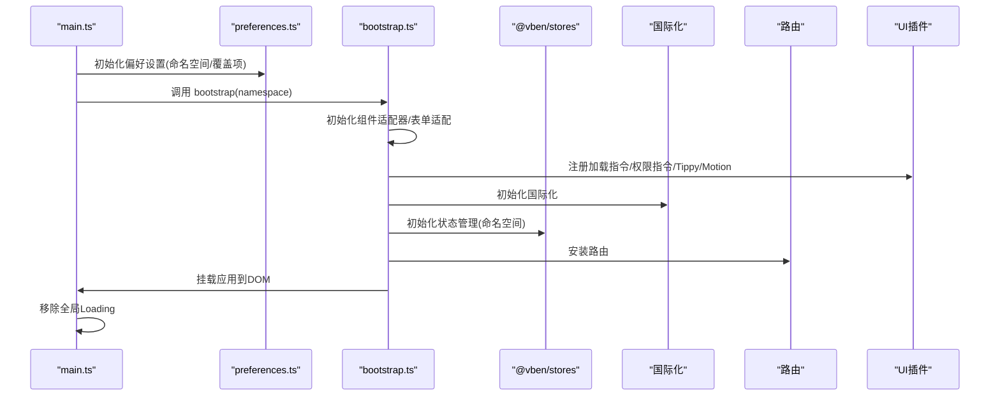
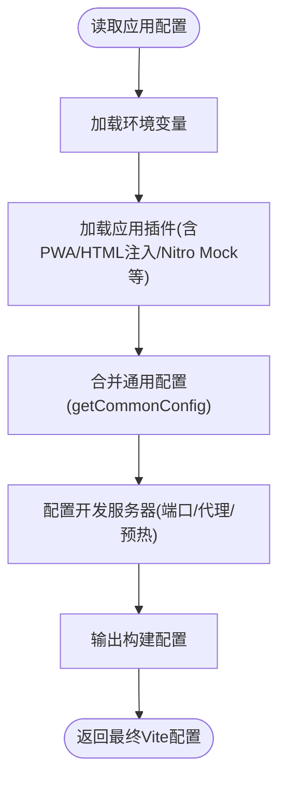
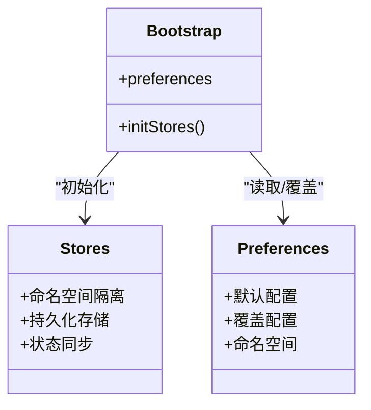
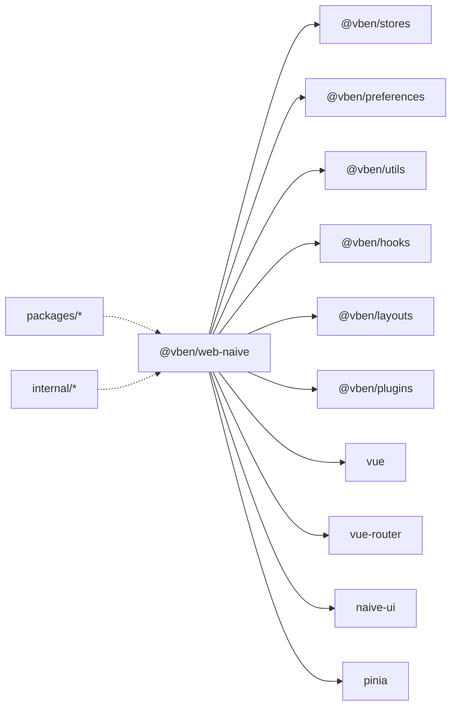

# 项目概述

<cite>
**本文引用的文件**
- [README.md](file://README.md)
- [package.json](file://package.json)
- [turbo.json](file://turbo.json)
- [pnpm-workspace.yaml](file://pnpm-workspace.yaml)
- [apps/web-naive/package.json](file://apps/web-naive/package.json)
- [apps/web-naive/vite.config.ts](file://apps/web-naive/vite.config.ts)
- [apps/web-naive/src/main.ts](file://apps/web-naive/src/main.ts)
- [apps/web-naive/src/preferences.ts](file://apps/web-naive/src/preferences.ts)
- [apps/web-naive/src/bootstrap.ts](file://apps/web-naive/src/bootstrap.ts)
- [packages/stores/package.json](file://packages/stores/package.json)
- [packages/preferences/package.json](file://packages/preferences/package.json)
- [internal/vite-config/src/config/application.ts](file://internal/vite-config/src/config/application.ts)
</cite>

## 目录

1. [引言](#引言)
2. [项目结构](#项目结构)
3. [核心组件](#核心组件)
4. [架构总览](#架构总览)
5. [详细组件分析](#详细组件分析)
6. [依赖关系分析](#依赖关系分析)
7. [性能考量](#性能考量)
8. [故障排查指南](#故障排查指南)
9. [结论](#结论)
10. [附录](#附录)

## 引言

本项目是一个基于 Vue 3 的现代化后台管理系统，采用最新的前端技术栈（Vue 3、Vite、TypeScript），提供多主题、国际化、动态权限控制等企业级能力。项目采用 Monorepo 架构，通过 Turbo 管理构建与开发流程，结合统一的内部工具链与配置，形成可复用、可扩展、可维护的工程体系。

- 核心价值主张
  - 技术前沿：Vue 3 + Vite + TypeScript，拥抱现代前端工程化最佳实践
  - 企业级特性：多主题、国际化、动态权限、状态管理与持久化
  - 工程化能力：Monorepo、统一配置、类型检查、自动化测试与发布
  - 学习参考：完整示例与可运行的 Playground，适合入门与进阶

- 版本与兼容性
  - 当前版本：5.7.0
  - 升级注意：5.x 与旧版本不兼容，建议新项目直接使用最新版本
  - 浏览器支持：推荐 Chrome 80+，支持现代浏览器，不支持 IE

- 社区生态
  - 文档中心：提供系统化文档与示例
  - 贡献方式：Issue 提交与 Pull Request 流程规范
  - 讨论渠道：GitHub Discussions

**章节来源**

- [README.md:17-32](file://README.md#L17-L32)
- [README.md:21-24](file://README.md#L21-L24)
- [README.md:115-124](file://README.md#L115-L124)
- [README.md:51-54](file://README.md#L51-L54)
- [README.md:87-114](file://README.md#L87-L114)

## 项目结构

项目采用 Monorepo 架构，以 pnpm workspace 管理多包与应用，核心目录职责如下：

- apps：应用层，包含多个前端应用（如 web-naive）
- packages：业务与通用包，如 @vben/stores、@vben/preferences、@vben/utils 等
- internal：内部工具与配置，如 lint-configs、vite-config、node-utils、tailwind-config、tsconfig 等
- scripts：脚本工具，如部署、清理、命令行工具等
- playground：演示与集成测试环境
- 根级配置：package.json、turbo.json、pnpm-workspace.yaml 等

**图表来源**

- [pnpm-workspace.yaml:1-14](file://pnpm-workspace.yaml#L1-L14)
- [turbo.json:15-47](file://turbo.json#L15-L47)
- [package.json:27-67](file://package.json#L27-L67)

**章节来源**

- [pnpm-workspace.yaml:1-14](file://pnpm-workspace.yaml#L1-L14)
- [turbo.json:15-47](file://turbo.json#L15-L47)
- [package.json:27-67](file://package.json#L27-L67)

## 核心组件

- 应用入口与启动流程
  - main.ts：应用初始化、偏好设置、引导启动、移除全局 Loading
  - bootstrap.ts：创建应用实例、注册指令与插件、国际化、状态管理、路由、动态标题等
  - preferences.ts：应用偏好覆盖（名称、登录过期模式、访问模式等）

- 状态管理与偏好设置
  - @vben/stores：基于 Pinia 的状态管理，支持持久化与命名空间隔离
  - @vben/preferences：统一的应用偏好设置，支持命名空间与覆盖配置

- 构建与开发配置
  - internal/vite-config：封装 Vite 应用配置，提供插件、PWA、HTML 注入、Nitro Mock、压缩等能力
  - apps/web-naive/vite.config.ts：应用层 Vite 配置入口，继承并扩展通用配置

- 开发与构建脚本
  - package.json scripts：统一的开发、构建、预览、测试、格式化、类型检查等命令
  - turbo.json：任务依赖与输出缓存策略，加速构建与预览

**章节来源**

- [apps/web-naive/src/main.ts:1-32](file://apps/web-naive/src/main.ts#L1-L32)
- [apps/web-naive/src/bootstrap.ts:19-77](file://apps/web-naive/src/bootstrap.ts#L19-L77)
- [apps/web-naive/src/preferences.ts:8-17](file://apps/web-naive/src/preferences.ts#L8-L17)
- [packages/stores/package.json:1-33](file://packages/stores/package.json#L1-L33)
- [packages/preferences/package.json:1-27](file://packages/preferences/package.json#L1-L27)
- [internal/vite-config/src/config/application.ts:17-99](file://internal/vite-config/src/config/application.ts#L17-L99)
- [apps/web-naive/vite.config.ts:1-21](file://apps/web-naive/vite.config.ts#L1-L21)
- [package.json:27-67](file://package.json#L27-L67)
- [turbo.json:15-47](file://turbo.json#L15-L47)

## 架构总览

整体架构围绕“应用层 + 包层 + 内部工具层”的三层结构展开，配合 Turbo 实现高效构建与缓存，Vite 提供快速开发体验，Pinia 与偏好设置实现状态与配置的统一管理。

**图表来源**

- [apps/web-naive/src/main.ts:1-32](file://apps/web-naive/src/main.ts#L1-L32)
- [apps/web-naive/src/bootstrap.ts:19-77](file://apps/web-naive/src/bootstrap.ts#L19-L77)
- [apps/web-naive/vite.config.ts:1-21](file://apps/web-naive/vite.config.ts#L1-L21)
- [packages/stores/package.json:1-33](file://packages/stores/package.json#L1-L33)
- [packages/preferences/package.json:1-27](file://packages/preferences/package.json#L1-L27)
- [internal/vite-config/src/config/application.ts:17-99](file://internal/vite-config/src/config/application.ts#L17-L99)

## 详细组件分析

### 应用启动与引导流程

应用启动从 main.ts 开始，按顺序执行：初始化偏好设置、引导应用、挂载、移除全局 Loading。bootstrap.ts 负责创建应用实例、注册指令与插件、国际化、状态管理、路由、动态标题等。

**图表来源**

- [apps/web-naive/src/main.ts:9-31](file://apps/web-naive/src/main.ts#L9-L31)
- [apps/web-naive/src/bootstrap.ts:19-77](file://apps/web-naive/src/bootstrap.ts#L19-L77)
- [apps/web-naive/src/preferences.ts:8-17](file://apps/web-naive/src/preferences.ts#L8-L17)

**章节来源**

- [apps/web-naive/src/main.ts:1-32](file://apps/web-naive/src/main.ts#L1-L32)
- [apps/web-naive/src/bootstrap.ts:19-77](file://apps/web-naive/src/bootstrap.ts#L19-L77)
- [apps/web-naive/src/preferences.ts:8-17](file://apps/web-naive/src/preferences.ts#L8-L17)

### Vite 应用配置与开发体验

应用层通过 vite.config.ts 使用 internal/vite-config 的 defineApplicationConfig，启用插件、PWA、HTML 注入、Nitro Mock、压缩、导入映射等功能，并配置本地开发服务器与预热文件列表，提升开发效率。

**图表来源**

- [internal/vite-config/src/config/application.ts:17-99](file://internal/vite-config/src/config/application.ts#L17-L99)
- [apps/web-naive/vite.config.ts:3-20](file://apps/web-naive/vite.config.ts#L3-L20)

**章节来源**

- [internal/vite-config/src/config/application.ts:17-99](file://internal/vite-config/src/config/application.ts#L17-L99)
- [apps/web-naive/vite.config.ts:1-21](file://apps/web-naive/vite.config.ts#L1-L21)

### 状态管理与偏好设置

- @vben/stores：集中管理应用状态，支持命名空间隔离与持久化，便于多应用或多项目共享
- @vben/preferences：统一管理应用偏好设置，支持覆盖默认值与命名空间隔离，确保不同环境与项目配置互不干扰

**图表来源**

- [packages/stores/package.json:1-33](file://packages/stores/package.json#L1-L33)
- [packages/preferences/package.json:1-27](file://packages/preferences/package.json#L1-L27)
- [apps/web-naive/src/bootstrap.ts:47-47](file://apps/web-naive/src/bootstrap.ts#L47-L47)
- [apps/web-naive/src/preferences.ts:8-17](file://apps/web-naive/src/preferences.ts#L8-L17)

**章节来源**

- [packages/stores/package.json:1-33](file://packages/stores/package.json#L1-L33)
- [packages/preferences/package.json:1-27](file://packages/preferences/package.json#L1-L27)
- [apps/web-naive/src/bootstrap.ts:47-47](file://apps/web-naive/src/bootstrap.ts#L47-L47)
- [apps/web-naive/src/preferences.ts:8-17](file://apps/web-naive/src/preferences.ts#L8-L17)

## 依赖关系分析

- 包依赖
  - apps/web-naive 依赖 @vben 下的多个包（stores、preferences、utils、hooks、layouts、plugins 等）以及外部生态（naive-ui、vue、vue-router、pinia 等）
  - packages 与 internal 通过 workspace:\* 与 catalog: 统一管理，减少重复依赖与版本漂移
- 任务依赖
  - turbo.json 定义了 build、preview、dev 等任务的依赖与输出缓存，确保增量构建与一致性

**图表来源**

- [apps/web-naive/package.json:28-49](file://apps/web-naive/package.json#L28-L49)
- [pnpm-workspace.yaml:1-14](file://pnpm-workspace.yaml#L1-L14)

**章节来源**

- [apps/web-naive/package.json:28-49](file://apps/web-naive/package.json#L28-L49)
- [pnpm-workspace.yaml:1-14](file://pnpm-workspace.yaml#L1-L14)
- [turbo.json:15-47](file://turbo.json#L15-L47)

## 性能考量

- 构建优化
  - 使用 Turbo 进行任务依赖与缓存，避免重复构建
  - Vite 构建配置启用 rolldown 输出与压缩选项，减少产物体积
- 开发体验
  - 服务器预热与插件注入，缩短首屏等待时间
  - Nitro Mock 与代理配置，提升联调效率
- 类型与质量保障
  - 统一的 tsconfig 与类型检查，降低运行时风险
  - Lint 与格式化配置，保证代码一致性

**章节来源**

- [turbo.json:15-47](file://turbo.json#L15-L47)
- [internal/vite-config/src/config/application.ts:60-76](file://internal/vite-config/src/config/application.ts#L60-L76)
- [apps/web-naive/vite.config.ts:7-17](file://apps/web-naive/vite.config.ts#L7-L17)

## 故障排查指南

- 常见问题
  - 构建失败：检查 turbo 任务依赖与输出缓存，清理缓存后重试
  - 依赖冲突：确认 pnpm-workspace.yaml 与 catalog: 配置是否正确
  - 开发代理异常：核对 vite 代理配置与后端服务状态
  - 国际化/主题不生效：确认偏好设置覆盖项与命名空间是否正确
- 排查步骤
  - 清理缓存与锁文件，重新安装依赖
  - 分步执行 dev/build 任务，定位具体环节
  - 查看 Lint 与类型检查输出，修复告警与错误

**章节来源**

- [package.json:44-66](file://package.json#L44-L66)
- [apps/web-naive/vite.config.ts:7-17](file://apps/web-naive/vite.config.ts#L7-L17)
- [apps/web-naive/src/preferences.ts:6-17](file://apps/web-naive/src/preferences.ts#L6-L17)

## 结论

本项目以 Vue 3 为核心，结合 Vite、TypeScript 与 Pinia，构建出一套现代化、可扩展、可维护的企业级后台管理解决方案。通过 Monorepo 架构与内部工具链，实现了工程化的统一与高效协作；通过多主题、国际化、动态权限等特性，满足复杂业务场景需求。对于初学者，项目提供了完整的示例与文档；对于有经验的开发者，其工程化设计与可扩展性具备很高的学习与参考价值。

## 附录

- 快速开始
  - 克隆仓库、安装依赖、启动开发服务器、构建产物
- 版本与升级
  - 当前版本 5.7.0，5.x 与旧版本不兼容
- 社区与贡献
  - Issue 提交与 Pull Request 规范、讨论渠道与文档中心

**章节来源**

- [README.md:55-82](file://README.md#L55-L82)
- [README.md:21-24](file://README.md#L21-L24)
- [README.md:51-54](file://README.md#L51-L54)
- [README.md:87-114](file://README.md#L87-L114)
