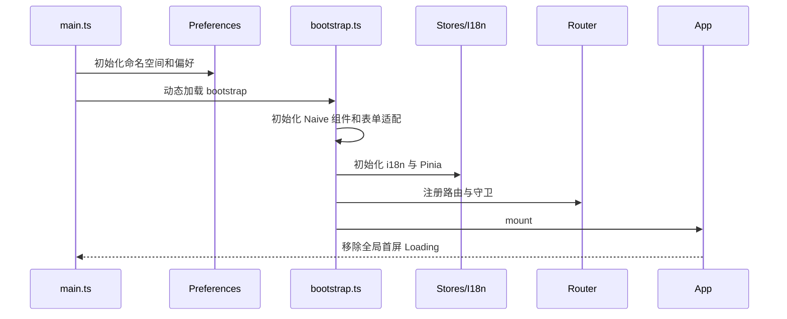

# ShiYu UI 前端技术文档

> 文档基线：2026-08-12。当前业务应用为 `apps/web-naive`。

## 1. 技术栈

| 领域   | 当前实现                                               |
| ------ | ------------------------------------------------------ |
| 语言   | TypeScript 6、Vue SFC                                  |
| 框架   | Vue 3.5、Vben Admin 5.7                                |
| 构建   | Vite 8、Turbo 2、pnpm workspace                        |
| UI     | Naive UI 2.44、Vben UI 包、Tailwind CSS 4              |
| 状态   | Pinia 3、持久化 Store                                  |
| 路由   | Vue Router 5、后端动态菜单 + 前端核心路由的 mixed 模式 |
| 图编辑 | Vue Flow Core、Background、Controls、Minimap           |
| 请求   | Vben Request/Axios；流式请求使用 Fetch                 |
| 国际化 | Vue I18n，`zh-CN`、`en-US`                             |
| 测试   | Vitest 4、Vue Test Utils、Playwright 1.61              |
| 质量   | vue-tsc、ESLint/Oxlint、Oxfmt、Stylelint、CI           |

运行时要求由根 `package.json` 固定为 Node.js `^22.18.0 || ^24.12.0`、pnpm `>=11.0.0`，锁定的包管理器为 pnpm 11.16.0。

## 2. 仓库结构

```text
shiyu-ui/
├─ apps/
│  └─ web-naive/            ShiYu 主应用
├─ packages/                Vben 核心、业务与效果包
├─ internal/                工程配置和内部工具
├─ tests/e2e/               Playwright 端到端测试
├─ scripts/                 构建、清理和部署脚本
├─ docs/                    文档站及项目文档
├─ pnpm-workspace.yaml       workspace 与 catalog 版本
├─ turbo.json                任务编排
└─ package.json              根命令与运行时约束
```

`apps/web-naive/src`：

```text
src/
├─ adapter/       Naive UI 与 Vben 表单/组件适配
├─ api/           REST、SSE、类型和请求拦截器
├─ components/    业务通用组件
├─ composables/   可复用组合式逻辑
├─ layouts/       主布局与认证布局
├─ locales/       中英文业务文案
├─ router/        核心路由、守卫、菜单契约
├─ store/         认证及业务状态
├─ utils/         应用工具
└─ views/         页面组件注册表
```

## 3. 启动流程



Store 命名空间包含应用 namespace、版本和 dev/prod 标识，以降低不同环境缓存互相污染的风险。修改偏好或权限调试时，若表现与代码不一致，应清理站点存储后重试。

## 4. 路由和动态菜单

应用使用 `accessMode: mixed`：

- 前端核心路由：登录、验证码登录、注册、找回密码、个人中心、菜单加载失败和 404。
- 后端业务路由：登录后调用 `/v1/system/menus/all` 获取，由 Vben access 模块动态生成。

`import.meta.glob('../views/**/*.vue')` 生成页面组件注册表。后端菜单 `component` 示例 `/knowledge-center/spaces/index` 会规范化为 `../views/knowledge-center/spaces/index.vue`。

`menu-contract.ts` 在注册前检查：

- 菜单响应必须是数组。
- 每个节点必须有唯一、非空的 `name`。
- 每个节点必须有非空 `path`。
- `children` 必须是数组。
- 字符串组件必须是 `BasicLayout`、`IFrameView` 或真实存在的页面组件。

契约失败时进入 `/menu-load-error`，用户可重试，不会静默渲染不完整菜单。

新增页面的完整链路：

1. 在 `views` 下创建组件。
2. 在后端 `AUTH_MENU` 新增/迁移菜单，确保 `name` 全局唯一。
3. `component` 写相对 `views` 的无 `.vue` 路径。
4. 为角色分配菜单和权限码。
5. 重新登录或刷新访问上下文，验证桌面和移动端。

## 5. 请求层

`src/api/request.ts` 创建两个客户端：

- `requestClient`：业务请求，自动解包 `Result<T>.data`。
- `baseRequestClient`：登录刷新等需要读取原始响应结构的场景。

请求拦截器负责：

- 添加 `Authorization: Bearer <token>`。
- 添加 `Accept-Language`。
- 为知识 API 添加 `version: 1` 请求头。
- 把 `page` 统一转换为后端的 `pageNum`。

响应拦截器负责：

- 以 `code === 200` 判断业务成功并提取 `data`。
- 在允许刷新时调用 `/v1/auth/refresh`。
- 刷新失败或未登录时清空会话并跳转登录页。
- 统一显示服务端 `error`/`message`，避免过期会话重复弹错。

### 5.1 API 前缀

开发和生产环境的 `VITE_GLOB_API_URL` 都默认 `/api`。开发服务器规则：

```ts
'/api' -> target VITE_PROXY_TARGET || 'http://localhost:9000'
rewrite: remove /^\/api/
```

后端 Controller 自身不带 `/api`。生产网关必须实现相同转发语义。

### 5.2 流式 API

对话、Agent 执行与 AI 家教通过 `fetch` 访问流式端点，因为需要逐块读取响应体。实现必须：

- 使用 `requestClient.getBaseUrl()` 生成 URL。
- 显式加入 Bearer Token。
- 使用共享 `api/stream.ts` 解析事件。
- 正确处理取消、结束事件、服务端错误和不完整数据块。

### 5.3 统一 Context 与 Prompt 预览

Chat、Agent 和 RAG 页面不得在 Vue 模板中自行拼接 Prompt。页面展示的 Prompt Preview、来源片段、Token、截断原因和模型参数必须来自后端 Context Assembly；真实运行使用同一装配结果，并通过 `promptHash` 保证预览与请求一致。

### 5.4 全局选择器文本规则

`packages/styles/src/naive/index.css` 是所有 Naive UI 选择器的共享样式入口。下拉菜单使用内容宽度并受视口上限约束，选中值保留原生 `title`。新增页面无需重复写局部省略号或 Tooltip；如果一个选项仍无法完整表达，应优先修正数据 label 和控件布局，并补充桌面/移动端回归。

## 6. 认证、租户和权限

登录成功后认证 Store 保存 Token，并获取：

- `/v1/system/users/detail` 用户信息。
- `/v1/auth/codes` 权限码。
- `/v1/system/menus/all` 菜单。
- `/v1/auth/tenants` 可用租户。

切换租户或角色后，后端返回新的完整上下文，前端刷新用户、权限和路由。按钮级控制通过权限码决定显示，但服务端必须重复鉴权。

默认开启 refresh token 流程；当前后端刷新接口使用现有 access token 换取新 token。变更此契约时必须同步前后端及过期会话 E2E。

## 7. 业务模块

| 目录 | 职责 |
| --- | --- |
| `views/dashboard` | 平台概览与分析工作台的实现目录；浏览器路由为 `/workbench` |
| `views/agent` | Agent 定义、版本、图编排、意图、平台、模型和聊天 |
| `views/knowledge` | 工作台、空间、资产、文档、图谱、检索、评测、索引和运维 |
| `views/learning` | 课程、知识点、学习计划和资源 |
| `views/practice` / `exam` / `review` | 练习、考试和复习 |
| `views/ai-tutor` | AI 家教、规划、练习、教师和报告 |
| `views/analytics` | 能力雷达、趋势、薄弱点和报告 |
| `views/education-admin` | 教育基础数据和业务后台 |
| `views/record` | 档案、记录、时间线、媒体和标签 |
| `views/system` | 用户、租户、角色、菜单、权限码、字典和文件 |

多数管理页面遵循 `data.ts + list.vue + modules/form.vue`：`data.ts` 集中类型、表格列、搜索和表单 schema，列表页负责编排，表单组件负责新增/编辑。

## 8. 环境变量与构建产物

| 变量                  | 用途              | 默认值                    |
| --------------------- | ----------------- | ------------------------- |
| `VITE_APP_TITLE`      | 应用标题          | ShiYu AI - 拾羽智能体平台 |
| `VITE_APP_NAMESPACE`  | Store/缓存隔离    | `vben-web-naive`          |
| `VITE_PORT`           | 开发端口          | `5888`                    |
| `VITE_GLOB_API_URL`   | 浏览器 API 根路径 | `/api`                    |
| `VITE_PROXY_TARGET`   | 本地代理目标      | `http://localhost:9000`   |
| `VITE_ROUTER_HISTORY` | 生产路由模式      | `hash`                    |
| `VITE_COMPRESS`       | 构建压缩          | `none`                    |
| `VITE_ARCHIVER`       | 是否生成 dist zip | `true`                    |

所有 `VITE_*` 变量都可能出现在客户端，不得保存服务端秘密。`VITE_APP_STORE_SECURE_KEY` 也不是密码保险箱，只是本地持久化混淆/加密材料。

生产输出位于 `apps/web-naive/dist`。当前使用 hash history，对静态托管的 SPA 回退要求较低；仍需正确设置 base 路径和 `/api` 网关。

## 9. 测试策略

### 9.1 应用门禁

```powershell
pnpm -F @vben/web-naive run typecheck
pnpm exec vitest run apps/web-naive/src
pnpm -F @vben/web-naive run build
```

CI 按上述顺序执行。应用单测覆盖菜单契约、流式解析、权限/请求等关键工具；新增协议逻辑应就近增加 Vitest。

### 9.2 E2E

`tests/e2e/web-naive.smoke.spec.ts` 覆盖：

- 六大任务域导航无模板残留。
- 代表页面、全部授权菜单页面与水平溢出。
- 平台/模型选择和流式请求。
- 会话过期的单次错误与重定向。
- 桌面 Chromium 和 Pixel 5 移动设备配置。

种子管理员默认单会话，所以 Playwright 固定 `workers: 1`，避免不同项目互相挤掉 Token。

## 10. 开发约定

- 业务 API 放到对应 domain 目录，导出经该目录 `index.ts` 汇总。
- 普通 API 使用 `requestClient`；确需原始响应或流式处理才使用其他方式。
- 不在页面中重复实现 Token、分页或错误处理。
- 页面路由名和后端菜单名必须稳定且唯一。
- 选择器、按钮和状态文案必须可访问、可国际化；不得通过截断、硬编码省略号或重复入口隐藏产品概念。
- 统一页面壳遵循 Standard、Immersive、Builder、Focus 四类布局，不为同一能力创建 Chat/Debug 平行页面。
- 新增用户可见文案同步补齐中英文 locale。
- 权限按钮统一使用权限码能力，不用用户名或角色中文名硬编码。
- Agent 图的节点配置变化应同步后端元数据/校验。
- 保持用户已有工作树改动，不把 Vben 上游示例流水线误当作 ShiYu 发布流程；ShiYu 有效质量门禁以 `.github/workflows/ci.yml` 为准。

## 11. 前后端契约审计与已知边界

本轮从前端 API 源码静态提取约 265 个 REST 调用模板，并与 2026-08-05 后端运行环境导出的 330 条 OpenAPI 方法/路径记录比较。除文档状态操作使用 `approve | archive | publish | reject | submit` 受限枚举动态生成路径外，其余调用均能找到结构对应，说明认证、系统、Agent、知识、教育、记录和用量等主要 REST 路由总体匹配。

还需保留以下边界判断：

- 该比对验证方法和路径结构，不证明每个请求体、响应字段、权限码、错误分支和真实数据语义都已做端到端验证。
- 前端 Store 会把后端用户字段 `id` 规范化为 `userId`，个人资料和改密页面使用的用户 ID 因此能够衔接。
- 主布局和个人设置页在租户/角色切换后会重置动态路由、清空访问状态并触发 `/v1/system/menus/all` 重载；菜单刷新逻辑符合后端上下文切换设计。
- 自动 Token 续期使用 `/v1/auth/refresh`，前端刷新请求只在 body 发送旧 Token，由后端控制器完成轮换校验。
- 后端 `/ws/usage` 当前没有前端消费者。用量页面通过 REST 查询，不是 WebSocket 实时刷新。
- 教育资源实际受后端 `/v1/education` 统一前缀和 `edu:resource:list` 权限约束，不是匿名静态资源。
- OpenAPI 快照更新于 2026-08-12；后端路由变更后运行 `pnpm run test:contract:update`，审查差异并重复契约测试。

## 12. 相关文档

- [前端项目介绍](./项目介绍.md)
- [前端使用文档](./使用文档.md)
- [完整文档导航](./文档导航.md)
- [后端技术文档](../../shiyu-ai/docs/技术文档.md)
