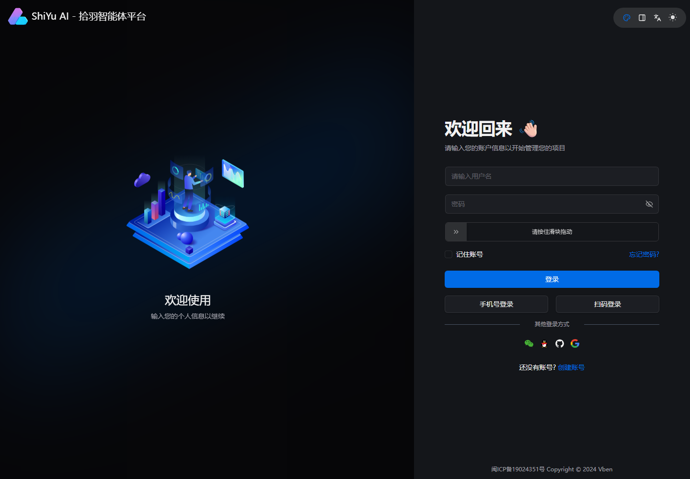
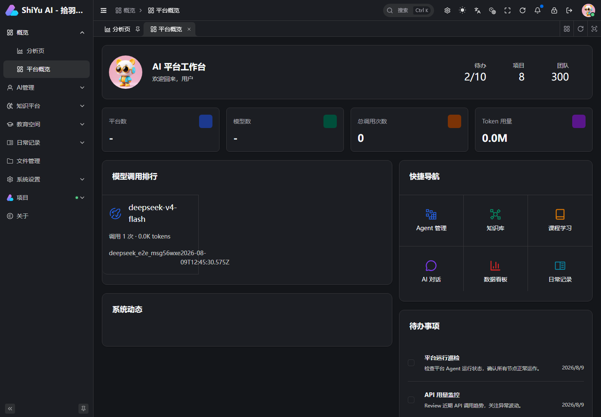
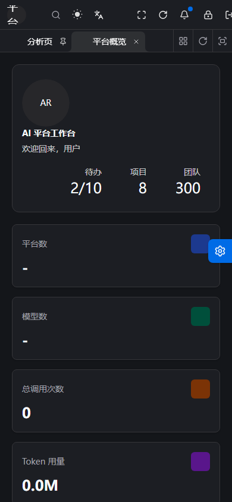
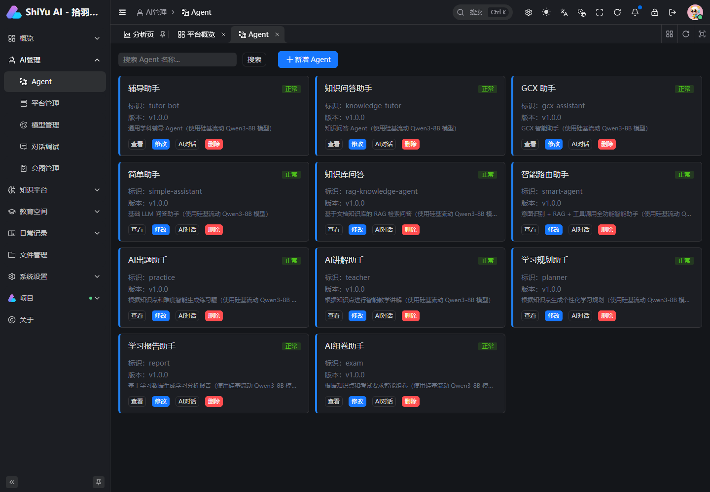
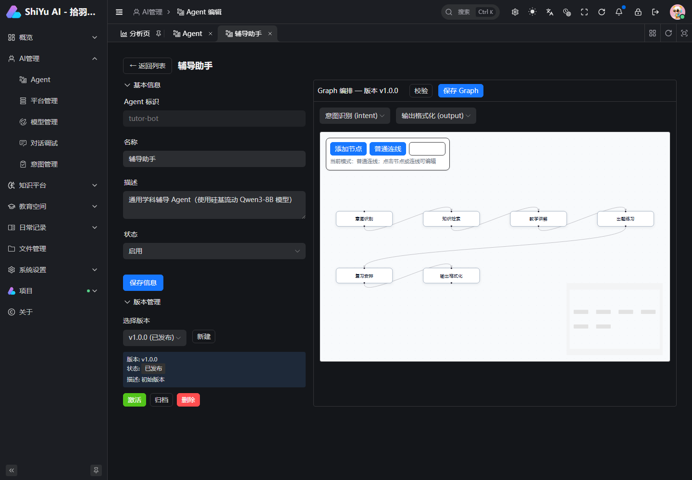
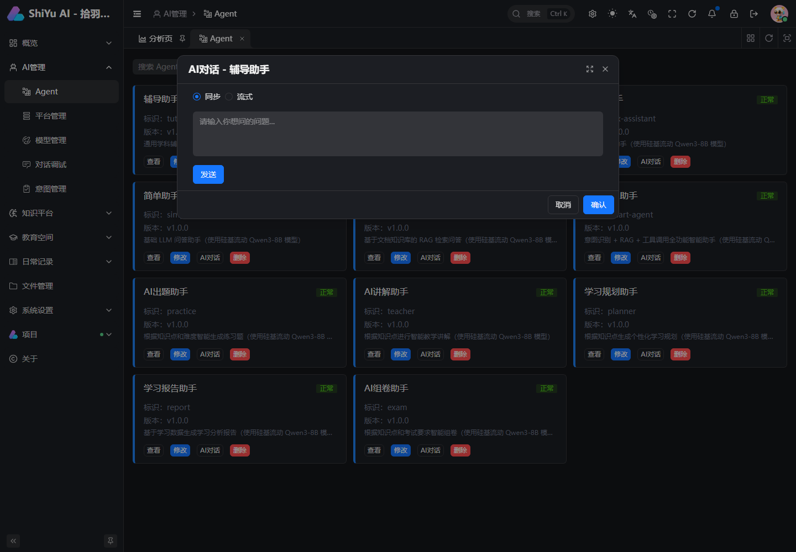
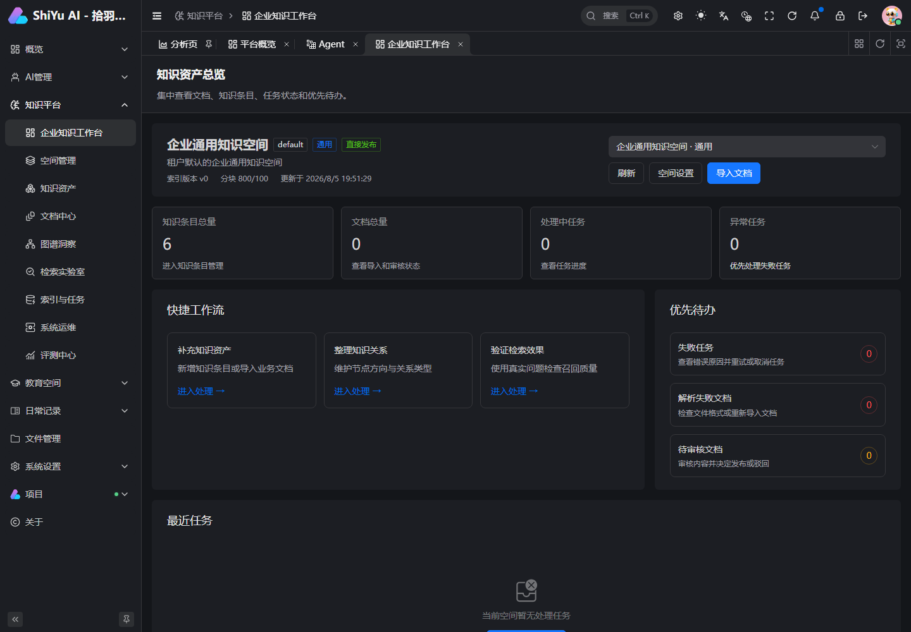
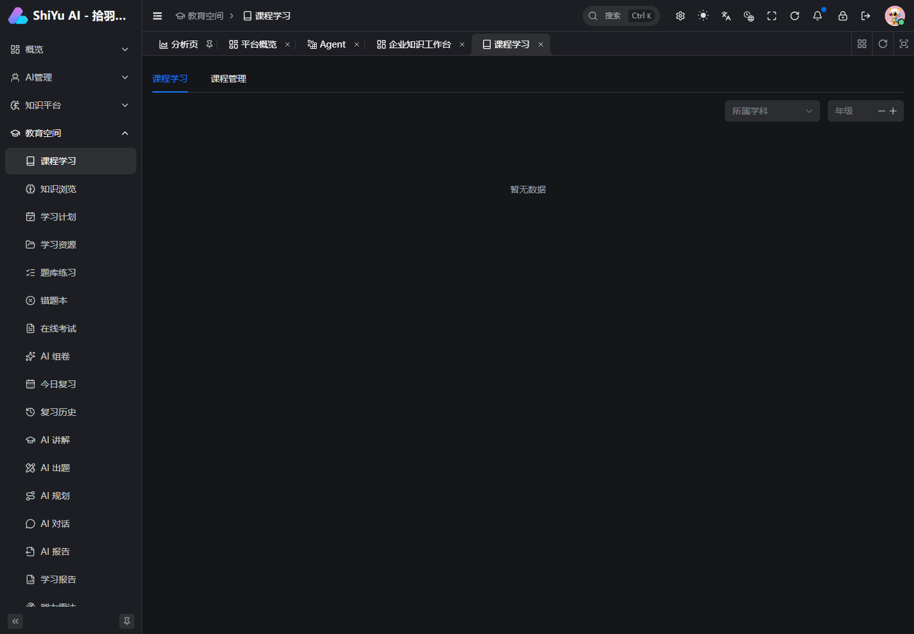
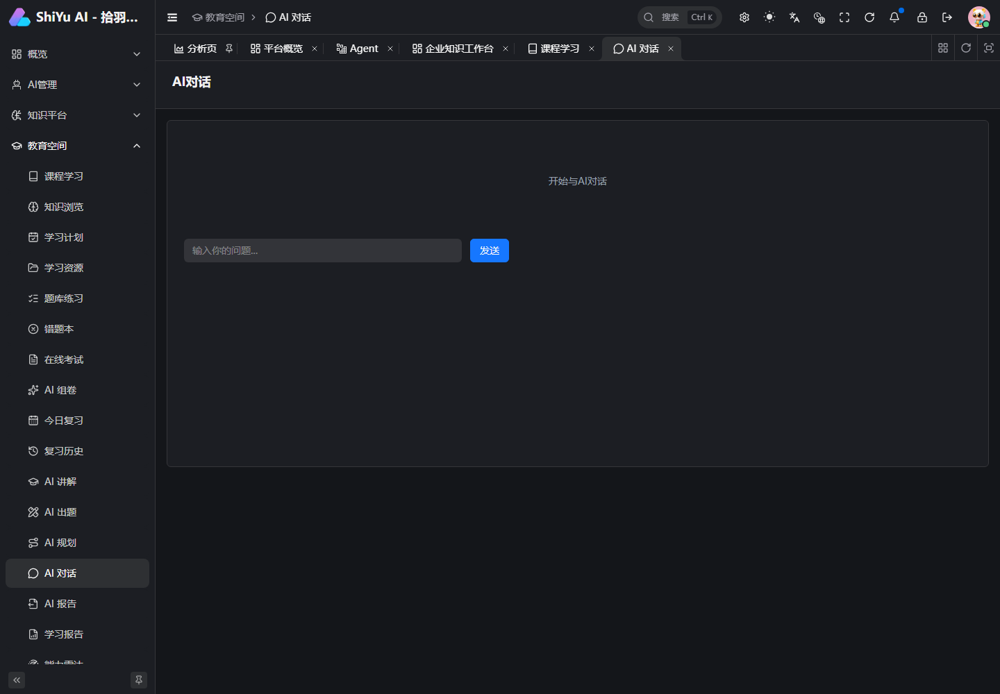
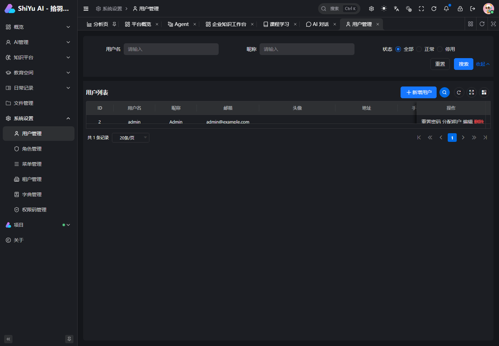

# ShiYu UI 页面操作手册

本文按初始化菜单基线说明实际页面流程。最终可见页面由“当前租户 + 当前角色菜单”决定：`super/admin` 可见管理区，`user` 默认可见教育学习区。按钮能否执行仍以后端权限码为准。

所有 76 个目录、页面、隐藏详情页和初始角色的逐条记录见 [页面路由与角色清单](参考/页面路由与角色清单.md)。

## 1. 登录与工作台

1. 打开 `/auth/login`，输入账号和密码；开发基线管理员为 `admin / 123456`，首次进入后应立即修改密码。
2. 登录成功后系统加载用户、租户、角色、权限码和动态菜单。
3. 有多个租户时先切换租户；切换后页面菜单和数据范围会重新计算。
4. 401 会清理会话并回登录页；403 表示账号已登录但无当前操作权限。

移动端概览：

## 2. Agent 平台

| 页面 | 路径 | 主要操作 |
| --- | --- | --- |
| Agent 列表 | `/agent/definition/list` | 查询、新建、编辑、删除、发布、打开对话 |
| Agent 编辑 | `/agent/admin/edit` | 编辑基础信息、编排节点和连线、校验并保存版本 |
| 平台管理 | `/agent/platform` | 配置模型供应商、密钥和默认平台 |
| 模型管理 | `/agent/model` | 配置模型标识、能力、参数和默认模型 |
| 对话调试 | `/agent/chat-config` | 选择模型，发送消息，验证流式输出 |
| 意图管理 | `/agent/intent` | 维护意图、样例与参数映射 |

推荐流程：先配置平台，再配置模型；创建 Agent 后进入编辑器编排并保存，最后在列表或对话调试中验证。离开有未保存改动的编辑页时会弹出确认。

## 3. 知识引擎

| 页面 | 路径 | 主要操作 |
| --- | --- | --- |
| 工作台 | `/knowledge/workbench` | 查看资产、任务、检索质量和快捷入口 |
| 空间管理 | `/knowledge/spaces` | 新建空间、设置成员和默认空间 |
| 知识资产 | `/knowledge/assets` | 管理结构化知识资产 |
| 文档中心 | `/knowledge/documents` | 上传、查看版本、解析、索引、删除 |
| 图谱洞察 | `/knowledge/graph` | 选择中心知识点、展开关系、查看节点详情 |
| 检索实验室 | `/knowledge/search` | 选择空间、查询、调整 topK 并检查召回片段 |
| 索引与任务 | `/knowledge/index` | 启动任务、观察解析/嵌入进度、失败重试 |
| 评测中心 | `/knowledge/evaluations` | 维护评测用例并比较检索结果 |
| 系统运维 | `/knowledge/operations` | 查看状态、审计和维护操作 |

标准流程：创建空间 → 上传文档 → 等待解析/向量化 → 在检索实验室验证 → 关联或浏览图谱 → 用评测中心固化质量基线。异步任务运行期间不要切换后继续使用旧页面对象；页面已对空间/文档 ID 做提交前快照，避免误更新。

## 4. 教育管理与学习空间

管理区包含学科、教材、章节、课程、题库、考试、学生、学习计划、复习任务、学情分析、资源和错题管理。建议按以下顺序初始化：

1. 学科 → 教材 → 章节。
2. 题库与资源，并关联知识点。
3. 课程及课程章节。
4. 学生、学习计划和考试。
5. 通过学情分析、复习任务和错题管理闭环。

普通学习区页面：

- 学习：课程学习、知识浏览、学习计划、学习资源，以及对应详情/学习页。
- 练习与考试：题库练习、错题本、在线考试、AI 组卷、答题中和结果页。
- 复习：今日复习、复习历史。
- AI 辅学：AI 讲解、出题、规划、对话和报告。
- 学习分析：学习报告、能力雷达、学习趋势、薄弱分析。

## 5. 日常记录

人物管理用于建立记录主体；时间轴用于按时间浏览事件；记录内容保存正文；标签用于分类；附件用于管理媒体。推荐先创建人物，再创建记录/事件并绑定标签和附件。删除人物前先确认关联记录的处理策略。

## 6. 系统与文件管理

| 页面 | 路径 | 操作与注意事项 |
| --- | --- | --- |
| 用户管理 | `/system/user` | 创建/编辑/删除用户，分配租户作用域角色 |
| 角色管理 | `/system/role` | 配置菜单与权限码；变更后用户需刷新上下文 |
| 菜单管理 | `/system/menu` | 配置动态路由；组件路径必须与前端视图匹配 |
| 租户管理 | `/system/tenant` | 维护租户和租户资源范围 |
| 权限码管理 | `/system/auth-code` | 管理后端操作授权编码 |
| 字典管理 | `/system/dict` | 管理通用选项数据 |
| 文件管理 | `/file` | 列表和下载按租户隔离；上传需 `file:upload`，删除需 `file:delete` |

## 7. 常见问题

- 页面不在菜单中：确认当前租户、角色菜单授权和菜单 `show` 状态。
- 页面可见但按钮 403：角色缺少后端权限码；菜单可见性不是操作授权。
- 请求地址出现 `/api`：这是前端代理前缀，后端真实路由不含 `/api`。
- 刷新登录态失败：刷新请求体必须是 `{ "accessToken": "旧令牌" }`；当前前端已关闭独立 refresh-token 模式，因为后端只支持有效 access token 轮换，不能用过期令牌续期。
- 流式回答中断：检查网络代理是否缓冲 SSE、读取超时以及模型平台配置。
