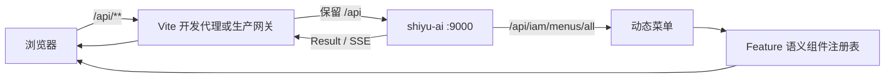

# ShiYu UI 前端项目介绍

> 文档基线：2026-08-12。本文以当前 `shiyu-ui` 的 `web-naive` 应用、页面、API 适配和动态菜单实现为依据。

## 1. 项目是什么

ShiYu UI 是 ShiYu AI 的 Web 管理端、Chat-first AI 工作区和业务工作台。项目基于 Vue 3、TypeScript、Vite、Naive UI 与 Vben Admin 5.7，采用 pnpm workspace 和 Turbo 管理多包仓库；当前 ShiYu 业务实现集中在 `apps/web-naive`。

前端负责登录与上下文切换、页面交互、权限可见性、动态菜单组件装配、Agent 可视化编排、知识运营、教育业务和日常记录等体验。业务权限和菜单来源于 `shiyu-ai`，前端不把客户端显示控制当作服务端授权边界。

## 2. 产品导航

系统一级任务域为：

1. 工作台
2. AI 工作区（Chat / Agent / RAG）
3. 应用开发（App / Agent / Prompt / Evaluation）
4. 知识中心
5. 运行观测
6. 教育空间
7. 个人记录
8. 平台管理

教育空间进一步覆盖学习、练习与考试、复习、AI 辅学、学习分析和教育配置。

## 3. 主要功能

| 产品域 | 用户可以完成的工作 |
| --- | --- |
| 工作台 | 查看平台概览、趋势、访问与用量数据 |
| AI 工作区 | Chat、Agent、RAG 统一执行；会话、分支、流式输出、Prompt Preview、引用、Trace 和工具审批 |
| 应用开发 | 管理 App、Agent、Prompt、版本、评测、平台和模型，拖拽编排流程并发布可执行版本 |
| 知识中心 | 管理空间、文档、知识点、关系和图谱，执行检索实验、评测、索引与运维操作 |
| 教育空间 | 学习课程与知识点、练习和考试、复习错题、使用 AI 家教、查看学习分析、维护教育基础数据 |
| 日常记录 | 管理档案、记录、时间线、媒体和标签 |
| 系统管理 | 管理用户、租户、角色、菜单、权限码、字典、文件与个人设置 |

## 4. 核心体验

- 后端菜单驱动：登录后按当前租户、角色和权限动态加载页面。
- 契约自检：菜单名重复、路径缺失或组件不存在时进入可重试错误页，避免空白侧栏。
- 可视化 Agent 编排：基于 Vue Flow 编辑节点与连线，并维护版本和校验结果。
- 实时 AI 交互：对话和 Agent 执行支持带认证的 SSE 流式显示。
- 统一工作区：Chat、Agent、RAG 共享会话侧栏、App/Version/Model 选择、Prompt Preview、引用、Trace 和工具审批位置。
- 全局完整文本：所有 Naive UI 下拉菜单按内容伸展，选中值悬浮显示完整名称；移动端受视口约束且不产生横向滚动。
- 多租户上下文：用户可切换当前租户和角色，前端随之刷新用户、菜单和权限。
- 响应式体验：关键页面由 Playwright 在桌面和移动端浏览器配置下覆盖。
- 中英文：业务 locale 提供 `zh-CN` 和 `en-US`。

## 5. 与后端的关系

- 开发环境：`http://127.0.0.1:5888/api/**` 原样代理到 `http://127.0.0.1:9000/api/**`。
- 生产环境：静态站点与 `/api` 通常同源，由网关反向代理后端。
- 普通请求遵循统一响应；AI 流式请求使用 `fetch` + SSE 解析。

## 6. 适用角色

- 平台运营和管理员。
- Agent 设计与调试人员。
- 知识库运营人员。
- 教育管理者、教师和学习者。
- 前后端开发、测试与部署人员。

## 7. 当前边界

- `web-naive` 是当前 ShiYu 主应用；仓库内的其他 Vben 应用、文档站或 playground 不等于 ShiYu 产品交付范围。
- 动态菜单必须使用 `feature:<domain>.<page>` 语义组件键，并由 feature 公共入口装配。
- Store 本地加密只能降低明文暴露，不能替代后端鉴权或安全存储。
- 前端环境变量会进入浏览器产物，不可放模型密钥、对象存储密钥或服务端秘密。
- 生产发布需要自行配置静态资源托管、SPA 回退和 `/api` 反向代理。
- 前端不复制 Conversation、Runtime 或 MAGMA 事实源；页面只消费后端结构化 API、Context Item 和运行事件。

## 8. 延伸阅读

- [前端技术文档](./技术文档.md)
- [前端使用文档](./使用文档.md)
- [完整文档导航](./文档导航.md)
- [开发规范与对话决策](./开发规范与对话决策.md)
- [后端项目介绍](../../shiyu-ai/docs/项目介绍.md)
